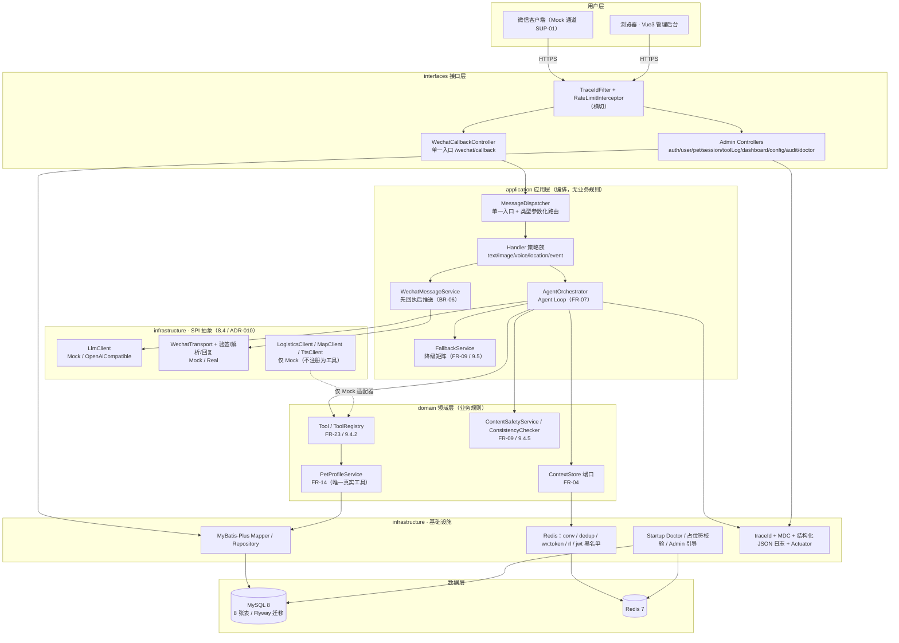
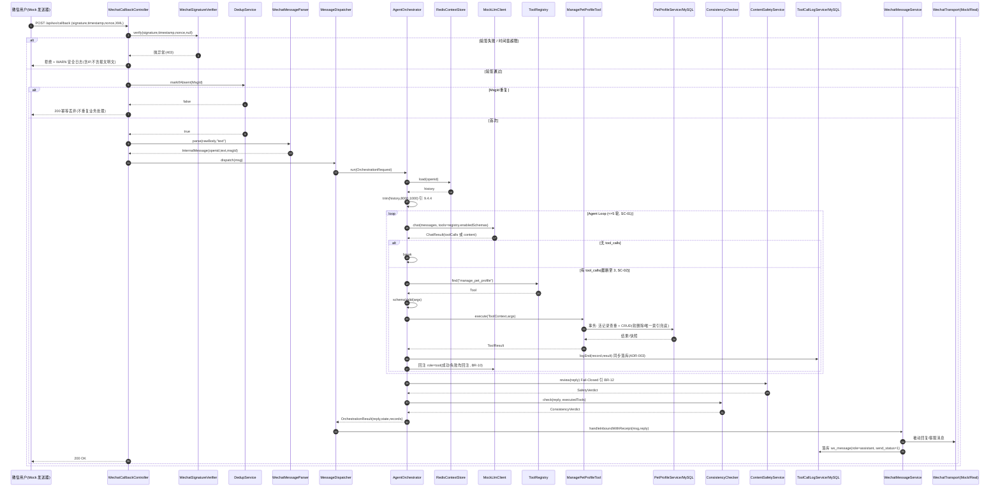
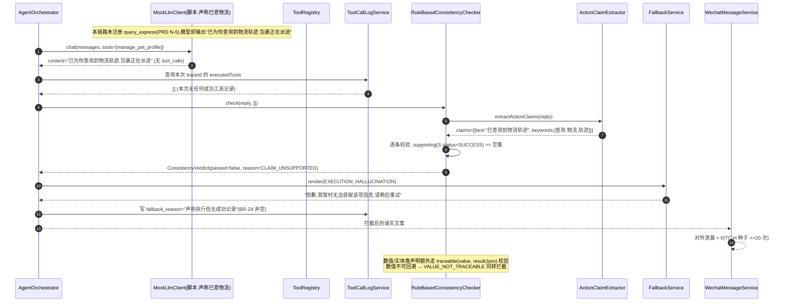
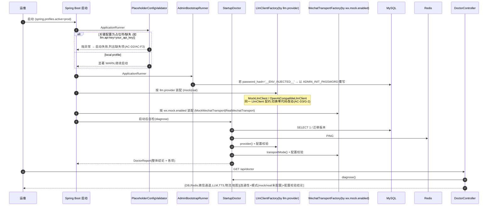

# Claw 助手（LumenSteward）MVP 系统架构设计与任务分解

| 项 | 内容 |
| --- | --- |
| 文档名称 | Claw 助手（LumenSteward）MVP 架构设计与任务分解 |
| 版本 | v1.0（迭代 1 基线） |
| 日期 | 2026-09-17 |
| 架构师 | 高见远（软件团队 · 架构师） |
| 需求输入 | `docs/MVP产品需求文档.md`（PRD，产品经理许清楚） |
| 权威基线 | `微信Claw助手需求规格说明书.md`（SRS-CLAWBOT-002 V2.2，只读） |
| 锁定技术栈 | Spring Boot 3.x（JDK 17）+ MyBatis-Plus + MySQL 8 + Redis 7 + Spring Security/JWT + Resilience4j；Vue 3 + TS + Vite + Element Plus + Pinia + axios + ECharts |
| 架构形态 | **分层单体（Modular Monolith，ADR-001）**，非微服务 |
| 交付物 | 本文件 + `docs/class-diagram.mermaid` + `docs/sequence-diagram.mermaid` |

> 阅读指引：**第 7 章（任务列表）是本文件对工程师最直接的操作依据**；第 5 章（类签名）是写代码时的接口契约；第 8 章（共享约定）是跨文件一致性约束。所有设计决策均标注 SRS 条款号或 PRD 的 AC 编号。

---

## 1 架构总览

### 1.1 分层单体的模块划分与依赖方向

系统为**前后端分离 + 分层单体**。后端严格遵循 SRS 9.2 的五层包结构 `interfaces → application → domain → infrastructure → common`，依赖方向**自上而下单向**，禁止反向依赖与跨层跳跃（`domain` 不依赖 `application`；`infrastructure` 实现 `domain` 定义的端口）。



**依赖方向铁律**

| 从 | 到 | 允许 | 说明 |
| --- | --- | --- | --- |
| interfaces | application / domain / common | ✅ | Controller 只做协议转换与鉴权注解，不含业务规则 |
| application | domain / common | ✅ | 编排器调用领域端口；**不得**直接引用 Mapper |
| domain | common | ✅ | 领域层定义端口接口（如 `ContextStore`），不含框架依赖 |
| infrastructure | domain / common | ✅ | 实现领域端口、提供 SPI 实现 |
| 反向依赖 | — | ❌ | 任何场景禁止（对应 G-16 配置类收敛、BR-05 单一入口） |

**wechat 回调链路与 JWT 过滤器链隔离**（SRS 9.2 关键说明）：`/wechat/callback` 在 `SecurityConfig` 中 `permitAll()`，由 `WechatSignatureVerifier` 执行平台验签；**Mock 通道与真实回调复用同一个 Controller 与同一段验签代码**（对应团队主理人裁定 Q1、PRD AC-D1）。

### 1.2 后端包结构（对齐 SRS 9.2）

```text
com.lumensteward.clawbot
├── interfaces/                 # 接口层：Controller / DTO / Assembler
│   ├── wechat/                 # WechatCallbackController（单一入口）
│   ├── admin/                  # 后台 REST 控制器（9 个）
│   ├── dto/                    # 请求/响应对象（按域分包）
│   └── assembler/              # 统一出参脱敏装配（G-11）
├── application/                # 应用层：用例编排
│   ├── dispatcher/             # 消息路由（FR-02，策略族）
│   ├── orchestrator/           # Agent Loop 编排（FR-07，9.4.3）
│   ├── context/                # 上下文服务 + token 裁剪（FR-04，9.4.4）
│   ├── safety/                 # 内容安全 + 执行一致性校验（FR-09，9.4.5）
│   ├── fallback/               # 降级文案与降级矩阵（FR-09，9.5）
│   └── wechat/                 # 先回执后推送（FR-03，BR-06）
├── domain/                     # 领域层：业务规则与端口
│   ├── tool/                   # Tool 契约 / ToolRegistry / JsonSchema（FR-23）
│   ├── intent/                 # 意图模型与分类端口（FR-05）
│   ├── service/                # 业务能力端口（PetProfile 等）
│   └── model/                  # 领域视图模型
├── infrastructure/             # 基础设施层
│   ├── persistence/            # entity / mapper / repository 实现
│   ├── cache/                  # ContextStore / 去重 / 限流 / 黑名单 / 配置缓存
│   ├── client/                 # llm / wechat / logistics / map / tts（SPI 实现）
│   ├── config/                 # 配置类收敛 + 属性类（@ConfigurationProperties）
│   ├── bootstrap/              # Startup Doctor / 占位符校验 / Admin 引导
│   └── observability/          # traceId Filter / MDC / 脱敏
└── common/                     # 通用：Result / 错误码 / 异常 / 枚举 / 工具
```

### 1.3 前端模块划分（对齐 SRS 9.3）

```text
frontend/src
├── main.ts / App.vue
├── router/index.ts             # 路由 + meta 守卫（G-26 同名同源）
├── config/permissions.ts       # 权限码/角色/菜单三映射（G-27）
├── stores/                     # auth / permission / config / toast / ui
├── utils/api.ts                # axios 三段式单例封装（G-23/G-24）
├── utils/mask.ts / constants.ts
├── types/                      # api/auth/user/session/toolLog/config/audit（G-25）
├── services/*.api.ts           # 一域一文件（auth/user/session/toolLog/config/audit/dashboard/doctor）
├── layouts/MainLayout.vue
└── views/                      # login / dashboard / users / sessions / tool-logs / configs / audit-logs
```

---

## 2 技术选型与依赖清单

> G-32 要求"技术栈每一项须有真实引用点"；G-33 要求不把计划写成已完成。**下表"状态"列中标注 `预留未启用` 的项不在 MVP 引用**，须在 `README.md` 显式标注（PRD Q11）。

### 2.1 后端 `backend/pom.xml`（Spring Boot 3.3.4 父 POM，JDK 17）

| 依赖坐标 | 版本 | 用途（引用点） | 状态 |
| --- | --- | --- | --- |
| `org.springframework.boot:spring-boot-starter-web` | 3.3.4 | 微信回调 + 后台 REST（MVC） | 启用 |
| `org.springframework.boot:spring-boot-starter-validation` | 3.3.4 | Jakarta Validation，FR-14 字段校验 | 启用 |
| `org.springframework.boot:spring-boot-starter-security` | 3.3.4 | JWT 过滤器链 + `@PreAuthorize` RBAC（FR-15） | 启用 |
| `org.springframework.boot:spring-boot-starter-data-redis` | 3.3.4 | `conv:` / `dedup:` / `wx:token:` / 黑名单 / 限流（FR-04/20） | 启用 |
| `org.springframework.boot:spring-boot-starter-actuator` | 3.3.4 | health/metrics/prometheus（FR-21，NFR-RE-07） | 启用 |
| `com.baomidou:mybatis-plus-spring-boot3-starter` | 3.5.7 | 单表 CRUD + 分页 + 逻辑删除 + 审计填充（7.6.2） | 启用 |
| `com.mysql:mysql-connector-j` | 8.4.0 | MySQL 8 驱动 | 启用 |
| `org.flywaydb:flyway-core` | 10.17.0 | 版本化增量迁移（SUP-08 / Q6 / 7.6.3） | 启用 |
| `org.flywaydb:flyway-mysql` | 10.17.0 | Flyway MySQL 方言支持 | 启用 |
| `org.redisson:redisson-spring-boot-starter` | 3.32.0 | 分布式锁（档案写 / token 回源）+ 限流（9.2/9.4.6） | 启用 |
| `io.jsonwebtoken:jjwt-api` / `jjwt-impl` / `jjwt-jackson` | 0.12.6 | JWT 签发与校验（FR-15） | 启用 |
| `io.github.resilience4j:resilience4j-spring-boot3` | 2.2.0 | LLM/外部工具超时、熔断、重试（NFR-RE-03） | 启用 |
| `org.springdoc:springdoc-openapi-starter-webmvc-ui` | 2.6.0 | OpenAPI 3（TODO-09；仅非生产开放） | 启用 |
| `net.logstash.logback:logstash-logback-encoder` | 7.4 | 结构化 JSON 日志（FR-21） | 启用 |
| `com.github.ben-manes.caffeine:caffeine` | 3.1.8 | 工具 Schema / 配置一级本地缓存（7.4 可选） | 启用 |
| `org.projectlombok:lombok` | 1.18.34 | 样板代码（`@RequiredArgsConstructor` 构造器注入） | 启用 |
| `org.springframework.boot:spring-boot-starter-test` | 3.3.4 | JUnit5 + Mockito + AssertJ（NFR-MA-04） | 启用（test） |
| `org.testcontainers:junit-jupiter` / `mysql` | 1.20.3 | MySQL/Redis 集成测试（NFR-MA-04） | 启用（test） |
| `org.testcontainers:testcontainers` | 1.20.3 | 容器测试基座 | 启用（test） |
| `org.owasp:dependency-check-maven` | 10.0.4 | CI 依赖漏洞扫描（AC-F2 / NFR-SE-10） | 启用（build 插件） |
| `net.javacrumbs.shedlock:shedlock-spring` | 5.16.0 | 定时任务分布式锁（FR-19 数据清理，迭代 3） | **预留未启用** |
| `org.springframework.boot:spring-boot-starter-amqp` | 3.3.4 | RabbitMQ 长任务解耦（9.2 可选） | **预留未启用** |
| `org.springframework.boot:spring-boot-starter-webflux` | 3.3.4 | SSE 实时通道（FR-08，迭代 3） | **预留未启用** |
| `com.h2database:h2` | 2.2.224 | 内嵌开发/测试库（NFR-CO-06，可选） | **预留未启用** |

**构建插件**：`spring-boot-maven-plugin`、`maven-surefire-plugin`、`maven-enforcer-plugin`（依赖收敛/版本锁定）、`dependency-check-maven`。
**Profile**：`local`（Mock 全开、占位符仅告警）、`test`（Testcontainers）、`prod`（占位符 Fail-Fast）。

### 2.2 前端 `frontend/package.json`

| 依赖 | 版本 | 用途 | 状态 |
| --- | --- | --- | --- |
| `vue` | ^3.4.38 | UI 框架（Composition API + `<script setup>`） | 启用 |
| `vue-router` | ^4.4.3 | 路由 + `meta` 守卫（FR-15） | 启用 |
| `pinia` | ^2.2.2 | 状态管理（auth/permission/config/toast/ui） | 启用 |
| `element-plus` | ^2.8.1 | 后台组件库（表格/表单/对话框） | 启用 |
| `axios` | ^1.7.7 | HTTP 单例封装（8.2.1） | 启用 |
| `dayjs` | ^1.11.13 | 时间格式化 | 启用 |
| `vite` | ^5.4.3 | 构建工具 | 启用 |
| `@vitejs/plugin-vue` | ^5.1.3 | Vue SFC 编译 | 启用 |
| `typescript` | ^5.5.4 | `strict: true`（NFR-MA-09） | 启用 |
| `vue-tsc` | ^2.1.6 | `tsc --noEmit` 门禁（G-28） | 启用 |
| `eslint` + `@typescript-eslint/*` + `eslint-plugin-vue` | ^9.x | 代码规范（CI） | 启用 |
| `prettier` | ^3.3.3 | 格式化 | 启用 |
| `vitest` + `@vue/test-utils` | ^2.0 / ^2.4 | 前端单测（NFR-MA-04） | 启用 |
| `echarts` | ^5.5.1 | 统计图表（FR-17 步骤④） | **预留未启用**（PRD N-8 / Q11） |

---

## 3 数据模型设计

### 3.1 表名校准（对齐 SRS 7.6.1）

SRS 7.1 的核心表命名未执行域前缀规则，7.6.1 已明示差异并授权在 DDL 落地时一次性校准（不改变字段定义与接口契约）。**以 7.6.1 校准后的表名为准**：

| SRS 7.2 原表名 | DDL 实际表名（域前缀） | 域 | 软删除 |
| --- | --- | --- | --- |
| `wx_user` | `wx_user` | 微信域 | ✅ `deleted_at` |
| `session` | `wx_session` | 微信域 | — |
| `message` | `wx_message` | 微信域 | — |
| `pet_profile` | `biz_pet_profile` | 业务域 | ✅ `deleted_at` |
| `tool_call_log` | `log_tool_call` | 日志域 | — |
| `admin_user` | `sys_admin_user` | 系统域 | — |
| `sys_config` | `sys_config` | 系统域 | — |
| `audit_log` | `log_audit` | 日志域 | — |

### 3.2 审计字段口径（G-03 的可执行解释）

SRS 7.2 各表的审计字段并不齐全（如 `sys_admin_user`/`wx_session` 无 `created_at`），而 7.6.2 与 G-03 要求"审计字段齐备"。**取 7.2 为字段基准，并按 7.6.2 做加法补齐**（不改/不删 7.2 任何字段）：

| 表 | `created_at` | `updated_at` | `deleted_at` |
| --- | --- | --- | --- |
| `wx_user` | ✓(7.2) | **＋补** | ✓(7.2) |
| `wx_session` | **＋补** | **＋补** | —（会话不软删） |
| `wx_message` | ✓(7.2) | —（只增不改） | — |
| `biz_pet_profile` | ✓(7.2) | ✓(7.2) | ✓(7.2) |
| `log_tool_call` | ✓(7.2) | —（只增不改） | — |
| `sys_admin_user` | **＋补** | **＋补** | — |
| `sys_config` | **＋补** | ✓(7.2) | — |
| `log_audit` | ✓(7.2) | —（只增不改） | — |

统一 DDL 形态（7.6.2）：
```sql
created_at DATETIME NOT NULL DEFAULT CURRENT_TIMESTAMP COMMENT '创建时间',
updated_at DATETIME NOT NULL DEFAULT CURRENT_TIMESTAMP ON UPDATE CURRENT_TIMESTAMP COMMENT '更新时间',
deleted_at DATETIME NULL COMMENT '软删除时间:NULL 表示未删除'
```
实体侧必须配套 `@TableField(fill = FieldFill.INSERT / INSERT_UPDATE)` 与 `@TableLogic(value = "null", delval = "now()")`，并**注册 `MyMetaObjectHandler`**（否则填充静默失效，G-04 / 7.6.2）。

### 3.3 ⭐ Q4 唯一约束的最终设计（PRD 陷阱的正面解决）

**问题定性**：SRS 7.2 表 7-4 与 PRD Q4 建议的 `UNIQUE(openid, pet_name, deleted_at)` 在 MySQL 下**不可用**。MySQL 唯一索引中 `NULL` 不参与相等性比较，因此所有"未删除"行（`deleted_at IS NULL`）彼此不冲突，可插入任意多条同名活宠物，**无法落实 BR-03（单用户宠物昵称唯一）**。

**最终方案：生成列活记录标记 + 复合唯一索引（数据库强约束）+ 写事务内应用层查重（友好提示与兜底）**

```sql
-- biz_pet_profile 关键片段（其余字段见 3.4）
CREATE TABLE biz_pet_profile (
  ...
  deleted_at  DATETIME NULL COMMENT '软删除时间:NULL 表示未删除',
  live_marker TINYINT GENERATED ALWAYS AS (IF(deleted_at IS NULL, 1, NULL)) STORED
              COMMENT '活记录标记（生成列）：未删除=1，已删除=NULL；仅用于唯一约束，不可应用写入',
  ...
  UNIQUE KEY uk_openid_pet_name_live_marker (openid, pet_name, live_marker),
  KEY idx_openid (openid),
  KEY idx_deleted_at (deleted_at)
) ENGINE=InnoDB DEFAULT CHARSET=utf8mb4 COLLATE=utf8mb4_unicode_ci COMMENT='宠物档案';
```

**原理**：`live_marker` 为 STORED 生成列，随 `deleted_at` 自动重算——未删除时恒为常量 `1`，软删除后变为 `NULL`。复合唯一索引 `(openid, pet_name, live_marker)` 中：
- **活记录**：三列均非 NULL → `(openid, pet_name, 1)` 严格唯一 → **AC-C3 拦截重复登记** ✅
- **已删除记录**：`live_marker = NULL`，任一带 NULL 的唯一索引项均视为不冲突 → 可存在任意多条历史删除行 → **AC-C6 删除后可重建同名宠物** ✅

**同时满足两条 AC 且零冲突**。该方案完全**保留 SRS 7.6.2 对 `deleted_at` 的语义定义**（NULL = 未删除），未引入第二种软删除表示；`live_marker` 是**派生列**，不是新的软删除标记。

**双保险（必须同时实现，缺一不可）**：

1. **应用层写事务内查重**（首要，负责友好提示）：`ManagePetProfileTool → PetProfileService` 在写事务内执行
   `SELECT ... WHERE openid = ? AND pet_name = ? AND deleted_at IS NULL`，命中即返回业务错误 `30001 宠物昵称重复`，由 `FallbackService` 渲染 "你已有一只叫豆豆的宠物，是要更新它的信息吗"（对应 AC-C3 文案要求）。并发下用 Redisson 锁 `lock:pet:write:{openid}` 串行化同用户写（9.2 Redisson 用途）。
2. **数据库唯一索引兜底**（最后防线，负责并发正确性）：捕获 `DuplicateKeyException` → 映射为同一 `30001`，返回同一友好文案，**禁止**向用户暴露 SQL/约束名（G-13）。

**取舍与被否方案**：

| 方案 | 结论 | 理由 |
| --- | --- | --- |
| `UNIQUE(openid,pet_name,deleted_at)` | ❌ 否决 | MySQL NULL 语义导致活记录重复无法拦截（即本陷阱） |
| 新增可空 `deleted_flag` 列（活=0/已删=时间戳），唯一键加该列 | ⚠️ 次选 | 可行（经典技巧），但需应用层在软删除时**双写两列**，与 7.6.2"不得混用两种软删除表示"的精神冲突，且易漏写 |
| **生成列 `live_marker` + 唯一索引** | ✅ **采用** | 无需应用维护、随 `deleted_at` 自动重算、零语义改动、DB 层并发安全 |
| 仅应用层查重（不建唯一索引） | ❌ 不足以单独使用 | 并发下仍可能写入重复活记录，无法自证"强一致"（7.3 要求档案强一致） |

> 工程提示：`live_marker` 为数据库生成列，**MyBatis-Plus 实体不得声明该字段**（或标注 `@TableField(exist = false)`），否则 INSERT/UPDATE 会因写入生成列而报错。集成测试须覆盖 AC-C3 / AC-C6 两用例（Testcontainers MySQL 8）。H2 对生成列语法支持有限，故相关集成测试统一走 Testcontainers MySQL。

### 3.4 8 张表 DDL 要点（字段以 SRS 7.2 为准，命名/引擎/注释按 7.6）

> 下列为每表的**要点摘要**（完整 DDL 由工程师在迁移脚本中落地）。所有表统一 `ENGINE=InnoDB DEFAULT CHARSET=utf8mb4 COLLATE=utf8mb4_unicode_ci`，**每字段带 `COMMENT` 且枚举取值写入注释**（G-05），索引按 `uk_` / `idx_` 命名（G-02）。

**① `wx_user`**（域：微信）
- 字段：`id`, `openid`, `unionid`, `nickname`, `avatar_url`, `status`, `last_interact_at`, `created_at`, `updated_at＋补`, `deleted_at`
- 索引：`uk_openid(openid)`、`idx_status_last_interact_at(status,last_interact_at)`
- 注释：`status TINYINT NOT NULL DEFAULT 1 COMMENT '状态:1-正常 0-禁用'`

**② `wx_session`**（域：微信）
- 字段：`id`, `openid`, `context_key`, `state`, `task_context JSON`, `turn_count`, `last_active_at`, `created_at＋补`, `updated_at＋补`
- 索引：`uk_context_key(context_key)`、`idx_openid(openid)`、`idx_last_active_at(last_active_at)`
- 注释：`state VARCHAR(16) NOT NULL DEFAULT 'IDLE' COMMENT '会话状态:IDLE/CHATTING/TASKING/DEGRADED'`
- `context_key` 存 Redis 键 `conv:{openid}`，与 SRS 7.2 一致

**③ `wx_message`**（域：微信）
- 字段：`id`, `session_id`, `openid`, `msg_id`, `role`, `msg_type`, `content`, `media_id`, `tool_name`, `token_count`, `send_status`, `created_at`
- 索引：`idx_session_id_created_at(session_id,created_at)`、`idx_openid_created_at(openid,created_at)`、`idx_created_at(created_at)`、`idx_msg_id(msg_id)`（追溯用，非唯一；去重以 Redis `dedup:msg:` 为准）
- 注释：`role COMMENT '角色:user/assistant/tool'`；`msg_type COMMENT '消息类型:text/image/voice/location/event'`；`send_status COMMENT '发送状态:0-待发 1-成功 2-失败'`

**④ `biz_pet_profile`**（域：业务）— **见 3.3 唯一约束方案**
- 字段：`id`, `openid`, `pet_name`, `pet_type`, `breed`, `gender`, `birthday`, `weight_kg`, `personality`, `notes`, `photo_media_id`, `created_at`, `updated_at`, `deleted_at`, `live_marker`(生成列)
- 索引：`uk_openid_pet_name_live_marker(openid,pet_name,live_marker)`、`idx_openid(openid)`、`idx_deleted_at(deleted_at)`
- 注释：`pet_type COMMENT '宠物类型:猫/狗/其他'`；`gender COMMENT '性别:公/母/未知'`；`birthday COMMENT '生日(须 ≤ 今日)'`

**⑤ `log_tool_call`**（域：日志）— **同步写入**（ADR-003 / 7.3，幻觉判定依据）
- 字段：`id`, `trace_id`, `openid`, `session_id`, `tool_name`, `call_seq`, `params_json JSON`, `result_json JSON`, `status`, `error_type`, `fallback_reason`, `latency_ms`, `llm_round`, `created_at`
- 索引：`idx_openid_created_at(openid,created_at)`、`idx_tool_name_status_created_at(tool_name,status,created_at)`、`idx_trace_id(trace_id)`
- 注释：`status COMMENT '状态:0-成功 1-失败 2-降级 3-超时 4-未执行'`；`error_type COMMENT '异常分类:L1/L2/L3/L4 对应 2.3.5'`

**⑥ `sys_admin_user`**（域：系统）
- 字段：`id`, `username`, `password_hash`, `display_name`, `role`, `status`, `fail_count`, `locked_until`, `last_login_at`, `last_login_ip`, `created_at＋补`, `updated_at＋补`
- 索引：`uk_username(username)`、`idx_role(role)`
- 注释：`role COMMENT '角色:SUPER_ADMIN/OPERATOR/AUDITOR'`；`fail_count COMMENT '连续登录失败次数'`

**⑦ `sys_config`**（域：系统）
- 字段：`id`, `config_key`, `config_value`, `value_type`, `default_value`, `is_encrypted`, `category`, `description`, `updated_by`, `updated_at`, `created_at＋补`
- 索引：`uk_config_key(config_key)`、`idx_category(category)`
- 注释：`value_type COMMENT '值类型:STRING/INT/DECIMAL/BOOL/JSON/SECRET'`；`is_encrypted COMMENT '是否加密:1-是 0-否'`
- **MVP 只读展示**（PRD Q/P1-06）；`SECRET` 类型出参仅返回尾号

**⑧ `log_audit`**（域：日志）
- 字段：`id`, `admin_id`, `reg_type`, `action`, `target`, `before_value`, `after_value`, `reason`, `ip`, `result`, `created_at`
- 索引：`idx_reg_type_created_at(reg_type,created_at)`、`idx_admin_id_created_at(admin_id,created_at)`
- 注释：`reg_type COMMENT '资源类型:CONFIG/USER/PROFILE/AUTH/DATA_DELETE'`；`result COMMENT '结果:0-失败 1-成功'`

### 3.5 Flyway 目录结构与迁移文件命名（Q6 决策）

**决策**：采用 **Flyway**（团队主理人裁定 Q6；SRS 7.6.3 / TODO-17 建议项）。理由：① 7.6.3 明示"建议引入 Flyway 或自建 `schema_version` 表"，Flyway 为成熟方案；② G-07 要求"结构变更走增量迁移脚本、禁止改已发布脚本"，Flyway 版本化天然满足；③ AC-F1 要求"空库执行 DDL + 迁移脚本"，Flyway baseline 即 DDL 单一来源（避免 G-06 重复定义）。
**这是一处对 SRS 9.2 技术栈的新增**，已在 2.1 依赖清单登记并在此显式记录决策与理由。

```text
backend/src/main/resources/db/migration/
├── V1.0.0__baseline_sys.sql        # sys_admin_user, sys_config, log_audit
├── V1.0.1__baseline_wx.sql         # wx_user, wx_session, wx_message
├── V1.0.2__baseline_biz.sql        # biz_pet_profile, log_tool_call
├── V1.0.3__seed_sys_config.sql     # sys_config 种子（不含密钥明文）
└── V1.0.4__seed_admin.sql          # 初始 SUPER_ADMIN（密码占位，见下）
```

**域分文件 + 不重复**：按 `sys_/wx_/biz_/log_` 域切分（G-06），每张表在**唯一一个**迁移文件中定义。后续结构变更一律新增 `V1.0.x__<描述>.sql`，**禁止**修改已发布脚本（G-07）。

**初始管理员（Q7）**：
- `V1.0.4__seed_admin.sql` 插入 1 行 `sys_admin_user`，`username='superadmin'`，`role='SUPER_ADMIN'`，`password_hash='__ENV_INJECTED__'`（占位标记，**非可用哈希**）。
- `AdminBootstrapRunner`（`ApplicationRunner`，`@Order(1)`，早于 Startup Doctor）在启动时：若发现 `password_hash='__ENV_INJECTED__'`，则以 `ADMIN_INIT_PASSWORD` 环境变量计算 BCrypt 覆写；**`prod` profile 下环境变量缺失即 Fail-Fast**（BR-20 / SUP-06），`local` 下 WARN 并生成一次性随机口令打印到控制台。**任何路径均禁止硬编码明文口令**。

### 3.6 初始化数据（`V1.0.3__seed_sys_config.sql`）

| config_key | value_type | category | 默认值 | 说明 |
| --- | --- | --- | --- | --- |
| `llm.provider` | STRING | llm | `mock` | mock/real（AC-D3 切换点） |
| `llm.model` | STRING | llm | `mock-model` | 模型名 |
| `llm.base-url` | STRING | llm | `` | real 模式必填 |
| `llm.input-budget-tokens` | INT | llm | `8000` | 上下文输入预算（Q3） |
| `llm.reserved-output-tokens` | INT | llm | `1000` | 输出预留（Q3） |
| `orchestration.max-rounds` | INT | orchestration | `5` | SC-01 |
| `orchestration.max-parallel-tools` | INT | orchestration | `3` | SC-02 |
| `orchestration.total-budget-ms` | INT | orchestration | `25000` | SC-03 |
| `orchestration.tool-timeout-ms` | INT | orchestration | `8000` | SC-03 |
| `orchestration.disabled-tools` | JSON | orchestration | `[]` | 工具开关（FR-18） |
| `safety.fail-closed` | BOOL | security | `true` | BR-12 |
| `safety.strict-mode` | BOOL | security | `false` | 9.4.5 严格模式 |
| `fallback.timeout-text` | STRING | text | `我暂时无法回应，请稍后再试` | 9.5 |
| `fallback.hallucination-text` | STRING | text | `抱歉，我暂时无法获取该项信息，请稍后重试` | BR-04 |
| `fallback.blocked-text` | STRING | text | `该内容我无法处理` | BR-12 |
| `wx.mock.enabled` | BOOL | security | `true` | SUP-01 开关（AC-D1/D2） |
| `wx.token` | SECRET | security | 环境变量注入 | 微信 Token（BR-01） |

> **密钥类配置（`llm.api-key`、`wx.token`、`wx.encoding-aes-key`、`tts.key`、`map.key`、`logistics.key`）一律经环境变量注入，`sys_config` 中不落明文**（BR-20 / NFR-SE-03）。`StartupDoctor` 与 `PlaceholderConfigValidator` 校验其非占位值。

---

## 4 接口契约

### 4.1 统一响应体与 HTTP 状态分层（8.2.1 / G-08）

```json
{
  "code": 0,
  "message": "success",
  "data": { },
  "traceId": "0f8fad5b-d9cb-469f-a165-70867728950e",
  "timestamp": "2026-09-17T09:30:00+08:00"
}
```

- `code` 与 HTTP 状态**分层而非互斥**：HTTP 表达传输/访问语义，`code` 表达业务结果。**禁止**业务失败一律 200（G-08）。
- `traceId` 由 `TraceIdFilter` 入口生成 UUID，写入 MDC + 响应头 `X-Trace-Id` + 响应体（G-09）。
- **分页契约全局唯一**：请求 `page`（≥1）/`pageSize`（默认 20，上限 100）；响应 `PageResult{ list, total, page, pageSize }`，类型在 `common/api/PageResult.java` 定义**一次**（G-10）。
- 时间格式：ISO 8601 带时区；DB 统一 `Asia/Shanghai`。
- **出参脱敏**在 `interfaces/assembler/MaskingAssembler` 统一完成（G-11），Controller 不得手工置空。

### 4.2 微信回调端点（FR-01 / FR-02 / 8.1.1）

| 方法 | 路径 | 说明 | 权限 |
| --- | --- | --- | --- |
| GET | `/wechat/callback` | 服务器配置验证：校验 `signature`，通过则**原样返回** `echostr`（无引号无包装） | 平台验签（`permitAll` + 验签过滤器） |
| POST | `/wechat/callback` | 消息推送：验签 → 时间窗(±300s) → MsgId 去重 → 解析 → 路由 | 平台验签 |

> **路径说明**：PRD §6 的 AC 使用 `/api/wx/callback`，SRS 9.2 示例为 `/wechat/callback`。为兼容既有 AC 表述，**实际路径统一为 `/api/wx/callback`**，并与 PRD AC-A1~A5 保持一致（见第 9 章反馈）。SRS 9.4.6(3) 的"单一入口"约束不受影响。

**Mock 通道与真实回调复用同一端点与同一段验签**（Q1 / AC-D1）：
- 验签逻辑**始终真实执行**，Mock **不跳过**校验（BR-01 铁律）。
- `WechatTransport` 为出站 SPI（回复/素材）；**入站**由 `WechatCallbackController` 单点承载，Mock 与真实**无分叉**。
- 提供 `WechatSignatureGenerator`（测试工具类，`src/test` 或 `local` profile）按 `sha1(sort(token,timestamp,nonce))` 生成合法签名与测试 Token，供本地构造合法请求。
- GET 验证与 POST 消息由**同一 Controller 的同一验签方法**处理（`WechatSignatureVerifier.verify`）。

**reply 形态（FR-03 / BR-06）**：处理预计超 5s 窗口时，先返回占位回执（"正在为你查询…"），最终结果经 `WechatTransport.sendCustomerMessage` 异步推送；`wx_message.send_status` 记录 0/1/2。

### 4.3 管理后台 REST API 清单（8.2.2 / 3.3 权限矩阵）

> 权限语义：`全部角色` = SUPER_ADMIN/OPERATOR/AUDITOR；`OPERATOR+` = SUPER_ADMIN/OPERATOR；`SUPER_ADMIN` 独占。所有写接口受 `@PreAuthorize` 方法级 RBAC 保护，后端独立鉴权（FR-15 验收准则② / G-08）。

**认证模块**

| 方法 | 路径 | 说明 | 权限 | 请求 | 响应 `data` |
| --- | --- | --- | --- | --- | --- |
| POST | `/api/auth/login` | 登录，返回 JWT | 公开 | `LoginRequest{username,password}` | `LoginResponse{token,tokenType,expiresIn,role,displayName}` |
| POST | `/api/auth/logout` | 登出，Token 入黑名单 | 已认证 | — | `null` |
| GET | `/api/auth/info` | 当前用户与角色 | 已认证 | — | `AuthInfoVO{username,role,displayName,permissions[]}` |
| POST | `/api/auth/password` | 修改密码 | 已认证 | `ChangePasswordRequest{oldPassword,newPassword}` | `null` |

**用户管理**

| 方法 | 路径 | 说明 | 权限 |
| --- | --- | --- | --- |
| GET | `/api/users` | 分页（`keyword`/`status`/`startTime`/`endTime`/`page`/`pageSize`） | 全部角色 |
| GET | `/api/users/{id}` | 详情（含档案数/会话数/工具调用数） | 全部角色 |
| PUT | `/api/users/{id}/status` | 启用/禁用 | SUPER_ADMIN |
| GET | `/api/users/export` | 导出 CSV（脱敏） | SUPER_ADMIN |

**宠物档案（管理侧）**

| 方法 | 路径 | 说明 | 权限 |
| --- | --- | --- | --- |
| GET | `/api/users/{id}/pets` | 查询用户全部宠物（活记录） | 全部角色 |
| POST | `/api/users/{id}/pets` | 新增档案 | OPERATOR+ |
| PUT | `/api/pets/{id}` | 更新档案（记前后值→`log_audit`） | OPERATOR+ |
| DELETE | `/api/pets/{id}` | 软删除档案 | OPERATOR+ |

**会话与监控**

| 方法 | 路径 | 说明 | 权限 |
| --- | --- | --- | --- |
| GET | `/api/sessions` | 会话列表（按 `last_active_at` 倒序） | 全部角色 |
| GET | `/api/sessions/{id}/messages` | 消息流（role/msg_type） | 全部角色 |
| GET | `/api/tool-logs` | 检索（`traceId`/`toolName`/`status`/`openid`/`startTime`/`endTime`） | 全部角色 |
| GET | `/api/tool-logs/{id}` | 详情（入参/结果/耗时/降级原因） | 全部角色 |
| GET | `/api/tool-logs/stats` | 统计（调用量/成功率/耗时分布） | 全部角色 |
| GET | `/api/dashboard/summary` | 概览（今日消息/活跃用户/调用量/成功率/降级数） | 全部角色 |

**配置管理**（MVP 骨架：读展示完整；写仅落库不热更新，标注"未完成"）

| 方法 | 路径 | 说明 | 权限 | MVP 状态 |
| --- | --- | --- | --- | --- |
| GET | `/api/configs` | 配置列表（`SECRET` 仅尾号） | SUPER_ADMIN | 完整（只读） |
| PUT | `/api/configs` | 批量更新（须 `reason`，BR-25） | SUPER_ADMIN | 骨架（落库+审计，**不热更新**） |
| POST | `/api/configs/{key}/reset` | 恢复默认值 | SUPER_ADMIN | 骨架 |
| GET | `/api/configs/{key}/history` | 变更历史 | SUPER_ADMIN | 骨架 |

**审计**

| 方法 | 路径 | 说明 | 权限 |
| --- | --- | --- | --- |
| GET | `/api/audit-logs` | 审计日志检索（`regType`/`action`/`startTime`/`endTime`） | AUDITOR+ |

**系统自检（SUP-05 / A-1）**

| 方法 | 路径 | 说明 | 权限 |
| --- | --- | --- | --- |
| GET | `/api/doctor` | 结构化体检报告（DB/Redis/微信/LLM/TTS/物流/地图：连通性+模式+配置结论） | 已认证 |

> **实时通道**（`/api/sse/console`、`/ws/console`）为迭代 3，MVP **不做**（PRD N-7 / Q5），接口清单保留占位但**不实现**（G-33）。

### 4.4 错误码分配表（8.5，MVP 实际使用清单）

> 编码规则：段内切块、段位不重叠不复用；**禁止**复用第三方返回码；错误 `message` 不含堆栈/SQL/主机名/密钥（G-12/G-13）。`40xxx`/`60xxx` **不得**原样透传微信用户，须经 FR-09 转自然语言（NFR-US-04）。

| code | HTTP | 含义 | 判据（系统侧可观测，2.3.5） |
| --- | --- | --- | --- |
| `0` | 200 | 成功 | — |
| `10001` | 400 | 参数缺失 | 校验器命中必填项 |
| `10002` | 400 | 参数格式非法 | 校验器命中格式/值域 |
| `10003` | 400 | 分页参数越界 | `page<1` 或 `pageSize>100` |
| `20001` | 401 | 未认证 | 无 `Authorization` 或无有效 Token |
| `20002` | 401 | Token 过期 | `exp` 超期 |
| `20003` | 403 | 权限不足 | `@PreAuthorize` 拒绝（记越权审计） |
| `20004` | 401 | 账号锁定 | `locked_until > now`（FR-15 2b） |
| `20005` | 401 | 账号或密码错误 | BCrypt 比对失败（**不区分账号存在性**） |
| `20006` | 403 | 账号已禁用 | `status=0` |
| `20007` | 401 | Token 已失效（已登出） | `jwt:blacklist:{jti}` 命中 |
| `30001` | 409 | 宠物昵称重复 | 写事务内活记录查重命中 或 `DuplicateKeyException`（AC-C3） |
| `30002` | 400 | 生日非法（晚于今日/格式错） | `birthday > today`（AC-C7） |
| `30003` | 404 | 宠物不存在 | 活记录未命中（AC-C9） |
| `30004` | 400 | 字段值域非法 | `pet_type/gender` 枚举未命中 |
| `40001` | 503 | LLM 超时 | 调用耗时 > `llm.timeout`（15s） |
| `40002` | 503 | 物流服务不可用 | 5xx/超时/配额（Mock 适配器） |
| `40003` | 503 | 地图服务配额超限 | 配额判据 |
| `40004` | 503 | TTS 失败 | 合成/转码异常 |
| `40005` | 503 | LLM 调用失败（非超时） | 连接异常/协议错误 |
| `50001` | 500 | 数据库异常 | 持久层异常（**不落库、不泄露 SQL**） |
| `50002` | 500 | 缓存异常 | Redis 连接异常 |
| `50003` | 500 | 系统内部错误 | 兜底（**不含堆栈**） |
| `60001` | 429 | 用户级限流 | `rl:user:{openid}` 超阈值（FR-20） |
| `60002` | 429 | 预算超限降级 | 日 token 预算 100% |
| `60003` | 429 | IP 级限流 | `rl:ip:{ip}` 超阈值 |
| `70001` | 200 | 工具未注册（TOOL_NOT_FOUND） | ToolRegistry 未命中（AC-B8，回注模型，不对外暴露） |
| `70002` | 200 | 工具参数非法（INVALID_ARGS） | JSON Schema 校验失败（AC-B9，回注模型） |
| `70003` | 200 | 工具执行失败 | `ToolResult.status=FAILED`（AC-B17，回注模型） |
| `70004` | 200 | 工具执行超时（TIMEOUT） | 单工具 > 8s（AC-B10） |
| `70051` | 200 | Agent Loop 达最大轮次（强制收敛） | `round >= 5`（SC-01/SC-04，AC-B11） |
| `70052` | 200 | 执行一致性校验拦截（执行性幻觉） | `ConsistencyChecker` DETECTED（AC-B13，BR-04） |
| `70053` | 200 | 内容安全拦截 | 本地词库命中（AC-B15，BR-12） |
| `70054` | 200 | 内容安全服务不可用（Fail-Closed） | 词表加载失败/异常（AC-B15②） |
| `70055` | 200 | LLM 输出格式非法 | 未返回合法 JSON（L2 认知层，一次重解析） |
| `70056` | 200 | 上下文不可用降级（Redis） | Redis 异常，转无状态（AC-B3 相邻场景） |

> `70001~70004` 归 8.5 的"70001–70050 工具调用"块，`70051~70056` 归"70051–70100 链路编排"块（段内切块规则）。

---

## 5 核心接口与类签名

> 以下签名是工程师写代码的**直接依据**。包名基址均为 `com.lumensteward.clawbot`。构造器注入（G-14），日志用 SLF4J 占位符（G-15）。

### 5.1 SPI 与工具契约（`domain` / `infrastructure.client`）

```java
// ---- domain.tool ----
public interface Tool {
    String name();                                   // 全局唯一（FR-23）
    String description();                            // 供模型理解
    JsonSchema parametersSchema();                   // 参数 JSON Schema
    ToolResult execute(ToolContext context, JsonNode args);
    boolean idempotent();                            // 决定能否自动重试
    boolean critical();                              // SC-05 关键工具
}

public record ToolContext(String traceId, String openid, Long sessionId, int llmRound,
                          Map<String, Object> attributes) {}

public enum ToolStatus { SUCCESS, FAILED, DEGRADED, TIMEOUT, NOT_EXECUTED }

public record ToolResult(ToolStatus status, String errorType, String message,
                         JsonNode data, boolean retryable, long latencyMs) {
    public static ToolResult success(JsonNode data, long latencyMs);
    public static ToolResult failure(String errorType, String message, boolean retryable);
    public static ToolResult timeout(String message);
}

public final class JsonSchema {
    public JsonSchema(JsonNode schemaNode);
    public ValidationResult validate(JsonNode args);       // 校验必填项与类型
    public JsonNode node();                                // 下发 LLM 的原始 Schema
    public static JsonSchema of(String json);
}

public record ValidationResult(boolean valid, List<String> violations) {}

// ---- domain.tool.ToolRegistry（9.4.2，启动 Fail-Fast） ----
@org.springframework.stereotype.Component
public class ToolRegistry {
    public ToolRegistry(List<Tool> tools);                          // 构造器注入全部 Tool
    private void validate(Tool tool);                               // Schema 非法/名冲突 → 抛异常，阻止启动
    public Optional<Tool> find(String name);
    public Set<String> names();
    public List<JsonNode> enabledSchemas(Set<String> disabledTools);  // 过滤后下发
}
```

```java
// ---- infrastructure.client.llm（9.4.1，8.1.2 OpenAI 兼容协议） ----
public interface LlmClient {
    ChatResult chat(ChatRequest request) throws LlmException;         // 文本与工具调用
    VisionResult vision(VisionRequest request) throws LlmException;   // 多模态（MVP 仅契约，Mock 实现）
    String provider();                                                // "mock" / "openai-compatible"
}

public record ChatRequest(String model, List<ChatMessage> messages, List<JsonNode> tools,
                          String toolChoice, boolean stream, java.time.Duration timeout) {}

public record ChatMessage(String role,            // system/user/assistant/tool
                          String content,
                          String toolCallId,      // role=tool 时必填
                          List<ToolCall> toolCalls,
                          String name) {}

public record ToolCall(String id, String type, String functionName, String argumentsJson) {}

public record ChatResult(String content, List<ToolCall> toolCalls,
                         TokenUsage usage, String finishReason, String rawJson) {}

public record TokenUsage(int promptTokens, int completionTokens, int totalTokens) {}

public record VisionRequest(String model, String imageUrlOrBase64, String question) {}
public record VisionResult(String description, double confidence, JsonNode raw) {}

// 异常族（Orchestrator 据此走降级）
public abstract class LlmException extends RuntimeException { public abstract String errorType(); }
public class LlmTimeoutException extends LlmException {}        // 40001
public class LlmUnavailableException extends LlmException {}    // 40005
public class LlmProtocolException extends LlmException {}       // 70055

// ---- 各 Mock / Real 实现 ----
public class MockLlmClient implements LlmClient { /* 读取可编程脚本 MockScript */ }
public class OpenAiCompatibleLlmClient implements LlmClient { /* Spring RestClient + Resilience4j */ }
public class MockScript {                    // 脚本：按轮次或按用户消息匹配的确定性响应
    public static MockScript fromResource(String path);
    public ChatResult next(int round, List<ChatMessage> messages);
}
```

```java
// ---- infrastructure.client.wechat（9.4.6） ----
public interface WechatTransport {                       // 出站 SPI（Mock/Real 可切换）
    String transportMode();                              // "mock" / "real"
    SendResult sendCustomerMessage(String openid, CustomerMessage message);
    MediaId uploadTempMedia(byte[] bytes, String type, String filename);
    byte[] downloadMedia(String mediaId);
}

public interface WechatSignatureVerifier {               // BR-01：始终真实执行
    void verify(String signature, String timestamp, String nonce, String encrypt);
    // 失败抛 SignatureInvalidException / TimestampOutOfWindowException
}

public interface WechatMessageParser {                   // 9.4.6(2)：平台报文→内部模型，禁 XXE
    InternalMessage parse(String rawBody, String msgTypeHint);
}
public record InternalMessage(String openid, String msgType, String msgId, String content,
                              String mediaId, Double latitude, Double longitude, long createTime,
                              Map<String, String> eventAttributes) {}

public interface WechatReplyBuilder {                    // 内部回复模型 → 平台报文
    String buildTextReply(InternalMessage inbound, String text);
}

public interface WechatTokenService {                    // 9.4.6(1) G-20
    String getAccessToken();                             // 缓存优先 + Redisson 锁 + 提前过期
    void evictAndRefresh();                              // 清缓存 + 单次回源重试
}

// ---- infrastructure.client.logistics / map / tts（仅 Mock，不注册为工具） ----
public interface LogisticsClient { ExpressTrace query(String companyCode, String trackingNo); }
public interface MapClient { GeoPoint geocode(String address);
                             RouteResult planRoute(GeoPoint from, GeoPoint to, RouteMode mode); }
public interface TtsClient { byte[] synthesize(String text, String voiceId); }

// ---- 工具实现（MVP 唯一真实工具） ----
public class ManagePetProfileTool implements Tool {
    public String name() { return "manage_pet_profile"; }
    public boolean idempotent() { return false; }        // 附录 B-5
    public boolean critical()   { return true; }         // 附录 B-5
    public JsonSchema parametersSchema();                // 附录 B-5 契约
    public ToolResult execute(ToolContext ctx, JsonNode args);   // 委托 PetProfileService
}
```

### 5.2 应用层编排（`application`）

```java
// ---- application.orchestrator（9.4.3） ----
public interface AgentOrchestrator {
    OrchestrationResult run(OrchestrationRequest request);
}
public record OrchestrationRequest(String traceId, String openid, Long sessionId,
                                   String userMessage, List<ChatMessage> history) {}
public record OrchestrationResult(String replyText, SessionState finalState,
                                  List<ToolCallRecord> executedTools, String fallbackReason,
                                  int llmCalls, int rounds) {}

public record ToolCallRecord(String toolName, int callSeq, int llmRound, ToolStatus status,
                             String errorType, String fallbackReason,
                             JsonNode params, JsonNode result, long latencyMs) {}

public class AgentOrchestratorImpl implements AgentOrchestrator {
    public AgentOrchestratorImpl(LlmClient llm, ToolRegistry registry,
                                 ContextStore contextStore, ContextTrimmer trimmer,
                                 ConsistencyChecker checker, ContentSafetyService safety,
                                 FallbackService fallback, ToolCallLogService logService,
                                 OrchestrationProperties props) { /* 构造器注入 */ }
    // 实现 SC-01(5轮)/SC-02(3并行)/SC-03(25s)/SC-05：伪代码见 SRS 9.4.3
}

// ---- application.context（9.4.4，Q3：token 预算主控） ----
public interface ContextStore {                              // 领域端口（domain）
    List<ChatMessage> load(String openid);
    void append(String openid, ChatMessage message);
    void appendAll(String openid, List<ChatMessage> messages);
    void clear(String openid);
    boolean isAvailable();                                   // Redis 故障→无状态降级（9.5）
}
public class RedisContextStore implements ContextStore { /* key: conv:{openid}, TTL 24h */ }

public class ContextTrimmer {
    public ContextTrimmer(TokenEstimator estimator) {}
    public List<ChatMessage> trim(List<ChatMessage> history, int budgetTokens, int reservedOutputTokens);
    // 关键：孤立 tool 消息须与其 assistant 调用配对（9.4.4 第 11-13 行）
}
public interface TokenEstimator { int estimate(String text); int estimate(ChatMessage m); }

// ---- application.safety（FR-09 / 9.4.5） ----
public interface ContentSafetyService {
    SafetyVerdict review(String text);        // Fail-Closed（BR-12）
}
public record SafetyVerdict(boolean passed, String hitWord, boolean serviceUnavailable) {}

public interface ConsistencyChecker {         // 执行一致性校验（9.4.5）
    ConsistencyVerdict check(String reply, List<ToolCallRecord> executedTools);
}
public record ConsistencyVerdict(boolean passed, String claimText, ConsistencyReason reason) {}
public enum ConsistencyReason { PASSED, CLAIM_UNSUPPORTED, VALUE_NOT_TRACEABLE }

public class RuleBasedConsistencyChecker implements ConsistencyChecker {
    public RuleBasedConsistencyChecker(ActionClaimExtractor extractor, SafetyProperties props) {}
}
public class ActionClaimExtractor {           // 动作声明抽取（规则 + 工具语义词表）
    public List<ActionClaim> extract(String reply);
}
public record ActionClaim(String text, Set<String> keywords, List<String> numerics) {}

// ---- application.fallback（9.5 降级矩阵） ----
public interface FallbackService { String render(FallbackReason reason, Map<String, Object> ctx); }
public enum FallbackReason { SIGNATURE_FAILED, MSG_DUPLICATED, UNKNOWN_MSG_TYPE, LLM_TIMEOUT,
    LLM_INVALID_OUTPUT, LOW_CONFIDENCE_CLARIFY, TOOL_NOT_FOUND, INVALID_ARGS, TOOL_FAILED,
    TOOL_TIMEOUT, EMPTY_RESULT, EXECUTION_HALLUCINATION, CONTENT_BLOCKED, SAFETY_UNAVAILABLE,
    REDIS_UNAVAILABLE, DB_UNAVAILABLE, RATE_LIMITED, BUDGET_EXCEEDED,
    FORCED_CONVERGENCE, PET_NAME_DUPLICATE, MISSING_SLOT }

// ---- application.dispatcher（FR-02，单一入口+类型参数化） ----
public class MessageDispatcher {
    public MessageDispatcher(List<MessageHandler> handlers) {}     // 策略族自动注入
    public void dispatch(InternalMessage message);                 // BR-05 单一入口
}
public interface MessageHandler {
    String supportsMsgType();                                      // text/image/voice/location/event
    void handle(InternalMessage message);
}

// ---- application.intent（FR-05） ----
public interface IntentClassifier { IntentResult classify(List<ChatMessage> history, String userMessage); }
public record IntentResult(IntentType intent, double confidence, Map<String, Object> slots) {}
public enum IntentType { PET_PROFILE, EXPRESS, NAVIGATION, TTS, IMAGE, CHITCHAT, UNKNOWN }

// ---- application.wechat（FR-03 / BR-06） ----
public class WechatMessageService {
    public WechatMessageService(WechatTransport transport, WxMessageRepository repo) {}
    public String handleInboundWithReceipt(InternalMessage msg, String finalReplyText);  // 先回执
    public void pushAsync(String openid, String text);            // 客服消息
}
```

### 5.3 领域服务（`domain.service`）

```java
public interface PetProfileService {            // FR-14，唯一真实工具的后端能力
    PetProfileView create(String openid, PetProfileCommand cmd);
    List<PetProfileView> listLive(String openid);
    Optional<PetProfileView> findLiveByName(String openid, String petName);
    PetProfileView update(String openid, String petName, PetProfilePatch patch);   // 记前后值→log_audit
    void softDelete(String openid, String petName);
}
public record PetProfileCommand(String petName, String petType, String breed, String gender,
                                LocalDate birthday, BigDecimal weightKg, String personality, String notes) {}
public record PetProfilePatch(...) {}            // 全字段可空，仅更新非空项（AC-C4 增量更新）
```

### 5.4 基础设施与横切（`infrastructure`）

```java
// ---- cache（Redis key 规范见 8.3） ----
public interface DedupService { boolean markIfAbsent(String msgId); }        // SETNX, TTL 300s
public interface RateLimitService { boolean tryAcquire(String openid, String ip); }  // rl:user / rl:ip
public interface TokenBlacklistService { void blacklist(String jti, long ttlSeconds); boolean isBlacklisted(String jti); }
public interface ConfigCacheService { String get(String key); void invalidate(String key); }

// ---- persistence（MyBatis-Plus） ----
public interface WxMessageRepository { void save(WxMessageEntity e); PageResult<WxMessageEntity> page(...); }
public interface ToolCallLogService {
    ToolCallRecord logStart(String traceId, String openid, Long sessionId, ToolCall call, int round);
    void logEnd(ToolCallRecord record, ToolResult result);     // 同步落库（ADR-003）
}
public interface AuditLogService { void record(Long adminId, String regType, String action, String target,
                                               String before, String after, String reason, String ip, int result); }

// ---- bootstrap ----
public interface StartupDoctor { DoctorReport diagnose(); }
public record DoctorReport(String overall, java.time.Instant checkedAt, List<DependencyCheck> items) {}
public record DependencyCheck(String name, String connectivity, String mode,
                              String configConclusion, String detail) {}
public class PlaceholderConfigValidator implements org.springframework.boot.ApplicationRunner {
    // SUP-06：prod 下占位符 Fail-Fast；dev 下显著 WARN（AC-D2 / AC-F3）
}
public class AdminBootstrapRunner implements org.springframework.boot.ApplicationRunner {
    // Q7：环境变量注入初始管理员口令（BR-20）
}

// ---- observability ----
public class TraceIdFilter extends org.springframework.web.filter.OncePerRequestFilter {
    // 生成 UUID → MDC("traceId") → 响应头 X-Trace-Id（G-09）
}
public final class MaskUtils {
    public static String openid(String openid);       // 前4+****+后4（BR-21）
    public static String trackingNo(String no);       // SF12****7890（BR-15）
    public static String secret(String value);        // ****尾4位
}

// ---- 配置属性类（@ConfigurationProperties，G-16 收敛于 config 包） ----
@ConfigurationProperties("wx")         public record WechatProperties(String token, String appId,
        String appSecret, String encodingAesKey, boolean mockEnabled, int timeWindowSeconds, int dedupTtlSeconds) {}
@ConfigurationProperties("llm")        public record LlmProperties(String provider, String baseUrl,
        String apiKey, String model, String visionModel, int timeoutSeconds, int visionTimeoutSeconds,
        int inputBudgetTokens, int reservedOutputTokens) {}
@ConfigurationProperties("orchestration") public record OrchestrationProperties(int maxRounds,
        int maxParallelTools, int totalBudgetMs, int toolTimeoutMs, int maxRetry, Set<String> disabledTools) {}
@ConfigurationProperties("security")   public record SecurityProperties(String jwtSecret, int jwtExpireHours,
        int lockThreshold, int lockMinutes, int loginFailWindowSeconds) {}
@ConfigurationProperties("safety")     public record SafetyProperties(String wordlistPath, boolean failClosed, boolean strictMode) {}
@ConfigurationProperties("admin.bootstrap") public record AdminBootstrapProperties(String username) {}
```

**配置类清单（G-16：Bean 声明收敛，禁散落业务类）**：`SecurityConfig`、`MybatisPlusConfig`（含 `MybatisPlusInterceptor`+`PaginationInnerInterceptor`→G-17）、`MyMetaObjectHandler`（G-04）、`RedisConfig`、`HttpClientConfig`、`WechatConfig`、`LlmConfig`、`OpenApiConfig`、`WebMvcConfig`（拦截器注册）。

---

## 6 调用流程（Mermaid 时序图）

> 同步输出到 `docs/sequence-diagram.mermaid`。

### 6.1 （a）消息主链路全流程（Mock 通道，含真实工具写库）



### 6.2 （b）执行一致性校验触发拦截（AC-B13 / 9.4.5 / BR-04）



### 6.3 （c）Mock/Real 切换与 Startup Doctor（AC-D2 / AC-D3 / AC-D4）



---

## 7 任务列表（实现顺序，精确到文件路径）

> **任务分解规则**：共 **5 个任务**（T01–T05）；每个任务为一个**模块聚合**，含 3 个以上相关文件；**T01 为项目基础设施**（配置 + 入口 + 依赖声明）；依赖尽量收敛到 T01，减少线性链。每个任务内含**建议实现步骤**（供工程师批量分批编写），并列**完成判据**（对应 PRD AC）。

### 7.1 任务总览

| 任务 | 名称 | 依赖 | 优先级 | 涉及文件数（估） | 完成判据（AC） |
| --- | --- | --- | --- | --- | --- |
| **T01** | 项目基础设施与工程门禁 | 无 | P0 | ~42 | AC-F2、AC-F5、G-08/G-09/G-10/G-13/G-17/G-19 |
| **T02** | 数据层与配置体系（DDL+实体+自检） | T01 | P0 | ~46 | AC-F1、AC-D2、AC-D4、AC-F3、G-01~G-07 |
| **T03** | 接入层与 SPI/Mock 层 | T01、T02 | P0 | ~40 | AC-A1~A5、AC-D1、AC-D3、G-20/G-21/G-22 |
| **T04** | 对话引擎与输出治理 | T03 | P0 | ~34 | AC-B1~B17、AC-C1~C9、S-1、S-2 |
| **T05** | 管理后台、前端与端到端集成 | T01（前端）、T02/T04（后端） | P0/P1 | ~48 | AC-E1~E9、AC-P1~P6、AC-F4 |

**依赖图与并行建议**：T02 一旦产出 DTO/实体契约，T05 的**前端骨架**即可与 T03/T04 **并行**开工（前端仅依赖 T01 的 Vite 工程与 T02 的接口契约）。因此实际关键路径为 T01 → T02 → T03 → T04 → T05（后端收口），T05 前端分支提前并行。

### 7.2 T01 项目基础设施与工程门禁（P0，无依赖）

**目标**：可编译、可启动、可 CI 的工程骨架 + 通用契约 + 横切能力。

**实现步骤（建议顺序）**
1. 后端 Maven 工程与多 profile 配置、主启动类、统一响应/错误码/异常；
2. 横切：`traceId` Filter + MDC + 脱敏工具 + 参数校验与全局异常处理；
3. MyBatis-Plus/Redis/HTTP 客户端配置类与 `MetaObjectHandler`；
4. 前端 Vite+Vue3+TS 工程、别名双端声明、axios 三段式、常量与权限配置；
5. CI 流水线与依赖扫描；容器化编排；README。

**文件清单（完整相对路径）**

*后端工程与通用层*
- `backend/pom.xml`
- `backend/Dockerfile`
- `backend/src/main/resources/application.yml`
- `backend/src/main/resources/application-local.yml`
- `backend/src/main/resources/application-test.yml`
- `backend/src/main/resources/application-prod.yml`
- `backend/src/main/resources/logback-spring.xml`
- `backend/src/main/java/com/lumensteward/clawbot/ClawbotApplication.java`
- `backend/src/main/java/com/lumensteward/clawbot/common/api/ApiResponse.java`
- `backend/src/main/java/com/lumensteward/clawbot/common/api/PageQuery.java`
- `backend/src/main/java/com/lumensteward/clawbot/common/api/PageResult.java`
- `backend/src/main/java/com/lumensteward/clawbot/common/error/ErrorCode.java`
- `backend/src/main/java/com/lumensteward/clawbot/common/exception/BizException.java`
- `backend/src/main/java/com/lumensteward/clawbot/common/exception/GlobalExceptionHandler.java`
- `backend/src/main/java/com/lumensteward/clawbot/common/util/MaskUtils.java`
- `backend/src/main/java/com/lumensteward/clawbot/common/util/JsonUtils.java`
- `backend/src/main/java/com/lumensteward/clawbot/common/enums/ToolStatus.java`
- `backend/src/main/java/com/lumensteward/clawbot/common/enums/SessionState.java`
- `backend/src/main/java/com/lumensteward/clawbot/common/enums/MessageRole.java`
- `backend/src/main/java/com/lumensteward/clawbot/common/enums/MessageType.java`
- `backend/src/main/java/com/lumensteward/clawbot/common/enums/AdminRole.java`

*后端横切与配置*
- `backend/src/main/java/com/lumensteward/clawbot/infrastructure/observability/TraceIdFilter.java`
- `backend/src/main/java/com/lumensteward/clawbot/infrastructure/observability/TraceContext.java`
- `backend/src/main/java/com/lumensteward/clawbot/infrastructure/config/MybatisPlusConfig.java`
- `backend/src/main/java/com/lumensteward/clawbot/infrastructure/config/MyMetaObjectHandler.java`
- `backend/src/main/java/com/lumensteward/clawbot/infrastructure/config/RedisConfig.java`
- `backend/src/main/java/com/lumensteward/clawbot/infrastructure/config/HttpClientConfig.java`
- `backend/src/main/java/com/lumensteward/clawbot/infrastructure/config/WebMvcConfig.java`
- `backend/src/main/java/com/lumensteward/clawbot/infrastructure/config/OpenApiConfig.java`

*前端工程*
- `frontend/package.json`
- `frontend/vite.config.ts`
- `frontend/tsconfig.json`
- `frontend/tsconfig.node.json`
- `frontend/index.html`
- `frontend/.env.example`
- `frontend/.env.development`
- `frontend/.env.production`
- `frontend/eslint.config.js`
- `frontend/.prettierrc`
- `frontend/Dockerfile`
- `frontend/nginx.conf`
- `frontend/src/main.ts`
- `frontend/src/App.vue`

*工程门禁与交付*
- `.github/workflows/ci.yml`
- `docker-compose.yml`
- `.env.example`
- `README.md`
- `.gitignore`

**完成判据**：`mvn -q compile` 通过；`npm run build` 与 `npx vue-tsc --noEmit` 通过；CI 四环节（构建/单测/`tsc`/依赖扫描）可运行且失败即阻断（AC-F2）；统一响应体含 `code/message/data/traceId/timestamp`（G-08/G-09/G-10）；错误码段位定义齐全（`ErrorCode` 枚举覆盖第 4.4 节全部码）；`MybatisPlusInterceptor`+`PaginationInnerInterceptor` 已注册（G-17）；`MyMetaObjectHandler` 已注册（G-04）；异常与 HTTP 状态显式绑定（G-19）。

### 7.3 T02 数据层与配置体系（P0，依赖 T01）

**目标**：8 张表的可迁移 DDL、MyBatis-Plus 实体与 Mapper、配置属性体系、启动自检与占位符校验、初始管理员引导。

**实现步骤**
1. Flyway 迁移脚本（按域分文件，含 3.3 唯一约束方案与 3.2 审计补齐）；
2. 8 个实体（不含 `live_marker`）与 8 个 Mapper；
3. 配置属性类与 `SecurityConfig`/`WechatConfig`/`LlmConfig`；
4. `StartupDoctor` + `PlaceholderConfigValidator` + `AdminBootstrapRunner`（+ `AdminInitializer` 口令注入）；
5. 集成测试基座（Testcontainers MySQL/Redis）与迁移校验测试。

**文件清单**

*迁移脚本*
- `backend/src/main/resources/db/migration/V1.0.0__baseline_sys.sql`
- `backend/src/main/resources/db/migration/V1.0.1__baseline_wx.sql`
- `backend/src/main/resources/db/migration/V1.0.2__baseline_biz.sql`
- `backend/src/main/resources/db/migration/V1.0.3__seed_sys_config.sql`
- `backend/src/main/resources/db/migration/V1.0.4__seed_admin.sql`

*实体（`infrastructure/persistence/entity`）*
- `.../entity/WxUserEntity.java`
- `.../entity/WxSessionEntity.java`
- `.../entity/WxMessageEntity.java`
- `.../entity/PetProfileEntity.java`
- `.../entity/ToolCallLogEntity.java`
- `.../entity/SysAdminUserEntity.java`
- `.../entity/SysConfigEntity.java`
- `.../entity/AuditLogEntity.java`

*Mapper（`infrastructure/persistence/mapper`）*
- `.../mapper/WxUserMapper.java`
- `.../mapper/WxSessionMapper.java`
- `.../mapper/WxMessageMapper.java`
- `.../mapper/PetProfileMapper.java`
- `.../mapper/ToolCallLogMapper.java`
- `.../mapper/SysAdminUserMapper.java`
- `.../mapper/SysConfigMapper.java`
- `.../mapper/AuditLogMapper.java`

*配置属性与配置类*
- `.../infrastructure/config/properties/WechatProperties.java`
- `.../infrastructure/config/properties/LlmProperties.java`
- `.../infrastructure/config/properties/OrchestrationProperties.java`
- `.../infrastructure/config/properties/SecurityProperties.java`
- `.../infrastructure/config/properties/SafetyProperties.java`
- `.../infrastructure/config/properties/AdminBootstrapProperties.java`
- `.../infrastructure/config/SecurityConfig.java`
- `.../infrastructure/config/WechatConfig.java`
- `.../infrastructure/config/LlmConfig.java`

*自检与引导（`infrastructure/bootstrap`）*
- `.../bootstrap/StartupDoctor.java`（接口）
- `.../bootstrap/StartupDoctorImpl.java`
- `.../bootstrap/doctor/DoctorReport.java`
- `.../bootstrap/doctor/DependencyCheck.java`
- `.../bootstrap/PlaceholderConfigValidator.java`
- `.../bootstrap/AdminBootstrapRunner.java`
- `.../bootstrap/AdminInitializer.java`

*测试基座*
- `backend/src/test/java/.../support/TestcontainersConfig.java`
- `backend/src/test/java/.../support/MySqlMigrationTest.java`

> 路径前缀省略处为 `backend/src/main/java/com/lumensteward/clawbot/`。

**完成判据**：空库执行 Flyway 后 8 张表全部建立（AC-F1）；G-01~G-07 逐条通过（命名/索引前缀/审计字段双保障/COMMENT/InnoDB/utf8mb4/域分文件不重复/增量迁移）；`biz_pet_profile` 的 `uk_openid_pet_name_live_marker` 生效，且**迁移脚本含 AC-C3/AC-C6 两用例的集成测试**；`GET /api/doctor` 返回结构化报告（AC-D4）；prod 下占位符/缺配启动失败并列明缺失项（AC-D2/AC-F3）；`AdminBootstrapRunner` 从环境变量注入口令（BR-20）。

### 7.4 T03 接入层与 SPI/Mock 层（P0，依赖 T01、T02）

**目标**：微信单一回调入口（验签/时间窗/去重/解析/GET 回显）+ 类型路由 + SPI 契约与 Mock 实现 + ToolRegistry 启动 Fail-Fast + 先回执后推送。

**实现步骤**
1. `WechatTransport` 与验证器/解析器/回复构造器 + Mock/Real 实现 + 签名生成器；
2. `WechatCallbackController`（GET/POST 单一入口）+ `DedupService` + `WechatTokenService`；
3. `LlmClient` 契约与 DTO + `MockLlmClient`（可编程脚本）+ `OpenAiCompatibleLlmClient`；
4. `Tool`/`JsonSchema`/`ToolRegistry` + Logistics/Map/Tts 的 Mock 适配器（**不注册为工具**）；
5. `MessageDispatcher` 与五类 `MessageHandler` 策略族；`FallbackService` 基础文案；
6. 接入层测试（验签 100 次、MsgId 去重、GET echostr、未知类型、Mock 全链路）。

**文件清单**

*微信接入（`interfaces/wechat` + `infrastructure.client.wechat`）*
- `.../interfaces/wechat/WechatCallbackController.java`
- `.../infrastructure/client/wechat/WechatTransport.java`
- `.../infrastructure/client/wechat/MockWechatTransport.java`
- `.../infrastructure/client/wechat/RealWechatTransport.java`
- `.../infrastructure/client/wechat/WechatSignatureVerifier.java`
- `.../infrastructure/client/wechat/WechatSignatureVerifierImpl.java`
- `.../infrastructure/client/wechat/WechatMessageParser.java`
- `.../infrastructure/client/wechat/WechatMessageParserImpl.java`
- `.../infrastructure/client/wechat/WechatReplyBuilder.java`
- `.../infrastructure/client/wechat/WechatTokenService.java`
- `.../infrastructure/client/wechat/WechatTokenServiceImpl.java`
- `.../infrastructure/client/wechat/model/InternalMessage.java`
- `.../infrastructure/client/wechat/model/CustomerMessage.java`
- `.../infrastructure/client/wechat/model/SendResult.java`
- `.../infrastructure/client/wechat/model/MediaId.java`
- `backend/src/test/java/.../support/WechatSignatureGenerator.java`

*缓存组件（`infrastructure/cache`）*
- `.../cache/DedupService.java`
- `.../cache/RedisDedupService.java`
- `.../cache/RateLimitService.java`
- `.../cache/RedisRateLimitService.java`
- `.../cache/TokenBlacklistService.java`
- `.../cache/RedisTokenBlacklistService.java`
- `.../cache/ConfigCacheService.java`

*LLM 客户端（`infrastructure/client/llm`）*
- `.../client/llm/LlmClient.java`
- `.../client/llm/MockLlmClient.java`
- `.../client/llm/OpenAiCompatibleLlmClient.java`
- `.../client/llm/dto/ChatRequest.java`
- `.../client/llm/dto/ChatMessage.java`
- `.../client/llm/dto/ToolCall.java`
- `.../client/llm/dto/ChatResult.java`
- `.../client/llm/dto/TokenUsage.java`
- `.../client/llm/dto/VisionRequest.java`
- `.../client/llm/dto/VisionResult.java`
- `.../client/llm/exception/LlmException.java`
- `.../client/llm/exception/LlmTimeoutException.java`
- `.../client/llm/exception/LlmUnavailableException.java`
- `.../client/llm/exception/LlmProtocolException.java`
- `.../client/llm/script/MockScript.java`
- `backend/src/main/resources/mock/llm-scripts.yml`

*工具契约与 Mock 外部适配（`domain.tool` + `infrastructure.client.*`）*
- `.../domain/tool/Tool.java`
- `.../domain/tool/ToolContext.java`
- `.../domain/tool/ToolResult.java`
- `.../domain/tool/JsonSchema.java`
- `.../domain/tool/ValidationResult.java`
- `.../domain/tool/ToolRegistry.java`
- `.../client/logistics/LogisticsClient.java`
- `.../client/logistics/MockLogisticsClient.java`
- `.../client/logistics/model/ExpressTrace.java`
- `.../client/map/MapClient.java`
- `.../client/map/MockMapClient.java`
- `.../client/map/model/GeoPoint.java`
- `.../client/map/model/RouteResult.java`
- `.../client/map/model/RouteMode.java`
- `.../client/tts/TtsClient.java`
- `.../client/tts/MockTtsClient.java`

*路由与降级（`application`）*
- `.../application/dispatcher/MessageDispatcher.java`
- `.../application/dispatcher/MessageHandler.java`
- `.../application/dispatcher/handler/TextMessageHandler.java`
- `.../application/dispatcher/handler/ImageMessageHandler.java`
- `.../application/dispatcher/handler/VoiceMessageHandler.java`
- `.../application/dispatcher/handler/LocationMessageHandler.java`
- `.../application/dispatcher/handler/EventMessageHandler.java`
- `.../application/wechat/WechatMessageService.java`
- `.../application/fallback/FallbackService.java`
- `.../application/fallback/FallbackReason.java`
- `.../application/fallback/DefaultFallbackService.java`

**完成判据**：非法签名 100 次全部被拒且业务调用 0 次（AC-A2）；正确签名 POST 落库 1 条（AC-A1）；同 MsgId 10 次业务处理 1 次（AC-A3）；GET 回显 `echostr` 原文（AC-A4）；时间窗 ±300s 拒绝（AC-A5）；`MsgType=foo` 不 500（AC-A6）；image/voice 返回如实提示且不外呼（AC-A9/A10）；Mock 通道全链路走通且无外网（AC-D1）；`llm.provider` 切换零代码改动（AC-D3）；Token 缓存具备前缀分域+提前过期+分布式锁+单次失效重试（G-20）；报文解析禁 XXE 且内部模型无平台字段（G-21）；单一入口+类型路由（G-22）；非法 Schema 工具导致启动失败（FR-23）。

### 7.5 T04 对话引擎与输出治理（P0，依赖 T03）

**目标**：Redis 上下文（TTL/裁剪/降级）+ 意图识别与追问 + Agent Loop（Schema 校验/依赖排序/失败回注/SC-01/02/05/8s 超时）+ 内容安全 Fail-Closed + **执行一致性校验** + 唯一真实工具 `manage_pet_profile` + 消息/工具日志/审计落库。

**实现步骤**
1. `ContextStore`/`RedisContextStore`/`ContextTrimmer`/`TokenEstimator`；
2. `IntentClassifier`（Mock LLM 驱动）+ 意图模型与追问；
3. `AgentOrchestratorImpl`（9.4.3 伪代码落地，含 SC-01~SC-05）；
4. `ContentSafetyService`（本地词库 Fail-Closed）+ `ActionClaimExtractor` + `RuleBasedConsistencyChecker`；
5. `PetProfileService`/`PetProfileRepository` + `ManagePetProfileTool`（唯一真实工具，含唯一约束双保险）；
6. `WxMessageRepository` 落库 + `ToolCallLogService`（同步）+ `AuditLogService`；
7. 引擎测试：5 轮强制收敛、3 并行截断、8s 超时、幻觉拦截 TC-H、CRUD 全用例。

**文件清单**

*上下文与意图*
- `.../domain/context/ContextStore.java`
- `.../infrastructure/cache/RedisContextStore.java`
- `.../application/context/ContextTrimmer.java`
- `.../application/context/TokenEstimator.java`
- `.../application/context/HeuristicTokenEstimator.java`
- `.../domain/intent/IntentType.java`
- `.../domain/intent/IntentResult.java`
- `.../domain/intent/IntentClassifier.java`
- `.../application/intent/LlmIntentClassifier.java`

*编排器*
- `.../application/orchestrator/AgentOrchestrator.java`
- `.../application/orchestrator/AgentOrchestratorImpl.java`
- `.../application/orchestrator/model/OrchestrationRequest.java`
- `.../application/orchestrator/model/OrchestrationResult.java`
- `.../application/orchestrator/model/ToolCallRecord.java`

*安全与一致性*
- `.../application/safety/ContentSafetyService.java`
- `.../application/safety/LocalWordlistSafetyService.java`
- `.../application/safety/ConsistencyChecker.java`
- `.../application/safety/RuleBasedConsistencyChecker.java`
- `.../application/safety/ActionClaimExtractor.java`
- `.../application/safety/ConsistencyReason.java`
- `.../application/safety/model/ActionClaim.java`
- `backend/src/main/resources/safety/wordlist.txt`

*真实工具与领域服务*
- `.../domain/service/PetProfileService.java`
- `.../domain/service/PetProfileServiceImpl.java`
- `.../domain/model/PetProfileView.java`
- `.../domain/model/PetProfileCommand.java`
- `.../domain/model/PetProfilePatch.java`
- `.../domain/tool/impl/ManagePetProfileTool.java`

*持久化服务*
- `.../infrastructure/persistence/repository/WxMessageRepository.java`
- `.../infrastructure/persistence/repository/WxMessageRepositoryImpl.java`
- `.../infrastructure/persistence/repository/PetProfileRepository.java`
- `.../infrastructure/persistence/repository/PetProfileRepositoryImpl.java`
- `.../infrastructure/persistence/service/ToolCallLogService.java`
- `.../infrastructure/persistence/service/ToolCallLogServiceImpl.java`
- `.../infrastructure/persistence/service/AuditLogService.java`
- `.../infrastructure/persistence/service/AuditLogServiceImpl.java`

*测试*
- `backend/src/test/java/.../orchestrator/AgentLoopConstraintTest.java`
- `backend/src/test/java/.../safety/ConsistencyCheckHallucinationTest.java`
- `backend/src/test/java/.../pet/PetProfileCrudTest.java`
- `backend/src/test/java/.../pet/PetUniqueConstraintTest.java`
- `backend/src/test/resources/tc-h/cases.yml`（反幻觉种子集 ≥20 条，Q10）

**完成判据**：AC-B1~B3（上下文/隔离/TTL 降级）；AC-B4/B5（意图与澄清追问）；AC-B6~B12（编排/依赖序/Schema/超时/SC-01/SC-02）；AC-B13/B14（幻觉拦截与数值可回溯）；AC-B15（内容安全 Fail-Closed）；AC-B16（LLM 超时兜底 ≤20s）；AC-B17（失败回注不中断）；AC-C1~C9（宠物档案 CRUD/唯一/软删重建/越权隔离）；S-1（Mock 端到端 P95 ≤ 3s，20 次取样）；S-2（TC-H ≥20 次对外泄漏 = 0）；`tool_call_log` 同步落库且降级项 `fallback_reason` 非空（BR-24）。

### 7.6 T05 管理后台、前端与端到端集成（P0/P1，依赖 T01、T02、T04）

**目标**：JWT+RBAC+登录锁定+登出黑名单+审计；后台看板/工具日志/用户/档案/配置/诊断 API；Vue 登录页+看板页+工具日志页+路由守卫；端到端联调与证据归档。

**实现步骤**
1. 认证与安全：`AuthService`（BCrypt/失败锁定/黑名单）、`JwtTokenProvider`、`JwtAuthenticationFilter`；
2. 后台控制器与 DTO/Assembler（统一脱敏）；
3. 看板/工具日志/统计查询（MyBatis-Plus 分页 + 聚合）；
4. 前端：`api.ts`、`permissions.ts`、`constants.ts`、stores、router 守卫、视图页；
5. 端到端走查脚本、证据清单（SUP-07）、性能取样。

**文件清单**

*认证与安全*
- `.../interfaces/admin/AuthController.java`
- `.../application/auth/AuthService.java`
- `.../application/auth/AuthServiceImpl.java`
- `.../infrastructure/security/JwtTokenProvider.java`
- `.../infrastructure/security/JwtAuthenticationFilter.java`

*后台控制器*
- `.../interfaces/admin/UserController.java`
- `.../interfaces/admin/PetController.java`
- `.../interfaces/admin/SessionController.java`
- `.../interfaces/admin/ToolLogController.java`
- `.../interfaces/admin/DashboardController.java`
- `.../interfaces/admin/ConfigController.java`
- `.../interfaces/admin/AuditLogController.java`
- `.../interfaces/admin/DoctorController.java`
- `.../interfaces/assembler/MaskingAssembler.java`

*后台服务*
- `.../application/admin/UserQueryService.java`
- `.../application/admin/DashboardService.java`
- `.../application/admin/ToolLogQueryService.java`
- `.../application/admin/ConfigQueryService.java`
- `.../application/admin/AuditLogQueryService.java`

*DTO（`interfaces/dto/*`）*
- `.../dto/auth/LoginRequest.java`、`.../dto/auth/LoginResponse.java`、`.../dto/auth/ChangePasswordRequest.java`、`.../dto/auth/AuthInfoVO.java`
- `.../dto/user/UserQuery.java`、`.../dto/user/UserVO.java`、`.../dto/user/UserDetailVO.java`
- `.../dto/pet/PetVO.java`、`.../dto/pet/PetCreateRequest.java`、`.../dto/pet/PetUpdateRequest.java`
- `.../dto/session/SessionVO.java`、`.../dto/session/MessageVO.java`
- `.../dto/toollog/ToolLogQuery.java`、`.../dto/toollog/ToolLogVO.java`、`.../dto/toollog/ToolLogDetailVO.java`、`.../dto/toollog/ToolStatsVO.java`
- `.../dto/dashboard/DashboardSummaryVO.java`
- `.../dto/config/ConfigVO.java`、`.../dto/config/ConfigUpdateRequest.java`
- `.../dto/audit/AuditLogVO.java`
- `.../dto/doctor/DoctorReportVO.java`

*前端核心*
- `frontend/src/utils/api.ts`
- `frontend/src/utils/mask.ts`
- `frontend/src/utils/constants.ts`
- `frontend/src/config/permissions.ts`
- `frontend/src/router/index.ts`
- `frontend/src/stores/auth.ts`、`permission.ts`、`config.ts`、`toast.ts`、`ui.ts`
- `frontend/src/types/api.ts`、`auth.ts`、`user.ts`、`session.ts`、`toolLog.ts`、`config.ts`、`audit.ts`
- `frontend/src/services/auth.api.ts`、`user.api.ts`、`session.api.ts`、`toolLog.api.ts`、`config.api.ts`、`audit.api.ts`、`dashboard.api.ts`、`doctor.api.ts`
- `frontend/src/layouts/MainLayout.vue`
- `frontend/src/views/LoginView.vue`、`DashboardView.vue`、`ToolLogView.vue`、`UserListView.vue`、`UserDetailView.vue`、`SessionListView.vue`、`SessionDetailView.vue`、`ConfigView.vue`、`AuditLogView.vue`、`NotFoundView.vue`

*端到端与证据*
- `docs/evidence/index.md`（SUP-07 证据清单）
- `scripts/e2e-mainchain.sh`（段 A~F 走查）
- `backend/src/test/java/.../e2e/MainChainE2ETest.java`

**完成判据**：AC-E1~E4（登录/401/403/锁定）；AC-E5/E6（看板数值与 SQL 一致、日志检索与降级原因）；AC-E7/E8（traceId 全链路、脱敏泄漏 = 0）；AC-E9（AUDITOR 只读）；AC-P1~P6（性能收敛）；AC-F4（证据门禁）；G-23~G-30（前端规范）；G-11（统一脱敏环节）。

---

## 8 共享约定（跨文件契约）

### 8.1 包名与命名规范

| 项 | 约定 |
| --- | --- |
| 根包名 | `com.lumensteward.clawbot` |
| 分层包 | `interfaces` / `application` / `domain` / `infrastructure` / `common`（1.2 节） |
| 类命名 | Controller/DTO(`*Request`/`*VO`/`*Query`)/Mapper/Service/Repository/Properties/Config 后缀统一 |
| 常量与枚举 | 后端 `common/enums`；前端 `src/utils/constants.ts`（**每项中文注释**，与后端枚举、7.6.3 字段 COMMENT、8.5 错误码**同源**） |
| 方法命名 | 动词前缀（`create/list/find/update/softDelete/verify/parse/dispatch/run/render/check`） |

### 8.2 traceId 传递与日志字段（G-09 / BR-30 / FR-21）

- 入口 `TraceIdFilter` 生成 UUID → `MDC.put("traceId", …)` → 响应头 `X-Trace-Id` + 响应体 `traceId`；微信回调链路同样注入。
- 出站调用透传 `traceId`（HTTP 头 `X-Trace-Id`）；`tool_call_log.trace_id` 与之一致（FR-21）。
- 结构化 JSON 日志字段：`ts`、`level`、`traceId`、`openid(脱敏)`、`module`、`event`、`costMs`、`result`；SLF4J 占位符（G-15），**禁字符串拼接**。
- 关键埋点：消息接收、验签结果、意图识别、工具开始/结束（状态/耗时）、LLM 调用（模型/token/耗时）、兜底触发（原因）、回复发送结果（FR-21 步骤③）。

### 8.3 Redis key 命名规范（7.4 / 9.4.6(1) / 4.4.1）

| 用途 | key 模板 | 类型 | TTL | 出处 |
| --- | --- | --- | --- | --- |
| 会话上下文 | `conv:{openid}` | String(JSON)/List | 24h | FR-04 |
| 任务槽位 | `task:{openid}` | Hash | 10min | FR-24 |
| 消息去重 | `dedup:msg:{msgId}` | String(SETNX) | 300s | FR-01 ⑥ |
| 微信 access_token | `wx:token:{appId}` | String | 7000s（< 平台 7200s） | 9.4.6(1) |
| 用户级限流 | `rl:user:{openid}` | String(INCR) | 60s 窗口 | FR-20 |
| IP 级限流 | `rl:ip:{ip}` | String(INCR) | 60s 窗口 | FR-20 ① |
| Token 黑名单 | `jwt:blacklist:{jti}` | String | 至 `exp` | FR-15 ⑥ |
| 配置缓存 | `cfg:{configKey}` | String | 事件失效 | 7.4 / BR-26 |
| 档案写锁 | `lock:pet:write:{openid}` | Redisson 锁 | 释放即删 | 9.2 / 3.3 双保险 |

> 命名空间分离：`conv:` 与 `wx:token:` **不得混用**（9.4.6(1)）。命名统一 `业务:实体:标识`（7.4）。TTL 加 ±10% 抖动防雪崩（7.4）。

### 8.4 日期时间与序列化

- DB 连接与时区统一 `Asia/Shanghai`；`DATETIME` 存储本地时间；容器时区一致（NFR-RE-09）。
- 后台 API 时间格式 ISO 8601 带时区（8.2.1）；前端用 `dayjs` 格式化显示。
- **分页类型唯一**：后端 `common/api/PageResult`；前端 `src/types/api.ts` 定义一次（G-10/G-25）。

### 8.5 脱敏约定（G-11 / BR-21 / BR-15 / BR-30）

- 后端：`MaskUtils.openid`（前 4 + `****` + 后 4）、`MaskUtils.trackingNo`（`SF12****7890`）、`MaskUtils.secret`（`****尾4`）；统一在 `MaskingAssembler` 应用于用户/会话/日志的出参（G-11）。
- 前端：`src/utils/mask.ts` 同规则，**禁止**模板里散落字符串截取（SRS 9.3 约束 3）。
- 日志：`openid`、运单号、地址一律脱敏；脱敏失败则**丢弃字段**而非明文输出（FR-21 异常流 2a）。

### 8.6 错误处理约定（8.5 / G-12/G-13/G-19）

- 业务异常统一抛 `BizException(ErrorCode)`；`GlobalExceptionHandler` 映射为 `ApiResponse` + 对应 HTTP 状态（**禁止一律 500**）。
- 新错误码须落在既有段位、段内切块未越界；**禁止**复用第三方返回码（G-12）。
- 错误 `message` 不含堆栈/SQL/主机名/密钥（G-13）；`40xxx`/`60xxx` 不透传微信用户（NFR-US-04）。

### 8.7 配置与开关约定（BR-20 / SUP-04）

- 密钥（`llm.api-key`/`wx.token`/`wx.encoding-aes-key`/`tts/map/logistics key`/`DB 密码`）**一律环境变量注入**，不入库不入 Git（`.env.example` 为契约，`.env.local`/.env 入 `.gitignore`）。
- Mock/Real 开关：`llm.provider`（`mock`/`real`）、`wx.mock.enabled`（`true`/`false`）；切换**零代码改动**（AC-D3）。
- 未启用技术栈（ECharts、ShedLock、AMQP、WebFlux/H2）须在 `README.md` 标注**"预留未启用"**（G-32/G-33 / Q11）。

### 8.8 附录 G 检查项 → 设计落点对照

| 检查项 | 落点 |
| --- | --- |
| G-01/G-02 | 3.1 表名校准、3.4 索引命名（`uk_`/`idx_`） |
| G-03/G-04 | 3.2 审计字段口径、T01 `MyMetaObjectHandler`、T02 断言测试 |
| G-05/G-06/G-07 | 3.4 注释与引擎字符集、3.5 Flyway 域分文件、增量迁移 |
| G-08/G-09/G-10/G-11 | 4.1 响应体分层、`TraceIdFilter`、`PageResult` 唯一、`MaskingAssembler` |
| G-12/G-13 | 4.4 错误码段位、`GlobalExceptionHandler` |
| G-14/G-15/G-16/G-17/G-18/G-19 | 5 章构造器注入、SLF4J 占位符、config 包收敛、分页拦截器、OR 分组包裹、异常绑定 |
| G-20/G-21/G-22 | 9.4.6(1)(2)(3)、T03 完成判据 |
| G-23/G-24/G-25/G-26/G-27/G-28/G-29/G-30 | 1.3 前端结构、8.4 分页唯一、T05 前端清单 |
| G-31/G-32/G-33/G-34 | T05 `docs/evidence/index.md`、8.7 预留标注、README |

---

## 9 对 PRD 的反馈（歧义 / 遗漏 / 技术不可行）

| 编号 | 类型 | 问题 | 修订建议 | 本设计是否已处理 |
| --- | --- | --- | --- | --- |
| F-01 | **技术不可行** | PRD Q4 建议 `UNIQUE(openid,pet_name,deleted_at)`；AC-C6 又要求"删除后可重建同名"。MySQL 唯一索引 `NULL` 不比较，导致**活记录可重名**，与 BR-03 冲突 | 改用「生成列 `live_marker` + `UNIQUE(openid,pet_name,live_marker)`」+ 应用层事务内查重双保险（3.3） | ✅ 已在 3.3 给出最终方案并覆盖 AC-C3/AC-C6 |
| F-02 | **SRS 内部不一致** | SRS 7.2 多张表**审计字段不齐**（如 `sys_admin_user`/`wx_session` 无 `created_at`），与 7.6.2/G-03"审计字段齐备"矛盾 | 取 7.2 为字段基准 + 按 7.6.2 加法补齐（不删不改），并请产品经理在 SRS 变更时同步 7.2 表标题 | ✅ 已在 3.2 给出补齐矩阵 |
| F-03 | 路径不一致 | PRD §6 用 `/api/wx/callback`，SRS 9.2 示例为 `/wechat/callback` | 统一为 `/api/wx/callback`（以 AC 为准），并在 SRS 变更时校准 9.2 | ✅ 已在 4.2 统一并说明 |
| F-04 | 契约歧义 | SRS 9.2 记 `BIGINT UNSIGNED` 主键，MyBatis-Plus 默认 `Long`；`log_audit.admin_id` 无外键约束但 4.3 记为 FK | 统一用 `Long` 映射 `BIGINT UNSIGNED`；`admin_id`/`session_id` 保留逻辑外键（不建物理 FK，避免软删与清理冲突） | ✅ 已在 3.4 说明逻辑外键 |
| F-05 | 遗漏 | PRD 未定义 MVP 阶段 `/api/configs` 写接口是否实现；但 AC-E3 要求 OPERATOR 调配置写接口得 403 | 保留 `PUT /api/configs` 接口并强制权限（403），实现为骨架（落库+审计，不热更新），标注"未完成" | ✅ 已在 4.3 标注骨架 |
| F-06 | 遗漏 | 微信回调 5s 窗口与 Mock 链路 P95≤3s 的关系未说明；AC-A8 要求 sleep 8s 仍先回执 | 明确"先回执后推送"由 `WechatMessageService` 承载，回执 ≤1s，最终结果走客服消息（Mock 落库） | ✅ 已在 4.2 / 6.1 处理 |
| F-07 | 表述风险 | PRD Q11/G-33 要求未启用项标注"预留未启用"，但 4.1 表中 ECharts 归"不做"而 SRS 9.3 列为技术栈 | 在 `README.md` 技术栈章节显式标注 ECharts/ShedLock/AMQP/WebFlux/H2 为"预留未启用" | ✅ 已在 8.7 与 T01 README 项处理 |
| F-08 | 一致性 | PRD 8.1 内部依赖将 Node 18+ 写入，但 CI 需固定版本以保证可复现 | CI 固定 `node-version: 20`、`java-version: 17`、`maven 3.9`，并锁定 `package-lock.json`/`pom.xml` | ✅ 已在 T01 CI 项处理 |

> 以上 F-01/F-02/F-03 属**对基线的技术性校准**，已在本设计直接处理；若需正式生效，仍应按 SRS 11.3 变更流程登记（对应 TODO-11/12）。

---

## 10 待明确事项

| 编号 | 事项 | 影响 | 建议默认值 | 需谁拍板 |
| --- | --- | --- | --- | --- |
| O-01 | 生成列方案在目标 MySQL 版本（≥5.7）与 H2 开发库的兼容性 | 集成测试基座选择 | 集成测试统一 Testcontainers MySQL 8；H2 仅作本地可选（若 H2 不支持生成列则禁用其作为档案测试库） | 架构师 + 后端 |
| O-02 | `ADMIN_INIT_PASSWORD` 口令策略是否强制 ≥10 位含 3 类（BR-19） | 首次登录体验 | 默认强制 BR-19；`local` profile 可放宽但 WARN | 架构师 + 负责人 |
| O-03 | `log_tool_call` 是否需保留未执行记录（`status=4 NOT_EXECUTED`） | 日志量与幻觉判定 | MVP 保留（`TOOL_NOT_FOUND`/`INVALID_ARGS` 记 `status=4`，便于 TC-H 比对） | 架构师 |
| O-04 | 意图语料 ≥50 条种子集的落位（是否入库/入资源） | FR-05 验证 | 以 `src/test/resources/intent-corpus.yml` 随仓库提交 | 测试 + 产品 |
| O-05 | 客服消息异步推送在 Mock 下的"可见性"验收方式 | AC-A8 | Mock 落库 `wx_message(send_status=1)` + 控制台打印模拟推送 | 产品 + 测试 |
| O-06 | `/api/doctor` 是否对 AUDITOR 开放 | 权限粒度 | 默认"已认证即可"（含 AUDITOR，只读） | 架构师 |

---

## 附：交付物清单

| 文件 | 说明 |
| --- | --- |
| `docs/MVP架构设计与任务分解.md` | 本文件（Part A 系统设计 + Part B 任务分解） |
| `docs/class-diagram.mermaid` | 类图（数据模型 + 服务契约 + 关系） |
| `docs/sequence-diagram.mermaid` | 时序图（主链路 / 幻觉拦截 / Mock-Real 切换） |

*本设计为迭代 1（MVP）架构基线。任何对 SRS 既有 FR 编号、范围冻结项或迭代归属的调整，须依 SRS 11.3 变更控制流程评审后生效。*