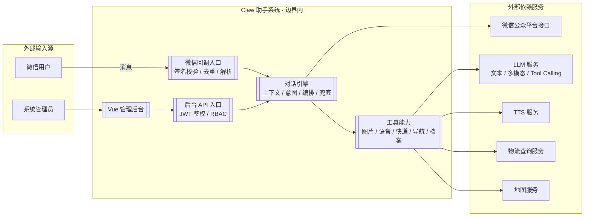
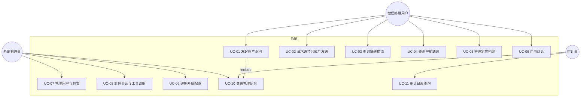
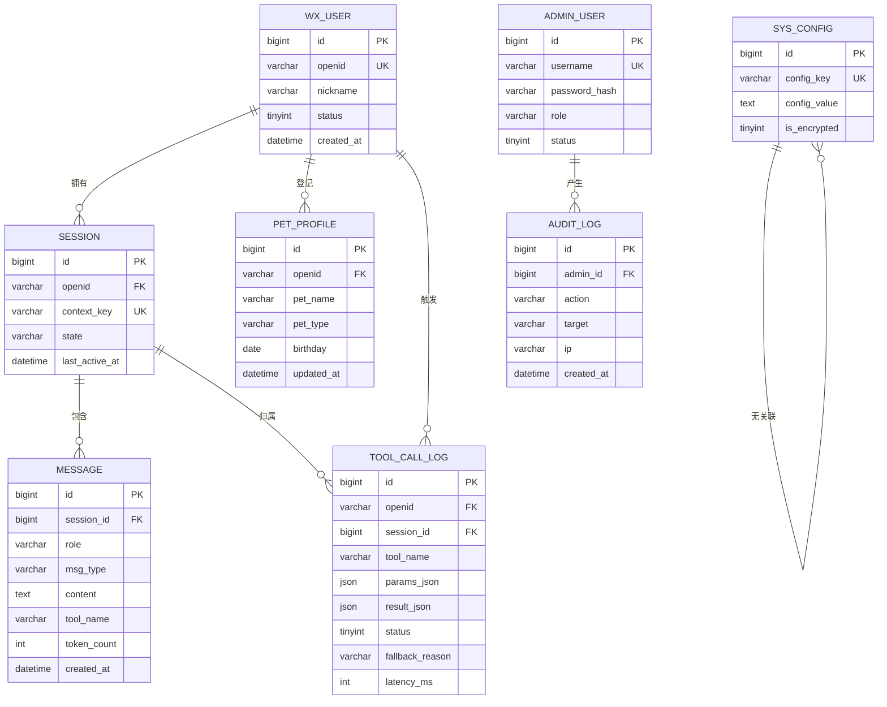
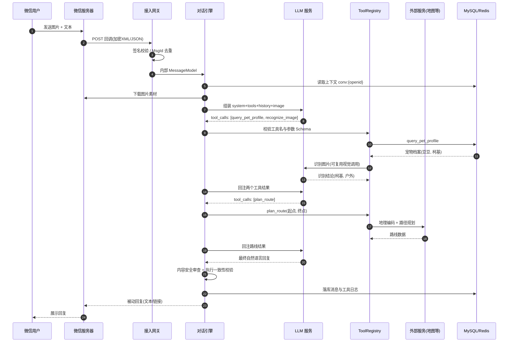
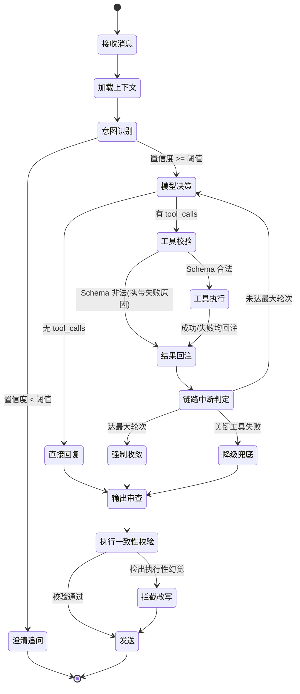
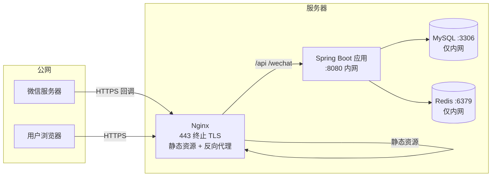
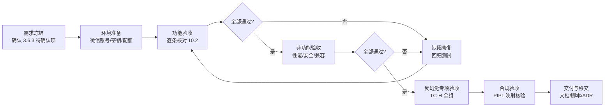
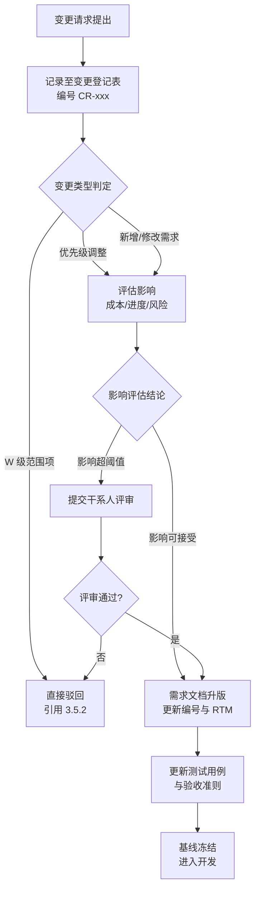

# 基于大语言模型的微信智能助手（Claw 助手 / Clawbot）软件需求规格说明书

> **文档编号**：SRS-CLAWBOT-002
> **文档版本**：V2.2（设计亮点吸收版）
> **文档性质**：软件需求规格说明书（Software Requirements Specification, SRS）
> **编制日期**：2026-09-16（V2.0）／ 2026-09-17（V2.1、V2.2）
> **核心技术栈**：Spring Boot 3.x（后端） + Vue 3（前端）
>
> **V2.1 修订说明**：新增第 12 章《前身项目复盘与后续迭代方向》与 2.6 节《前身项目实证校验与证据等级修正》。修订依据为对前身代码仓库 `xianguangSteward` 的代码级审计（目录清点、全库关键词检索、依赖与配置核对、SQL 表清单核对、Git 历史统计），方法见 12.1。本次修订**不改变任何既有功能需求的编号、优先级、验收准则与数据模型**，仅增补溯源修正、复盘结论与迭代建议，并调整章节编号（原第 12 章附录顺延为第 13 章）。
>
> **V2.2 修订说明**：对前身项目做**设计亮点提取**（角度由"真实性核验"转为"可移植设计提取"），将其工程做法、代码组织与命名规范**去来源化地写入本项目正文**：新增 7.6 节（建表与命名规范）、9.4.6 节（微信通道实现规范）、附录 G（工程规范速查表），并在 8.2.1、8.5、9.2、9.3 补充规范条款；第 12 章改写为《前身项目设计亮点吸收与后续迭代方向》，新增 **12.5 设计亮点吸收台账**与 **12.10 前身项目可移除判定**。本次修订**完整保留 FR-01 ~ FR-24 及全部既有需求，不删减、不降级、不改编号**。
> **至此，本文档不再以任何形式依赖前身项目**：其全部可移植亮点已纳入正文（映射关系见 12.5），可移除前提的核验结论见 12.10。
>
> **编制依据**：
> - GB/T 8567-2006《计算机软件文档编制规范》
> - IEEE Std 830-1998《IEEE Recommended Practice for Software Requirements Specifications》
> - ISO/IEC/IEEE 29148:2018《Systems and software engineering — Life cycle processes — Requirements engineering》
> - ISO/IEC 25010:2011《Systems and software Quality Requirements and Evaluation (SQuaRE) — System and software quality models》
>
> **需求溯源基准**：微信公众号文章《从"执行者"变成"创造者"》（马欣妍，Meta AI 星球，2026-09-14，江苏）。该文为本文档唯一的原始需求素材来源，全文证据抽取与推导规则见第 2 章。

---

## 目录

| 章节 | 标题 |
| --- | --- |
| 1 | [引言](#1-引言) |
| 2 | [需求溯源：原始素材的抽取、解释与可信度分级](#2-需求溯源原始素材的抽取解释与可信度分级) |
| 3 | [项目概述](#3-项目概述) |
| 4 | [总体需求描述](#4-总体需求描述) |
| 5 | [功能需求](#5-功能需求) |
| 6 | [非功能需求](#6-非功能需求) |
| 7 | [数据需求](#7-数据需求) |
| 8 | [接口需求](#8-接口需求) |
| 9 | [系统架构与技术选型](#9-系统架构与技术选型) |
| 10 | [需求验证、验收与追踪](#10-需求验证验收与追踪) |
| 11 | [风险登记与需求变更管理](#11-风险登记与需求变更管理) |
| 12 | [前身项目设计亮点吸收与后续迭代方向](#12-前身项目设计亮点吸收与后续迭代方向) |
| 13 | [附录](#13-附录) |

---

## 1 引言

### 1.1 编写目的

本文档对"基于大语言模型的微信智能助手——Claw 助手（Clawbot）"进行系统化、形式化的需求定义。其编制目的包括：

1. **契约目的**：在项目干系人之间建立关于"系统应做什么"与"系统不应做什么"的书面共识，作为后续设计、编码、测试与验收的唯一基准。
2. **验证目的**：为每一条需求提供**可验证的验收准则**（Acceptance Criteria），使需求具备可测试性（Testability），满足 ISO/IEC/IEEE 29148:2018 对"单一、完整、一致、可行、必要、无歧义、可验证"（Unambiguous / Complete / Consistent / Feasible / Necessary / Verifiable）的需求质量要求。
3. **溯源目的**：建立"原始素材 → 抽取需求 → 设计元素 → 测试用例"的双向追踪链路，确保不存在无来源的需求（Gold-plating，镀金需求），也不存在无需求支撑的实现。
4. **工程目的**：回应原始素材提出的核心工程命题——**系统"能跑"与"能用"之间的鸿沟**，将异常处理、幻觉兜底、可观测性等"非典型功能"提升为一级需求（First-class Requirement），而非事后补丁。

### 1.2 需求表述规范

本文档中每一条需求遵循以下强制表述约定，以消除自然语言的歧义性：

#### 1.2.1 EARS 句型模板

需求陈述句采用 EARS（Easy Approach to Requirements Syntax）模板体系，共五类：

| 句型类型 | 模板 | 适用场景 |
| --- | --- | --- |
| 普适型（Ubiquitous） | 系统**应**〈响应〉 | 恒成立的功能与质量约束 |
| 事件驱动型（Event-driven） | **当**〈触发事件〉**时**，系统**应**〈响应〉 | 消息到达、用户操作等外部事件 |
| 状态驱动型（State-driven） | **当**〈处于某状态〉**时**，系统**应**〈响应〉 | 会话过期、链路降级等状态约束 |
| 可选型（Optional） | **若**〈具备某特性〉，系统**应**〈响应〉 | 可配置能力、可选部署形态 |
| 非期望行为型（Unwanted） | **若**〈发生某异常〉，系统**应**〈响应〉 | 失败、超时、非法输入等异常分支 |

#### 1.2.2 需求编号规则

```
功能需求：FR-{两位序号}          例：FR-07
非功能需求：NFR-{质量特性缩写}-{两位序号}   例：NFR-PE-01
业务规则：BR-{两位序号}          例：BR-03
质量属性场景：QA-{两位序号}        例：QA-04
风险项：RSK-{两位序号}           例：RSK-02
```

质量特性缩写对照（ISO/IEC 25010:2011）：`FS` 功能适合性 / `PE` 性能效率 / `CO` 兼容性 / `US` 易用性 / `RE` 可靠性 / `SE` 安全 / `MA` 可维护性 / `PO` 可移植性。

#### 1.2.3 优先级定义（MoSCoW 法）

| 标记 | 含义 | 判定标准 | 迭代归属 |
| --- | --- | --- | --- |
| **M** | Must have | 缺失则系统不成立或无法验收 | 迭代 1–2（MVP） |
| **S** | Should have | 影响可用性与工程完备度，有临时替代方案 | 迭代 2–3 |
| **C** | Could have | 提升体验或扩展性，可延后 | 迭代 4+ |
| **W** | Won't have | 本期明确不做（记录以冻结范围） | 不在本期 |

#### 1.2.4 证据等级定义

本文档需求全部标注溯源的证据等级，用于区分"原文事实"与"工程推导"：

| 等级 | 定义 | 处理方式 |
| --- | --- | --- |
| **A 级** | 原文**直接陈述**，且**经外部证据独立验证**的事实，可逐字引用 | 直接转化为需求，无解释弹性 |
| **A′ 级** | 原文**直接陈述**，但**未经独立验证**，或经核验后与既有证据不一致 | 保守处理：需求可以成立，但**不得**据此推断既有实现程度、开发工作量与进度；须另行补证（见 2.6） |
| **B 级** | 原文**提出但未解答**的问题，需工程化收敛 | 作为设计约束转化为需求，推导过程须显式记录 |
| **C 级** | 原文**未提及**，但为 A/B 级需求可落地的**必要工程前提** | 明确标注为推导需求，须经干系人确认后生效 |

> **诚实性声明**：原始素材系一篇工程感悟类散文，对 Clawbot 系统的技术描述不足 100 字。本文档中绝大多数技术细节属于 B 级与 C 级推导，其目的是使 A 级需求（即原文列举的五项功能）具备可实现性与可验证性。**读者不应将任何 C 级推导误认为原作者或原系统的既有实现。**

### 1.3 术语与缩略语

| 术语/缩略语 | 全称 | 定义 |
| --- | --- | --- |
| LLM | Large Language Model | 大语言模型，本系统的认知中枢，负责意图理解、工具决策与自然语言生成 |
| Clawbot | Claw Assistant | 本系统项目代号，即"Claw 助手" |
| Tool Calling | Function Calling | 模型的工具调用机制；模型以结构化指令（`tool_calls`）声明欲调用的外部函数及其参数 |
| Agent Loop | 智能体循环 | "模型决策 → 工具执行 → 结果回注 → 模型再决策"的迭代过程，直至产出终态回复 |
| ToolRegistry | 工具注册中心 | 系统内所有可用工具（名称、JSON Schema、执行器）的集中注册与查找容器 |
| Orchestrator | 编排器 | 负责按依赖顺序驱动工具执行并把结果回注给模型的组件 |
| Hallucination | 幻觉 | 模型生成与事实不符、或声称已执行实际并未执行的操作的现象 |
| Fallback | 降级/兜底 | 主流程失败或结果不可信时切换至的、可控且诚实的替代响应 |
| TTS | Text-To-Speech | 文本转语音合成技术 |
| OCR | Optical Character Recognition | 光学字符识别，属多模态识别的子场景 |
| MediaId | — | 微信素材库中媒体资源的唯一标识 |
| OpenId | — | 微信用户在某一公众号下的唯一标识 |
| EncodingAESKey | — | 微信消息加解密密钥，用于回调消息的 AES-256-CBC 加解密 |
| SSE | Server-Sent Events | 服务端单向事件流推送协议 |
| RAG | Retrieval-Augmented Generation | 检索增强生成 |
| SRS | Software Requirements Specification | 软件需求规格说明书 |
| RTM | Requirements Traceability Matrix | 需求追踪矩阵 |
| MoSCoW | Must/Should/Could/Won't | 需求优先级排序方法 |
| SLA | Service Level Agreement | 服务等级协议 |
| P95 / P99 | 95th / 99th Percentile | 第 95/99 百分位，用于表征长尾延迟 |

### 1.4 读者对象与阅读指南

| 读者 | 关注章节 | 阅读目的 |
| --- | --- | --- |
| 产品负责人 | 2、3、4.5、10.2 | 确认需求覆盖范围与优先级，参与范围冻结 |
| 系统架构师 | 4、6、8、9 | 提取架构约束，设计技术方案 |
| 后端工程师（Spring Boot） | 5、7、8、9.2、9.5 | 明确功能边界、数据模型、算法细节 |
| 前端工程师（Vue） | 5.4、6.4、8.3、9.3 | 明确管理后台交互与实时通道协议 |
| 测试工程师 | 5、6、10.1、10.3 | 提取可测试点，设计测试用例 |
| 安全与合规评审人 | 6.5、7.5、11.2 | 审查个人信息保护与内容安全措施 |

### 1.5 参考资料

**标准与规范**

1. GB/T 8567-2006《计算机软件文档编制规范》
2. IEEE Std 830-1998《IEEE Recommended Practice for Software Requirements Specifications》
3. ISO/IEC/IEEE 29148:2018《Systems and software engineering — Life cycle processes — Requirements engineering》
4. ISO/IEC 25010:2011《Systems and software Quality Requirements and Evaluation (SQuaRE) — System and software quality models》
5. ISO/IEC/IEEE 42010:2011《Architecture description》
6. 《中华人民共和国个人信息保护法》（2021 年 11 月 1 日施行）
7. 《中华人民共和国网络安全法》（2017）
8. 《生成式人工智能服务管理暂行办法》（2023）

**平台与技术文档**

9. 微信公众平台开发文档：消息加解密、被动回复、客服消息、素材管理、自定义菜单
10. OpenAI 兼容 Chat Completions API 规范（`tools` / `tool_calls` / `tool` role）
11. 主流 TTS 服务 HTTP 接口规范
12. 快递物流轨迹查询开放接口规范（以快递 100 等聚合服务为例）
13. 高德地图 / 腾讯位置服务 Web 服务 API（地理编码、路径规划）

**原始需求素材**

14. 马欣妍.《从"执行者"变成"创造者"》. Meta AI 星球, 2026-09-14. （本文档第 2 章全量抽取其与 Clawbot 相关的内容）

### 1.6 适用范围

本文档适用于 Claw 助手系统从需求分析、概要设计、详细设计、编码实现、集成测试、系统测试到验收交付的**完整生命周期**，覆盖：

- **用户侧**：微信平台内的对话式交互能力；
- **管理侧**：基于浏览器的 B/S 管理后台（Vue 3）；
- **服务端**：单一 Spring Boot 应用及其依赖的存储、外部服务集成。

本文档**不覆盖**：运维部署手册、数据库物理设计（DBA 层面）、商业运营方案。此三类内容另有专项文档。

---

## 2 需求溯源：原始素材的抽取、解释与可信度分级

> 本章为 V2.0 相较 V1.0 的核心增补。其方法论意义在于：**任何需求文档都必须能回答"这条需求从何而来"**。缺少溯源的需求文档，其"详细"只是一种自我循环的虚构。

### 2.1 源文本概况与结构分析

源文章《从"执行者"变成"创造者"》共四节，主题为**工程理念反思**而非技术说明。经逐段审查，与 Clawbot 系统直接相关的文本仅集中于第二节，全文可抽取的有效信息如下（逐字引用）：

| 证据编号 | 原文引用 | 信息类型 |
| --- | --- | --- |
| **E-01** | "我和小组成员开发了一个**基于大模型的微信 AI 机器人项目 Clawbot**" | 系统定位：微信平台 + 大模型 + 机器人 |
| **E-02** | "实现了**图片识别、语音生成与发送、快递查询、导航、宠物档案**等功能" | 功能清单：五项核心能力 |
| **E-03** | "模型如何处理数据？**工具链路如何串联**？" | 架构命题：工具链编排机制 |
| **E-04** | "**异常如何判断**？" | 质量命题：异常识别与处理机制 |
| **E-05** | "模型产生**幻觉**后，**行动又该如何兜底**？" | 质量命题：幻觉检测与降级策略 |
| **E-06** | "当我真正开始对一个项目负责，才发现'**能跑**'和'**能用**'之间隔着一道巨大的鸿沟。任何系统都可以继续优化架构、**完善异常处理**" | 工程目标：从 Demo 到产品的质量门槛 |
| **E-07** | "这个功能是给谁用的？解决了什么真实问题？它具备商业价值或工程价值，还是只是一个**技术玩具**？在现有条件下，它**能不能实现**，又**值不值得投入**？" | 产品命题：价值判断与可行性约束 |

**关键观察**：E-01 ~ E-02 为 A 级证据（原文事实），E-03 ~ E-07 为 B 级证据（原文提出的问题，但未给出答案）。**原文未提供任何**：技术栈、数据库设计、接口协议、性能指标、部署形态、安全方案。因此本文档的全部技术规格均为 B/C 级推导。

### 2.2 A 级需求抽取：原文直接陈述的功能

| 抽取编号 | 需求陈述 | 映射需求 |
| --- | --- | --- |
| A-1 | 系统承载平台为**微信**，形态为**AI 机器人** | FR-01、FR-02、FR-03 |
| A-2 | 系统认知中枢为**大语言模型** | FR-05、FR-06、FR-07 |
| A-3 | 具备**图片识别**能力 | FR-10 |
| A-4 | 具备**语音生成与发送**能力 | FR-11 |
| A-5 | 具备**快递查询**能力 | FR-12 |
| A-6 | 具备**导航**能力 | FR-13 |
| A-7 | 具备**宠物档案**能力 | FR-14 |

> **解释规则 A**：原文使用"等"字（"……宠物档案等功能"），表明功能清单为**开放式枚举**。本版本不擅自扩展业务功能域，仅将"等"字所隐含的**可扩展性要求**显式化为 NFR-MA-01（工具插件化），不虚构原文未提及的业务能力（如天气、日程、支付），以避免范围蔓延（Scope Creep）。

### 2.3 B 级需求推导：原文的四个工程命题

原文第二节连续提出四个设问，构成本系统的核心技术挑战。以下逐条给出推导规则与收敛结论。

#### 2.3.1 命题一：**工具链路如何串联**（E-03）

| 项 | 内容 |
| --- | --- |
| 原文状态 | 仅提出设问，未给方案 |
| 问题本质 | 单一工具调用是平凡问题（一次函数调用）；**多工具按业务依赖顺序执行**（如"先查宠物档案 → 再据此规划遛狗路线导航"）才是非平凡问题，涉及：调用顺序、参数传递、失败中断、结果回注 |
| 推导规则 | R1：若系统需支持 ≥ 2 个工具且存在跨工具数据依赖，则必须具备**编排能力**，而非并列的独立处理器 |
| 收敛结论 | 引入"编排器（Orchestrator）+ 工具注册中心（ToolRegistry）+ Agent Loop"三元结构，支持**单轮多工具**与**跨轮多步**链路 → **FR-07** |
| 残留假设 | 编排采用"模型驱动"（LLM 自主决策调用顺序）而非"规则驱动"（硬编码流程）。理由：原文强调"基于大模型"，且规则驱动无法覆盖自然语言表达的任意组合意图。此假设须经干系人确认 |

#### 2.3.2 命题二：**异常如何判断**（E-04）

| 项 | 内容 |
| --- | --- |
| 原文状态 | 仅提出设问，未给判据 |
| 问题本质 | "异常"在 LLM 系统中是多源异构的，必须建立分类学（Taxonomy），否则"异常处理"退化为到处 `try-catch` |
| 推导规则 | R2：异常须按**来源层次**分类，不同层次采用不同处置策略；同一层次内的判定须有**可编程的判据** |
| 收敛结论 | 建立四层异常分类与判定判据表（见 2.3.5），映射至 **FR-09**、**NFR-RE-01** |
| 关键判据 | 异常判定不得依赖"模型自称"，必须以**系统侧可观测事实**（HTTP 状态码、超时计数、结果字段非空性）为准。此条极为重要，因模型在失败时常谎报成功 |

#### 2.3.3 命题三：**幻觉后如何兜底**（E-05）

| 项 | 内容 |
| --- | --- |
| 原文状态 | 仅提出设问，且已预判"幻觉必然发生"（用词为"产生幻觉**后**"，非"若产生幻觉"） |
| 问题本质 | 幻觉分两类，处置方式截然不同：（a）**事实性幻觉**——内容错误但无副作用；（b）**执行性幻觉**——模型声称调用了某工具并陈述了结果，而工具实际未被执行或执行失败。后者危害更大，因它向用户输出了**伪造的业务数据**（如虚假快递轨迹） |
| 推导规则 | R3：兜底策略须区分"内容不可信"与"动作未发生"；对后者必须建立**执行一致性校验**（模型声明 vs 系统日志比对） |
| 收敛结论 | （a）内容幻觉 → 措辞降级（使用"可能/疑似"）+ 置信度阈值；（b）执行幻觉 → 强制拦截并降级为诚实提示 → **FR-09**、**BR-04** |
| 反例约束 | 明确禁止："工具失败时由模型编造一个合理结果"作为兜底。宁可答"查不到"，不可答错。此约束源自 E-05 与 E-06 的价值取向 |

#### 2.3.4 命题四：**能否实现 / 值不值得投入**（E-06、E-07）

| 项 | 内容 |
| --- | --- |
| 原文状态 | 提出价值判断与可行性双重设问 |
| 问题本质 | 这是**范围控制与工程经济性**问题，而非技术问题 |
| 推导规则 | R4：需求须标注优先级，使"值不值得投入"可被裁剪；须显式列出技术依赖与前置条件，使"能不能实现"可被评估 |
| 收敛结论 | 全文引入 MoSCoW 优先级（1.2.3）、显式约束与假设（3.6）、风险登记册（第 11 章）；明确排除远程不做项（3.5 Out of Scope） |

#### 2.3.5 推导产物：四层异常分类与判定判据

该表是 R2 的直接产出，为 FR-09 提供可编程判据。

| 层次 | 异常类别 | 典型场景 | 判定判据（系统侧可观测） | 处置策略 |
| --- | --- | --- | --- | --- |
| L1 接入层 | 签名校验失败 | 伪造回调 | `sha1` 签名比对不一致 | 拒绝请求，返回失败码，不执行业务 |
| L1 接入层 | 消息重复 | 微信超时重试 | MsgId 已存在于去重集合 | 静默返回成功，幂等丢弃 |
| L1 接入层 | 非法/未知消息类型 | 新增消息类型 | 类型枚举未命中 | 记录日志，走默认文本处理 |
| L2 认知层 | LLM 超时 | 上游拥塞 | 请求耗时 > 15s | 返回超时兜底文案，标记 degraded |
| L2 认知层 | LLM 输出格式非法 | 未返回合法 JSON / 工具名不存在 | Schema 校验失败 | 一次重解析；仍失败转纯文本对话 |
| L2 认知层 | 意图置信度不足 | 表述歧义 | 置信度 < 阈值（默认 0.7） | 触发澄清式追问，不直接执行 |
| L3 工具层 | 工具未注册 / 参数缺失 | 模型编造工具名 | ToolRegistry 查找失败；参数缺必填项 | 向模型回注失败原因，转文本回复 |
| L3 工具层 | 工具超时 / 上游 5xx | 物流或地图服务故障 | 耗时 > 8s；HTTP ≥ 500 | 中断依赖链路，执行降级（FR-09） |
| L3 工具层 | 业务空结果 | 单号不存在 | 结果集为空且业务码表示"无数据" | 重试一次口径，仍空则返回核对提示 |
| L4 输出层 | **执行性幻觉** | 模型声称已查快递但无调用记录 | 回复中的工具声明与 tool_call_log 比对不一致 | **强制拦截**，替换为诚实兜底文案 |
| L4 输出层 | 内容安全命中 | 违禁/涉敏内容 | 审核服务返回不通过 | 拦截并返回合规提示 |
| L4 输出层 | 发送失败 | 微信侧拒绝 | 接口返回错误码 | 指数退避重试 ≤ 3 次；终败则静默记录 |

### 2.4 C 级需求推导：使 A 级需求可落地的最小必要前提

原文未提及但对 A 级功能的实现而言不可或缺的技术前提，逐条列示并注明推导理由。**所有 C 级需求均需干系人确认后方可生效**（见第 11.3 节需求确认流程）。

| 编号 | 推导需求 | 必要性论证（为何缺此则 A 级需求无法落地） | 对应需求 |
| --- | --- | --- | --- |
| C-1 | 微信平台的**消息接收与安全校验**机制 | 无此则 A-1（微信形态）不成立；且未校验签名的回调端点可被伪造 | FR-01 |
| C-2 | **会话上下文管理**（多轮记忆） | "机器人"隐含多轮对话；无上下文则"语音生成与发送"等跨轮指令（"把上面那段读出来"）无法解析 | FR-04 |
| C-3 | **内容安全审查** | 依《生成式人工智能服务管理暂行办法》，生成式服务必须对输出内容负责 | FR-09 |
| C-4 | **管理后台** | 原文 E-06/E-07 强调"对项目负责""真实反馈"，无管理端则参数不可调、故障不可见、档案不可审 | FR-15 ~ FR-18 |
| C-5 | **可观测性**（日志与指标） | 无工具调用日志则 2.3.5 中 L4 执行性幻觉**无法判定**（无从比对） | FR-17、FR-21 |
| C-6 | **限流与滥用防护** | 微信回调端点为公网暴露面，无防护则单点滥用可耗尽 LLM 配额 | FR-20 |
| C-7 | **数据持久化与保留策略** | 宠物档案（A-7）要求持久化；依《个人信息保护法》第 47 条须支持删除 | FR-14、FR-19 |
| C-8 | **外部服务适配抽象层** | 五项功能中三项（快递、导航、TTS）依赖第三方，无抽象层则供应商锁定、故障不可降级 | FR-23、9.4.1 |
| C-9 | **配置热更新** | 模型/密钥/阈值需在不重启前提下调整，否则线上问题响应周期以"发版"为单位 | FR-18 |
| C-10 | **部署与运行环境** | Spring Boot + Vue 的既定技术栈要求明确的运行时与最小资源规格 | 3.6、9.1 |

### 2.5 溯源结论与需求完备性自评

| 维度 | 评估 | 说明 |
| --- | --- | --- |
| A 级需求覆盖率 | 100% | 原文列举的 7 项事实性信息（E-01/02）全部映射至功能需求，见 2.2 |
| B 级命题收敛率 | 100% | 原文 4 个设问全部收敛为可编程判据或设计约束，见 2.3 |
| C 级推导标注率 | 100% | 10 项推导需求逐条论证必要性，见 2.4 |
| **不实信息注入** | **0 项** | 全文未声明原文未提及的事实；所有技术规格均标注为推导 |
| 残余风险 | 3 项 | （1）编排采用"模型驱动"为假设（2.3.1）；（2）原文"等"字所指的潜在功能域未展开（2.2）；（3）E-02 所述"已实现"五项功能经前身代码审计后**未获支持**，证据等级下调为 A′ 级（见 2.6）。三者均需干系人确认 |

### 2.6 前身项目实证校验与证据等级修正（V2.1 增补）

> **本节的方法论意义**：第 2 章的溯源只能回答"需求从何而来"，无法回答"原文所述是否属实"。当存在可核验的工程实物时，**对素材本身做一次独立校验**，是溯源体系不可或缺的第二半。本节即完成这一校验，并对结论做诚实披露。

#### 2.6.1 校验对象与方法

| 项 | 内容 |
| --- | --- |
| 校验对象 | 前身代码仓库 `xianguangSteward`（与本项目同处一个上级目录） |
| 校验方法 | ① 目录与代码规模实测；② 全库关键词检索（LLM / 微信 / 工具调用 / 五项业务能力）；③ 依赖坐标与配置文件核对；④ SQL 表清单核对；⑤ Git 提交历史统计；⑥ 将 `docs/` 与 `README.md` 的每一条"已实现"声明与代码逐条对照 |
| 证据强度声明 | 本章所有正面结论均给出文件路径与行号；所有"不存在"类结论均基于全库检索的**零命中**，不排除因命名差异导致的漏检，故一律表述为"未获证据支持"而非"绝对不存在" |
| 方法论前提 | 本节的校验方法（检索关键词清单、核对顺序、证据格式）已固化于 12.1，可对任何后续交付物复用 |

#### 2.6.2 校验发现：E-02 未获证据支持

原材料 E-02 陈述为："实现了**图片识别、语音生成与发送、快递查询、导航、宠物档案**等功能"。该陈述在 2.2 中被抽取为 A-1 ~ A-7，并在 2.5 中被计入"A 级需求覆盖率 100%"。

前身仓库的核验结果与此陈述**不一致**：

| 原文陈述（E-02） | 前身仓库核验结果 | 判定 |
| --- | --- | --- |
| 图片识别 | 全库检索 `OCR` / 视觉调用 / 多模态相关代码，**零命中** | 未获证据支持 |
| 语音生成与发送 | 全库检索 `TTS` / 语音合成，**零命中** | 未获证据支持 |
| 快递查询 | 仅 `IntentRecognitionService` 中一条关键词规则 `"快递"`，无任何物流接口调用 | 未获证据支持 |
| 导航 | 全库检索 `导航` / `amap` / `navigation`，**零命中** | 未获证据支持 |
| 宠物档案 | 代码零命中；数据库 33 张表中**不存在**任何宠物相关表 | 未获证据支持 |
| "基于大模型"（E-01） | 全库检索 `openai` / `chatgpt` / `dashscope` / `qwen` / `deepseek` / `spring-ai` / `langchain4j` / `tool_calls` / `function calling`，Java/SQL/配置侧**零命中** | 未获证据支持 |
| 工具链路编排（E-03 隐含的既有能力） | 无工具注册中心、无编排器、无工具调用日志表 | 未获证据支持 |

**同时须诚实指出一处定位错位**：前身仓库的 `README.md` 与 `docs/` 将自身描述为"基于微信生态的综合管理平台"，含智能客服、流程自动化、数据分析、运营管理四大板块，并以"国家级项目""等保三级""国产化适配"为叙事框架——这与原文所述"微信 AI 机器人（宠物/快递/导航）"**不是同一个产品形态**。因此**不能断言**前身仓库即为原文所称的 Clawbot 系统；能够确定的只是：**在同名主题下可核验的工程实物中，原文所述能力没有对应实现**。

#### 2.6.3 证据等级修正

据此，对 1.2.4 的证据等级体系与 2.2 的抽取结果作如下修正：

| 修正项 | 修正前 | 修正后 | 依据 |
| --- | --- | --- | --- |
| E-01、E-02 等级 | A 级（原文事实） | **A′ 级**（原文自述，未经独立验证） | 2.6.2 核验结果 |
| A-1 ~ A-7 抽取的效力 | 视为既有实现的事实 | 视为**需求方向的声明**；需求的成立性不变，但**不承载任何关于"已实现"的信息** | 需求经 2.4 的 C 级推导后已具备独立成立性，不依赖"是否已实现" |
| FR-10 ~ FR-14 的溯源表述 | "A-3（原文直接陈述）" | 维持编号不变，但含义依 A′ 级解释：**须从零实现，不存在可继承的既有实现** | 保守原则 |
| 工作量与进度估算依据 | 未明确 | **禁止**以"前身已实现"为由扣减任何工作量；全部 FR 一律按从零实现估算 | 12.4 根因分析 |

#### 2.6.4 对本项目的影响

1. **需求层面：无实质影响。** FR-10 ~ FR-14 的成立性来自原文的产品意图（2.2）与 C 级工程前提（2.4 C-8），并非来自"已经做出来了"。故本轮修正**不新增、不删除、不降级**任何需求。
2. **工程层面：风险上升。** 五项业务能力与全部智能能力（LLM 集成、工具编排、幻觉兜底）均无参考实现，属**完全自研区间**。据此，附录 F 新增 TODO-11 ~ TODO-16（见第 13 章附录 F）。
3. **文档治理层面：确立"证据优先"原则。** 本文档对前身项目的态度自本节起明确为——**可借鉴其结构与信息架构，不采信其完成度声明**。详细复盘见第 12 章。
4. **自评口径的诚实性**：2.5 中"不实信息注入 = 0 项"的自评**依然成立**——本文档从未声明前身已实现任何能力；本次修正的对象是**素材的可信度**，而非本文档的推导质量。但 2.5 的"残余风险"由此由 2 项增至 3 项，已同步更新。
5. **V2.2 补充（吸收完成声明）**：上一条的结论是"不采信其完成度声明"；V2.2 完成另一半工作——**提取其可移植的设计亮点，并去来源化地写入本项目正文**，使其成为本项目自身的工程规范（吸收台账见 12.5，落点见 7.6、8.2.1、8.5、9.2、9.3、9.4.6 与附录 G）。吸收完成后，**前身项目对本项目不再具有参考价值，可安全移除**（核验结论见 12.10）。本文档在移除前身项目后**完整自洽**。

---

## 3 项目概述

### 3.1 产品定位与价值主张

Claw 助手（Clawbot）定位为：**以微信社交生态为入口、以大语言模型为认知中枢、以工具调用机制为行动能力的一体化智能助手系统**，形态为单拥有方（Single-tenant）可自主部署的微信机器人 + B/S 管理后台。

其价值主张可用三个层次表述，直接呼应原文 E-06 与 E-07 的工程与产品命题：

| 层次 | 价值主张 | 成功判据 | 溯源 |
| --- | --- | --- | --- |
| **能力层** | 用户以自然语言即可完成图片识别、语音合成、快递查询、导航与档案管理五类任务，无需记忆指令 | 五类意图识别准确率 ≥ 95% | E-02 |
| **可靠层** | 系统在外部依赖故障、模型幻觉、格式非法等场景下，**宁可诚实拒答，不可输出伪造结果** | 执行性幻觉对外泄漏 = 0 次；异常场景 100% 有可控响应 | E-03/04/05 |
| **工程层** | 具备完整可观测性与可运营性，使系统从"能跑的 Demo"演进为"能用的产品" | 全链路工具调用可追溯；配置变更无需重启 | E-06 |

**反向澄清（不做什么）**：本系统**不是**通用聊天机器人（通用闲聊不是目标，而是兜底能力）；**不是**营销自动化工具（不做群发、卡券、支付）；**不是**多租户 SaaS（不服务第三方商家）。

### 3.2 系统上下文与边界

系统处于"用户—系统—外部服务"三段式上下文之中。其边界遵循**最小暴露原则**：仅暴露微信回调和后台 Web 两个入口。



**边界声明**

| 关系 | 声明 |
| --- | --- |
| 系统 → 微信 | **依赖**微信开放平台授权接口；系统**不**直连微信客户端私有协议，**不**做协议逆向 |
| 系统 → LLM | **依赖**外部 LLM 服务；系统**不**自研模型训练，仅做推理调用与编排 |
| 系统 → 用户 | **不**主动向用户发起营销类消息；仅响应用户会话 |
| 系统 ↔ 数据 | 系统**仅**采集实现功能所必需的最小数据集，见 7.5 |

### 3.3 干系人分析与权限矩阵

| 干系人 | 类型 | 关切点 | 权限范围 |
| --- | --- | --- | --- |
| 终端用户（微信用户） | 使用者 | 响应是否准确、是否泄露隐私 | 仅可与其自身档案交互；不可见他人数据 |
| 系统管理员（SUPER_ADMIN） | 运营者 | 系统是否可控、可否排查问题 | 全量读 + 配置写 + 用户禁用 |
| 运营管理员（OPERATOR） | 运营者 | 日常查看与档案维护 | 用户/档案/会话读；档案写；**不可**改配置 |
| 审计员（AUDITOR） | 监督者 | 操作可审计、数据使用合规 | 日志与统计**只读**；不可修改任何业务数据 |
| 开发/运维 | 支持者 | 故障定位效率 | 通过 Actuator 与日志系统（非后台 UI） |
| 第三方服务商 | 供应方 | 配额与调用合规 | 无系统内权限 |

**RBAC 权限矩阵**（✓ 允许 / ✗ 禁止）

| 功能域 | SUPER_ADMIN | OPERATOR | AUDITOR |
| --- | --- | --- | --- |
| 用户列表/详情（读） | ✓ | ✓ | ✓ |
| 用户禁用/启用（写） | ✓ | ✗ | ✗ |
| 宠物档案维护（写） | ✓ | ✓ | ✗ |
| 会话与消息查看（读） | ✓ | ✓ | ✓ |
| 工具调用日志（读） | ✓ | ✓ | ✓ |
| AI 参数与密钥配置（写） | ✓ | ✗ | ✗ |
| 系统统计看板（读） | ✓ | ✓ | ✓ |

### 3.4 用户角色画像

| 角色 | 画像 | 关键诉求 | 使用频度 |
| --- | --- | --- | --- |
| 宠物主（典型用户） | 养宠家庭，日常拍照、咨询、记录 | 拍张照就知道猫在做什么；能记住"豆豆"的生日 | 日活 |
| 通勤/出行用户 | 频繁查询路线与包裹 | 一句话拿到路线或物流状态 | 周活 |
| 管理者（服务提供方） | 即系统拥有者 | 知道系统在做什么、有没有出错、成本多少 | 按需 |

### 3.5 产品范围（范围冻结）

#### 3.5.1 包含（In Scope）

| 域 | 内容 | 需求映射 |
| --- | --- | --- |
| 微信接入 | 消息接收、签名校验、去重、类型解析、多形态回复 | FR-01 ~ FR-03 |
| 对话引擎 | 上下文管理、意图识别、多模态与文本生成、工具编排、流式输出、兜底 | FR-04 ~ FR-09 |
| 业务能力 | 图片识别、语音生成与发送、快递查询、导航、宠物档案 | FR-10 ~ FR-14 |
| 管理后台 | 认证授权、用户与档案管理、会话与工具监控、配置管理 | FR-15 ~ FR-18 |
| 工程保障 | 数据保留与删除、限流防护、可观测性、工具插件化、任务型会话 | FR-19 ~ FR-24 |
| 数据与部署 | 数据持久化、缓存、容器化部署 | 第 7、9 章 |

#### 3.5.2 明确排除（Out of Scope，W 级）

| 排除项 | 排除理由 | 溯源 |
| --- | --- | --- |
| 多租户 SaaS 化与计费 | 单拥有方形态，无此业务诉求 | E-07（值不值得投入） |
| 微信支付、卡券、营销群发 | 与"助手"定位冲突，且合规成本高 | 3.1 反向澄清 |
| 移动端原生 App | 微信即为入口，重复建设 | E-01 |
| 大规模分布式集群 / 微服务拆分 | 目标规模为万级用户以内，单体足够 | E-07（能否实现的经济性） |
| 自研模型训练与微调 | 成本远超收益，直接使用现成 LLM API | E-07 |
| 语音消息**识别**（用户发语音，系统转文字后处理） | 原文仅提及"语音生成与发送"，未提及语音识别。**注**：此项列为 C 级候选，见 3.6 待确认项 | E-02 严格解释 |
| 多语言支持 | 原文语境为中文单语场景 | — |

### 3.6 约束、假设与待确认项

#### 3.6.1 设计约束（Design Constraints，不可协商）

| 编号 | 约束 | 来源性质 |
| --- | --- | --- |
| DC-01 | 后端技术栈锁定为 **Spring Boot 3.x（JDK 17+）**，前端锁定为 **Vue 3** | 本需求文档既定前提（用户指定） |
| DC-02 | 微信侧仅使用开放平台授权接口，禁止协议逆向 | 合规强制 |
| DC-03 | 单拥有方、单租户部署；数据规模万级用户以内 | E-07 经济性 |
| DC-04 | 微信回调必须为 HTTPS 且域名已备案（微信平台硬性要求） | 平台强制 |
| DC-05 | 所有生成内容须经内容安全审查后方可下发 | 《生成式人工智能服务管理暂行办法》 |
| DC-06 | 个人信息采集遵循最小必要原则，须支持删除 | 《个人信息保护法》第 6、47 条 |

#### 3.6.2 假设（Assumptions）

| 编号 | 假设 | 若不成立的影响 | 应对 |
| --- | --- | --- | --- |
| AS-01 | 具备已认证的微信公众平台账号（服务号或订阅号），并已配置回调 URL/Token/EncodingAESKey | FR-01 全链路不可用 | 上线前置条件，须提前 2–4 周申请 |
| AS-02 | LLM 服务支持多模态视觉输入与 Tool Calling | FR-06/FR-07/FR-10 降级为纯文本 | 选型阶段验证；准备备选供应商 |
| AS-03 | 已开通物流查询与地图服务并具备有效配额 | FR-12/FR-13 不可用 | 双供应商冗余 |
| AS-04 | 部署环境具备公网出口与固定域名 | 无法接收微信回调 | 采用云服务器 + 已备案域名 |
| AS-05 | 用户流量平缓，无恶意刷量 | 成本超预算 | 依赖 FR-20 限流兜底 |
| AS-06 | TTS 服务可输出微信可播放的音频格式（或可本地转码） | FR-11 需增加转码链路 | 预留 ffmpeg 转码能力 |

#### 3.6.3 待干系人确认项（Open Issues）

| 编号 | 待确认问题 | 影响需求 | 建议默认值 |
| --- | --- | --- | --- |
| OI-01 | 编排采用"模型驱动"还是"规则驱动+模型兜底"？ | FR-07 | 模型驱动（见 2.3.1 推导） |
| OI-02 | 是否纳入用户语音消息的**识别**能力？ | 3.5.2 排除项 | 本期不纳入，列为 C-11 候选 |
| OI-03 | 上下文保留窗口（轮数 / token 预算）取值？ | FR-04 | 最近 20 轮 / 8K token |
| OI-04 | 宠物档案是否支持共享（多用户共建一只宠物）？ | FR-14 | 本期不支持，仅 用户—宠物 一对多 |
| OI-05 | 是否需要多模型 A/B 与灰度发布？ | FR-22 | 需要，但可延后至迭代 4 |
| OI-06 | 用户数据保留期限？ | FR-19 | 会话消息 180 天；档案至用户主动删除 |

---

## 4 总体需求描述

### 4.1 功能分解结构（FBS）

```text
Claw 助手系统
├── 4.1.1 微信接入层
│   ├── FR-01 消息接收与签名校验
│   ├── FR-02 消息类型解析与路由
│   └── FR-03 多形态回复发送
├── 4.1.2 对话引擎（认知层）
│   ├── FR-04 会话上下文管理
│   ├── FR-05 意图识别与指令解析
│   ├── FR-06 多模态与文本生成
│   ├── FR-07 工具调用链路编排
│   ├── FR-08 流式输出
│   └── FR-09 内容安全与幻觉兜底
├── 4.1.3 业务工具能力层
│   ├── FR-10 图片识别
│   ├── FR-11 语音生成与发送
│   ├── FR-12 快递查询
│   ├── FR-13 导航服务
│   └── FR-14 宠物档案管理
├── 4.1.4 管理后台（B/S）
│   ├── FR-15 身份认证与权限控制
│   ├── FR-16 用户与宠物档案管理（管理侧）
│   ├── FR-17 会话与工具调用监控
│   └── FR-18 系统配置与参数管理
└── 4.1.5 工程保障（非业务横向能力）
    ├── FR-19 数据保留与用户数据删除
    ├── FR-20 限流与滥用防护
    ├── FR-21 可观测性与链路追踪
    ├── FR-22 配置热更新与灰度开关
    ├── FR-23 工具插件化扩展接口
    └── FR-24 任务型多步会话支持
```

### 4.2 系统用例模型

#### 4.2.1 用例图



#### 4.2.2 核心用例规约（示例，选取复杂度最高者）

**UC-05 管理宠物档案**

| 项 | 内容 |
| --- | --- |
| 用例编号 | UC-05 |
| 主参与者 | 微信终端用户 |
| 涉众与利益 | 用户：档案准确、可持续维护；管理员：数据合规、可审计 |
| 前置条件 | 用户 OpenId 已确立；数据库可用 |
| 触发事件 | 用户发送包含档案操作意图的自然语言消息 |
| 成功后置条件 | 档案数据按预期变更并持久化；用户收到操作摘要 |
| 失败后置条件 | 数据不变更；用户收到明确的缺失项提示 |
| 主成功场景 | ① 系统接收消息并加载上下文；② LLM 判定意图为 `pet_profile` 且操作为 C/R/U/D；③ 系统提取字段并做业务校验（BR-02）；④ 系统按 用户—宠物 一对多关系执行持久化；⑤ 系统返回操作摘要与当前档案快照 |
| 扩展场景 3a | 必填字段（pet_name）缺失 → 系统追问缺失字段，等待用户补充后回到 ③ |
| 扩展场景 3b | 操作唯一约束冲突（同用户同昵称）→ 返回冲突提示，建议改名或改为更新 |
| 扩展场景 4a | 数据库写入失败 → 事务回滚，返回"暂时无法保存，请稍后重试"，记录 ERROR 日志 |
| 扩展场景 2a | 意图置信度 < 阈值 → 触发澄清追问，不执行写操作 |
| 业务规则 | BR-02 档案字段约束；BR-03 单用户宠物昵称唯一 |
| 非功能约束 | 写操作响应 P95 ≤ 3s；操作须记录审计日志（NFR-SE-05） |
| 溯源 | A-7（原文直接陈述）；C-7（推导：须持久化且可删除） |

### 4.3 领域模型与实体关系



**领域模型要点**

1. **会话状态机（Session.state）**：`IDLE` → `CHATTING` → `TASKING` → `DEGRADED`，用于 FR-24 任务型会话与 FR-09 降级标记。
2. **消息角色（Message.role）**：`user` / `assistant` / `tool` 三值，与 LLM 消息协议对齐，便于上下文重建。
3. **日志与消息分离**：`tool_call_log` 独立于 `message`，原因是前者是**审计与幻觉判定的事实依据**，不可被对话内容污染（对应 2.3.5 L4 判据）。

### 4.4 关键动态行为建模

#### 4.4.1 端到端主链路时序（典型多工具链路）

以下时序以"用户发送宠物照片并问'带豆豆去哪遛'"为例，展示跨工具依赖（档案查询 → 识别 → 导航）的编排过程。



#### 4.4.2 Agent Loop 状态机



**状态机约束**（对应 FR-07、FR-09）

| 编号 | 约束 | 值 |
| --- | --- | --- |
| SC-01 | Agent Loop 最大迭代轮次（防死循环与成本失控） | 5 轮 |
| SC-02 | 单轮最大并行工具数 | 3 |
| SC-03 | 全链路总超时预算 | 25s（LLM 单次 15s，工具单次 8s） |
| SC-04 | 达到最大轮次仍未收敛时 | 强制以当前已有信息生成回复，并标注"信息可能不完整" |
| SC-05 | 关键工具（快递/导航/档案写）失败时 | 不继续调用后续依赖工具，直接降级 |

### 4.5 需求优先级与迭代规划

| 迭代 | 主题 | 需求范围 | 交付判据 |
| --- | --- | --- | --- |
| **迭代 1（MVP）** | 打通链路 | FR-01 ~ FR-05、FR-07、FR-09（基础版）、FR-15、FR-21（基础日志） | 微信可收发；单工具可调用；异常有兜底；后台可登录 |
| **迭代 2** | 五能力齐备 | FR-06、FR-10 ~ FR-14、FR-16、FR-18 | 五类业务意图端到端可用 |
| **迭代 3** | 可运营 | FR-08、FR-17、FR-19、FR-20、FR-24 | 有监控看板、有数据删除、有限流 |
| **迭代 4（增强）** | 可演进 | FR-22、FR-23、FR-09（完整执行一致性校验） | 支持灰度与插件化扩展 |

优先级与迭代归属的对应关系见 5.x 各需求条目中的"优先级"字段。**冻结规则**：W 级需求（3.5.2）在本期内不得实施；O 级待确认项（3.6.3）须在迭代 1 结项前完成确认。

> **迭代规划的修订依据**：上表为 V2.0 的基线规划。V2.1/V2.2 依据前身项目的实证复盘与设计亮点吸收（第 12 章），对迭代内容与交付判据提出修订建议，见 12.8。修订须经 11.3 变更流程确认后方可生效；在确认之前，**上表仍为唯一有效基线**。

---

## 5 功能需求

> **本章阅读说明**：每条需求采用统一模板，包含 12 个字段。其中"溯源"字段对应第 2 章的证据编号或推导编号，是本文档区别于普通需求文档的关键。
>
> 字段：编号 / 优先级 / EARS 陈述 / 溯源 / 触发条件 / 前置条件 / 基本流 / 备选流 / 异常流 / 后置条件 / 业务规则 / 验收准则。

### 5.1 微信接入层

#### FR-01 微信消息接收与安全校验

| 字段 | 内容 |
| --- | --- |
| **编号** | FR-01 |
| **优先级** | M |
| **EARS 陈述** | **当**微信服务器向系统配置的回调 URL 推送请求**时**，系统**应**完成签名校验、消息去重与安全解析，并将合法消息转化为内部统一消息模型。 |
| **溯源** | A-1（E-01）；C-1（推导：A 级需求落地的最小必要前提） |
| **触发条件** | 微信服务器发起 HTTP GET（首次接入验证）或 POST（消息推送）请求 |
| **前置条件** | 微信公众平台已完成服务器配置（URL / Token / EncodingAESKey / 消息加解密方式）；服务正常运行 |
| **基本流** | ① 接收请求并提取 `signature`、`timestamp`、`nonce`、`echostr`（或加密体 `Encrypt`）；② 计算 `sha1(sort([token, timestamp, nonce]))` 并与 `signature` 比对；③ 校验 `timestamp` 与当前时间偏差在允许窗口内（默认 ±300s）；④ 若启用加密模式，使用 EncodingAESKey（AES-256-CBC + PKCS#7）解密并校验 `msg_signature`；⑤ 解析消息类型与内容，提取 `MsgId`（事件消息取 `FromUserName + CreateTime + Event`）；⑥ 以 `MsgId` 查询去重集合（Redis `SETNX`，TTL 默认 300s）；⑦ 未重复则构建内部 `MessageModel`（含 SessionKey、OpenId、MsgType、Payload、Timestamp）并投递至 FR-02；⑧ GET 验证请求则原样返回 `echostr`。 |
| **备选流** | 3a. 若平台采用明文模式，跳过步骤 ④；3b. 若为事件消息（`subscribe` / `unsubscribe` / `CLICK`），交由会话状态管理处理而非对话引擎。 |
| **异常流** | 4a. 签名校验失败 → 立即拒绝（返回 403 或平台约定的失败响应），**不得**进入任何业务逻辑，并记录 WARN 级安全日志（含来源 IP）；4b. `timestamp` 超窗 → 视为重放攻击，拒绝并告警；4c. 解密失败 → 拒绝并记录，不返回任何内部错误细节；4d. `MsgId` 已存在 → 幂等丢弃，向微信返回成功（避免其持续重试）；4e. 消息体解析失败 → 记录原始报文（脱敏后）与 ERROR 日志，返回成功以避免重试风暴。 |
| **后置条件** | 合法消息已转为 `MessageModel` 并投递；重复消息未产生二次业务处理；所有拒绝事件已留痕 |
| **业务规则** | BR-01：签名校验为**强制前置**，任何情况下不可跳过（含开发环境，可配置测试 Token 但不可关闭校验逻辑） |
| **验收准则** | ① 100 次非法签名请求全部被拒绝，业务逻辑调用次数 = 0；② 相同 MsgId 连续推送 10 次，业务处理次数 = 1；③ 文本 / 图片 / 语音 / 位置 / 事件五类消息均可被正确解析为 `MessageModel`；④ GET 验证请求返回 `echostr` 完全一致。 |

#### FR-02 消息类型解析与路由

| 字段 | 内容 |
| --- | --- |
| **编号** | FR-02 |
| **优先级** | M |
| **EARS 陈述** | **当**系统接收到已通过校验的消息**时**，系统**应**依据消息类型将其路由至对应的处理链路。 |
| **溯源** | A-1；C-1 |
| **触发条件** | FR-01 完成并投递 `MessageModel` |
| **前置条件** | 消息已通过签名校验与去重 |
| **基本流** | ① 依据 `MsgType` 匹配处理器：`text` → 对话引擎；`image` → 多模态识别链路；`voice` → 语音处理链路（本期为提示不支持或转文本，见 3.5.2 与 OI-02）；`location` → 导航链路（直接以坐标为起/终点）；`event` → 会话状态管理；② 处理器可组合（如 `image` 消息携带 `text` 描述，则先走多模态再走对话引擎）；③ 路由结果记录至会话上下文 |
| **备选流** | 2a. 图文混合消息：图片与文本作为同一轮输入共同提交 LLM（多模态单次调用优于两次串行）；2b. 位置消息附带文本：坐标注入意图参数。 |
| **异常流** | 1a. `MsgType` 未命中任何处理器 → 走默认文本对话流程，记录 WARN；1b. 消息体缺关键字段（如 `image` 消息无 `MediaId`）→ 返回友好提示"消息解析失败，请重新发送"，记录 ERROR；1c. 用户 `status = 禁用` → 直接返回统一话术，不进入对话引擎。 |
| **后置条件** | 消息已进入唯一确定的处理链路，且链路入口有日志记录 |
| **业务规则** | BR-05：**单一入口原则**——所有业务处理必须经由路由分发，禁止 handler 之间横向直接调用（避免环形依赖与重复计费） |
| **验收准则** | ① 五类消息 100% 路由至预期处理器；② 构造未知类型 `MsgType=foo` 时系统不抛异常且返回可读提示；③ 被禁用用户的消息不触发任何 LLM 调用（可通过工具日志验证）。 |

#### FR-03 多形态回复发送

| 字段 | 内容 |
| --- | --- |
| **编号** | FR-03 |
| **优先级** | M |
| **EARS 陈述** | **当**对话引擎产出回复内容**时**，系统**应**以文本、图片、语音或图文链接等形式将回复送达用户；**若**被动回复窗口已过，系统**应**自动切换至客服消息通道。 |
| **溯源** | A-1；A-4（语音发送）；C-1 |
| **触发条件** | 处理链路产出回复内容 |
| **前置条件** | 用户会话有效；媒体素材（如有）已取得 `MediaId` |
| **基本流** | ① 判断回复形态（文本 / 图片 / 语音 / 图文）；② **优先**走被动回复（在微信要求的 5s 窗口内直接返回 XML/JSON）；③ 若处理耗时预计超窗（如视觉识别 + 多工具链路），**先**返回占位提示（"正在为你查询…"）并**后**通过客服消息异步推送结果；④ 媒体类回复先上传素材换取 `MediaId`（临时素材 TTL 3 天，长期使用须走永久素材）；⑤ 记录发送结果（成功/失败、形态、耗时、重试次数） |
| **备选流** | 3a. 客服消息 48h 窗口：若用户最后一次交互已超 48h，客服消息不可用 → 回复降级为"下次交互时再提供结果"，或依赖模板消息（需用户授权，本期不实现）；3b. 多段回复合并为一次发送以减少打扰。 |
| **异常流** | 4a. 发送失败（非幂等错误）→ 按指数退避重试最多 3 次（1s / 2s / 4s）；4b. 重试仍失败 → 记录 `message` 表发送状态为 failed，**不向用户暴露错误细节**（静默降级）；4c. 素材上传失败 → 跳过媒体发送，仅回文本并说明"语音发送失败，以下为文字内容"；4d. 微信返回 `45015`（回复超时）/`40001`（Token 失效）等错误码 → 按错误码分类处理：Token 类自动刷新后重试一次，超时类直接转客服消息。 |
| **后置条件** | 回复已送达或已明确记录失败；媒体素材无重复上传（同一轮同一素材仅上传一次） |
| **业务规则** | BR-06：**5s 窗口原则**——耗时不可控的链路（多工具、视觉）必须假定会超窗，采用"先回执后推送"模式 |
| **验收准则** | ① 文本、图片、语音三种回复形态均可成功送达真实微信客户端；② 人为让处理耗时 8s，用户仍在 1s 内收到占位回执，最终结果通过客服消息送达；③ 注入发送失败（Mock 返回 500）后，重试次数恰为 3 且不存在重复素材。 |

### 5.2 对话引擎（认知层）

#### FR-04 会话上下文管理

| 字段 | 内容 |
| --- | --- |
| **编号** | FR-04 |
| **优先级** | M |
| **EARS 陈述** | 系统**应**以微信用户（OpenId）为粒度维护多轮对话上下文；**当**上下文超出令牌预算**时**，系统**应**按滑动窗口策略裁剪；**当**会话空闲超过 TTL**时**，系统**应**自动清理。 |
| **溯源** | C-2（推导：无上下文则跨轮指令无法解析）；A-1 |
| **触发条件** | 每轮对话开始与结束 |
| **前置条件** | Redis 可用 |
| **基本流** | ① 以 `SessionKey = conv:{openid}` 读取上下文（压缩存储的 `role/content` 数组）；② 追加本轮用户消息；③ 提交 LLM 前执行令牌预算检查：若 `累计 token + 预留输出 token > 模型窗口`，从最早轮次开始丢弃直至满足（保留 system prompt 与最近 1 轮）；④ LLM 返回后写回 assistant 消息；⑤ 每次读写刷新 `last_active_at` 并续期 TTL（默认 24h）；⑥ **异步**将完整消息持久化至 MySQL（Redis 仅存热态，MySQL 为审计与统计源） |
| **备选流** | 3a. 长上下文优化：对较早轮次执行摘要压缩（Summary Buffer）而非直接丢弃，保留语义但省 token（本期为 C 级可选）；3b. 话题切换检测：若当前消息与上文的语义相似度低于阈值，可选择性清空上下文以避免污染。 |
| **异常流** | 1a. Redis 读取失败 → 以空上下文兜底，按首轮对话处理，记录 WARN 并**不中断**用户会话；2a. 裁剪后仍超预算（单条消息本身超长）→ 对超长消息做截断（保留首尾）并在日志中标注；5a. Redis 写入失败 → 记录 ERROR 并降级为无状态模式（本轮正常回复，但下轮无记忆），同时在回复中不做任何异常暴露。 |
| **后置条件** | 上下文连续可用；不同用户之间上下文物理隔离（键空间按 OpenId 划分） |
| **业务规则** | BR-07：**上下文隔离铁律**——任何跨用户的上下文读取或复用均为严重缺陷，须在代码审查与测试中专项检查 |
| **验收准则** | ① 同一用户连续 5 轮对话，第 5 轮可正确引用第 1 轮信息；② 用户 A 与用户 B 并发对话，各自上下文互不污染（自动化测试）；③ 上下文清空后（TTL 到期）首轮对话不报错；④ Redis 宕机时，用户仍能收到回复（功能降级但可用）。 |

#### FR-05 意图识别与指令解析

| 字段 | 内容 |
| --- | --- |
| **编号** | FR-05 |
| **优先级** | M |
| **EARS 陈述** | 系统**应**由 LLM 将用户自然语言输入解析为结构化意图与参数；**若**意图置信度低于阈值，系统**应**发起澄清式追问而非直接执行。 |
| **溯源** | A-2（大模型为中枢）；E-03（工具链路的起点）；B 级命题一/二 |
| **触发条件** | 上下文就绪且用户消息为文本或已转为文本的多模态输入 |
| **前置条件** | LLM 服务可用；系统 Prompt 与工具 Schema 已加载 |
| **基本流** | ① 组装请求：`system`（角色、能力边界、语气规范、不确定时明确说明）+ `tools`（当前启用工具的全量 Schema）+ `history` + 本轮输入；② 请求 LLM；③ 解析响应：若含 `tool_calls` → 判定为工具意图（可能多意图）；若无 → 判定为纯对话意图；④ 对纯对话意图，可选用一次轻量分类调用输出意图域标签与置信度（`image_recognition` / `tts` / `express` / `navigation` / `pet_profile` / `chat`）；⑤ 输出意图域、参数与原始 `tool_calls` 至 FR-07 |
| **备选流** | 3a. 多意图并发（如"看看这照片，顺便查下我的快递"）→ 拆解为多个子任务并行/串行执行，最终合并为一次回复；3b. 隐含意图（"我的猫几岁了"）→ 需结合档案推断（隐含 `pet_profile` 查询）。 |
| **异常流** | 2a. LLM 超时 → 走 FR-09 超时兜底；3a. 输出非法（非 JSON / 工具名不在注册表）→ 重解析一次（携带错误提示重新请求）；仍失败则降级为纯文本对话回复，记录 WARN；4a. 置信度 < 0.7 → 生成澄清问句（示例："你是想问快递（请提供单号）还是想导航（请提供目的地）？"），不执行任何工具；4b. 参数不完整（如快递缺单号）→ 优先尝试从上下文与档案补全，仍缺失则追问。 |
| **后置条件** | 系统获得结构化的意图与参数（或明确的澄清请求） |
| **业务规则** | BR-08：**不确定即追问原则**——禁止在参数缺失或意图模糊时猜测执行，因为猜错产生的"看似成功"的回复比明确追问危害更大 |
| **验收准则** | ① 基于 ≥ 300 条测试语料，五类业务意图的宏平均 F1 ≥ 0.95（含边界语料）；② 歧义语料（构造 30 条）100% 触发追问而非直接执行；③ LLM 返回畸形 JSON 时系统不崩溃且降级为文本回复。 |

#### FR-06 多模态与文本生成

| 字段 | 内容 |
| --- | --- |
| **编号** | FR-06 |
| **优先级** | M |
| **EARS 陈述** | **当**用户输入包含图片**时**，系统**应**调用支持视觉理解的模型获取结构化识别结论，并据此生成面向用户的自然语言回复。 |
| **溯源** | A-2；A-3（图片识别）；C-1 |
| **触发条件** | 消息类型为 `image`（或图文混合） |
| **前置条件** | 已接入具备视觉能力的 LLM；图片素材已下载并校验 |
| **基本流** | ① 通过微信素材接口下载图片至本地临时目录（或对象存储）；② 校验格式（jpg/png/gif/bmp/webp）、大小（默认 ≤ 10MB）与尺寸；③ 编码为模型可接受形态（Base64 data URL 或公网可访问 URL）；④ 与用户文本问句一并提交视觉模型；⑤ 解析结构化结论（主体类别、属性、OCR 文本、置信度）；⑥ 交由回复组织层生成友好措辞（结合用户宠物档案做个性化表达） |
| **备选流** | 5a. 结果低置信度 → 措辞降级为"可能/疑似/看起来像"，并主动建议用户补充信息；5b. 多图上传（微信单次仅推一张，连续多图视为多轮）→ 各自识别后统一回复。 |
| **异常流** | 1a. 素材下载失败（网络/超时）→ 返回"图片获取失败，请重新发送"；2a. 格式不支持或文件损坏 → 返回"无法识别该图片格式"；4a. 视觉模型超时（> 15s）→ 返回降级提示（"图片分析超时，请稍后再试"），不阻塞后续会话；4b. 视觉服务不可用 → 记录 ERROR，返回"图片识别服务暂时不可用"；5a. 识别结论为空 → 不编造内容，回复"未能识别出图片内容"。 |
| **后置条件** | 用户收到基于真实识别结论的回复；图片临时文件在 TTL 后清理 |
| **业务规则** | BR-09：**识别结果不可臆造**——若模型未返回有效结论，禁止以"这看起来是一只猫"等虚构内容填充 |
| **验收准则** | ① 构造 100 张测试图（宠物 40 / 物品 30 / 文字截图 30），整体识别可用率 ≥ 90%；② 构造损坏图片，系统返回可读提示且不发生 500 错误；③ 视觉服务 Mock 超时，用户 20s 内收到降级文案。 |

#### FR-07 工具调用链路编排

| 字段 | 内容 |
| --- | --- |
| **编号** | FR-07 |
| **优先级** | M |
| **EARS 陈述** | **当**LLM 输出 `tool_calls`**时**，系统**应**校验工具名与参数合法性，按依赖顺序执行工具，并将执行结果（含成功/失败与失败原因）**如实**回注给模型以生成最终回复。 |
| **溯源** | **E-03 命题一的直接收敛**（工具链路如何串联）；A-2 |
| **触发条件** | FR-05 解析出至少一个 `tool_calls` |
| **前置条件** | ToolRegistry 已注册所需工具；工具 Schema 完整 |
| **基本流** | ① 解析 `tool_calls` 列表（含 `id`、`function.name`、`function.arguments`）；② 校验：工具名存在于注册表、`arguments` 符合 JSON Schema（含必填项与类型）；③ 构建执行计划：识别工具间数据依赖（如 `plan_route` 的起点需来自 `query_pet_profile` 或用户输入），生成有向无环图；④ 按拓扑序执行（无依赖者可并行，上限 SC-02=3）；⑤ 每次执行记录 `tool_call_log`（工具名、入参、结果、状态、耗时）；⑥ 将结果以 `role: tool` 消息回注 LLM（**失败也回注**，附结构化失败原因）；⑦ 若模型再次返回 `tool_calls` 且未达 SC-01=5 轮，回到步骤 ②；⑧ 模型产出最终文本回复后退出循环 |
| **备选流** | 3a. 依赖关系不确定时，采用保守串行（先执行所有无依赖工具，再将其结果回注由模型决定下一步）；5a. 幂等工具（查询类）可安全重试；非幂等工具（档案写）禁止自动重试。 |
| **异常流** | 2a. 工具名不存在（模型编造）→ **不执行**，回注"工具 `xxx` 不存在，可用工具为 [...]"，由模型改选或转文本回复；2b. 参数缺必填项或类型错 → 回注具体校验错误（字段名 + 期望类型），模型重试一次；3a. 关键工具失败 → 依 SC-05 中断后续依赖工具，进入 FR-09 降级；4a. 单工具耗时 > 8s → 中断该工具，状态记为 `TIMEOUT`；6a. 达到最大轮次 SC-01 仍未收敛 → 依 SC-04 强制以已有信息生成回复并标注信息不完整；7a. LLM 在工具全部失败后仍声称执行成功 → 由 FR-09 执行一致性校验拦截。 |
| **后置条件** | 每个工具调用均有完整日志；最终回复所依赖的工具结果均可追溯 |
| **业务规则** | BR-03：工具执行结果必须**原样**回注模型（可做字段裁剪，但不可篡改数值与状态）；BR-10：**禁止静默吞异常**——工具内部异常须转为结构化失败结果回注，不得直接抛出中断链路（除非属 SC-05 关键工具） |
| **验收准则** | ① 单工具链路：任意五类工具均可正确调用并生成回复；② 多工具链路：构造"查档案 → 导航"依赖场景，执行顺序正确且第二工具能正确取到第一工具的输出；③ 构造模型编造工具名场景，系统不崩溃、日志可见校验失败、用户收到合理回复；④ 所有工具调用在 `tool_call_log` 中 100% 可查（工具名、参数、耗时、状态）。 |

#### FR-08 流式输出

| 字段 | 内容 |
| --- | --- |
| **编号** | FR-08 |
| **优先级** | S |
| **EARS 陈述** | **当**管理后台建立实时通道**时**，系统**应**以 SSE 或 WebSocket **流式**推送 LLM 生成过程与工具执行事件，并在结束后推送终态事件。 |
| **溯源** | C-4（可运营性推导）；E-06 |
| **触发条件** | 前端订阅 `/api/sse/console` 或建立 `/ws/console` 会话 |
| **前置条件** | 后端已实现事件发布机制（`ApplicationEventPublisher` + 通道适配器） |
| **基本流** | ① 前端建立通道并完成鉴权（JWT 校验）；② 订阅通道并接收事件（`message_delta`、`tool_start`、`tool_end`、`error`、`done`）；③ 后端在对话过程中逐段发布事件（工具开始/结束即时发布，文本按 token 批次发布）；④ 收到 `done` 后前端合并展示并落库确认 |
| **备选流** | 1a. 微信侧**不使用流式**（微信被动回复不支持流式），此能力仅用于管理后台可观测性；1b. 若前端环境不支持 SSE（老旧代理），降级为短轮询。 |
| **异常流** | 2a. 通道中断 → 前端感知并提示，支持自动重连（带 Last-Event-ID 续传，服务端缓存最近 100 个事件）；2b. 鉴权失败 → 通道拒绝建立，返回 401；3a. 后端异常 → 推送 `error` 事件携带已生成内容与错误码，避免用户看到半截内容。 |
| **后置条件** | 管理后台可实时观测对话与工具执行过程 |
| **业务规则** | BR-11：流式通道为**只读观测**通道，不承载业务写入（避免通道被用作旁路接口） |
| **验收准则** | ① 通道建立至收到首个事件 < 3s；② 工具开始与结束事件时间戳与 `tool_call_log` 记录耗时偏差 < 200ms；③ 强制断开网络 5s 后恢复，前端自动重连且不丢失终态事件。 |

#### FR-09 内容安全与幻觉兜底

| 字段 | 内容 |
| --- | --- |
| **编号** | FR-09 |
| **优先级** | M（其中执行一致性校验为 M，措辞降级为 S） |
| **EARS 陈述** | **若**模型输出命中内容安全规则，系统**应**拦截并返回合规提示；**若**模型在回复中声称执行了某工具但系统日志显示该工具未成功执行，系统**应**拦截该回复并替换为诚实的兜底文案。 |
| **溯源** | **E-04（异常如何判断）、E-05（幻觉如何兜底）的直接收敛**；2.3.5 四层异常判据表；C-3（合规） |
| **触发条件** | LLM 产出终态回复，或任一环节发生异常 |
| **前置条件** | 已配置安全审核词库/审核服务、兜底文案模板、`tool_call_log` 已落库 |
| **基本流** | ① **内容安全审查**：对模型输出执行敏感词/违规内容检测（本地词库 + 可选第三方审核 API）；② **执行一致性校验**（核心）：从回复中抽取"已执行动作"的声明（如"已为你查询到物流""路线规划完成"），与本次会话的 `tool_call_log` 成功记录比对；③ 若无对应成功记录 → 判定为**执行性幻觉**，丢弃该回复，替换为诚实文案（如"抱歉，我暂时无法获取该项信息，请稍后重试"）；④ **事实性幻觉处理**：对工具成功返回的结果，回复中出现的数值/关键字段须可回溯至 `result_json`；不可回溯的补充描述须加不确定措辞；⑤ 记录降级原因至 `tool_call_log.fallback_reason` 与系统日志 |
| **备选流** | 3a. 部分执行（多工具中部分成功）→ 回复中明确区分"已完成"与"未能完成"部分，不使用整体性成功表述；4a. 用户主动询问系统能力边界时，允许如实说明"我无法访问某数据"。 |
| **异常流** | 1a. 内容安全命中 → 拦截，返回合规提示（不透露被拦截内容），记录 WARN；1b. 审核服务不可用 → **默认拒绝**（Fail-Closed）而非放行，返回"内容暂时无法处理"；2a. LLM 调用超时（> 15s）→ 返回超时兜底文案，会话标记 `degraded`；2b. 工具结果为空/不可信 → 重试一次查询口径（可调整参数，如换用快递公司），仍失败则返回核对提示（"暂时无法查询到该快递信息，请核对单号后重试"）；3a. 无法解析回复中的动作声明 → 保守处理：若本次存在失败工具调用，则在回复前置免责说明。 |
| **后置条件** | 用户收到的每条回复均可被系统内部的工具日志支撑；不存在"系统无法自证"的对外输出 |
| **业务规则** | BR-04：**诚实优先原则**——在"给出可能错误的答案"与"承认暂时无法回答"之间，**必须**选择后者；BR-12：内容安全审查采用 Fail-Closed 策略 |
| **验收准则** | ① 违禁样本（≥ 50 条）拦截率 100%；② 构造"工具全部失败但模型声称成功"场景 ≥ 20 次，**对外泄漏次数 = 0**；③ 工具失败场景 100% 返回可控文案，无 stack trace 或内部错误码外露；④ 超时场景用户等待时间 ≤ 20s 且必收到回复。 |

### 5.3 业务工具能力层

> 本节五项能力直接对应原文 E-02 的功能清单（A-3 ~ A-7），是本系统唯一的 A 级功能需求集合。

#### FR-10 图片识别

| 字段 | 内容 |
| --- | --- |
| **编号** | FR-10 |
| **优先级** | M |
| **EARS 陈述** | **当**用户发送图片**时**，系统**应**输出对图片内容的结构化识别结论，并以自然语言描述回复；识别结论为低置信度时，**应**使用不确定措辞。 |
| **溯源** | **A-3**（原文直接陈述"图片识别"）；C-1 |
| **触发条件** | 收到 `image` 类型消息 |
| **前置条件** | 图片素材已下载并通过格式/大小校验；视觉模型可用 |
| **基本流** | ① 复用 FR-06 的视觉调用链路；② 按子场景输出结论：**宠物识别**（种类/品种/毛色/姿态）、**物体识别**（类别/属性）、**文字识别 OCR**（文本内容/版式）；③ 若识别主体为宠物且用户档案中存在匹配宠物，则结合档案输出个性化描述（"看起来豆豆又在晒太阳了"）；④ 生成自然语言回复（长度默认 50–150 字，避免冗长） |
| **备选流** | 2a. 若图片同时含文字与物体，输出复合结论（先 OCR 后物体）；2b. 支持"再仔细看看"类追问，触发二次更细粒度识别（携带原图与追问意图）。 |
| **异常流** | 1a. 图片模糊/过小 → 返回"图片不够清晰，方便重发一张吗"；1b. 识别置信度 < 阈值（默认 0.6）→ 措辞降级为"可能/疑似"，并建议用户补充信息；1c. 图片含敏感内容 → 由 FR-09 内容安全拦截，回复合规提示；1d. 素材过期（微信临时素材 3 天）且用户追问历史图片 → 明确告知"该图片已过期，请重新发送"。 |
| **后置条件** | 用户收到基于真实识别结论（非臆造）的回复；识别结果可选地写入消息表以供追溯 |
| **业务规则** | BR-09（识别结果不可臆造）；BR-13：宠物识别命中档案时须优先引用档案称谓，提升个性化与准确性 |
| **验收准则** | ① 宠物识别准确率 ≥ 90%（100 张含宠图片）；② OCR 场景对清晰文字截图的字段级准确率 ≥ 85%；③ 低置信度场景抽查 20 例，100% 使用不确定措辞；④ 模糊图片不产生虚构描述。 |

#### FR-11 语音生成与发送

| 字段 | 内容 |
| --- | --- |
| **编号** | FR-11 |
| **优先级** | M |
| **EARS 陈述** | **当**用户请求将文本转为语音，或系统判定需以语音形态回复**时**，系统**应**通过 TTS 合成音频，转换/上传为微信可识别的语音素材并发送。 |
| **溯源** | **A-4**（原文直接陈述"语音生成与发送"——注意原文为"生成与发送"，**未包含"识别"**，故本期不含语音转文字，见 3.5.2） |
| **触发条件** | 意图为 `tts`；或用户消息明确表达"用语音说/读出来" |
| **前置条件** | TTS 服务可用；具备素材上传能力；具备格式转码能力（如 ffmpeg） |
| **基本流** | ① 提取待合成文本：优先取用户指定内容（"把这句话读出来：XXX"），否则取上一轮系统回复文本；② 文本长度控制：默认上限 250 字（约 60s 语音），超长则先做摘要或分段；③ 调用 TTS 合成音频（默认中文标准音色，采样率 ≥ 16kHz）；④ 转码为微信语音消息支持的格式（amr 或 speex；微信对时长有上限要求）；⑤ 上传素材获取 `MediaId`（优先复用同文本的缓存 `MediaId`，避免重复上传）；⑥ 发送语音消息 + **文字回执**（附原文，便于用户在静音环境阅读，并规避语音识别误差问题） |
| **备选流** | 3a. 音色可选：配置项支持指定音色（如女声/男声/活泼），由 FR-18 管理；6a. 用户明确要求"只发语音不要文字"时，仅发语音。 |
| **异常流** | 2a. 文本超长 → 分段合成并依次发送（上限 3 段），超限部分转为"内容较长，已附文字版"；3a. TTS 服务失败/超时 → **仅发送文字回复**并提示"语音生成暂时失败，先以文字回复"；4a. 转码失败（缺少编码器）→ 视同 TTS 失败处理，记录 ERROR 并告警；5a. 素材上传失败 → 不发音频（**严禁**发送损坏或空音频），仅回文字；6a. 语音发送被微信拒绝（如非认证账号无语音权限）→ 记录 ERROR，降级为文字并说明能力受限。 |
| **后置条件** | 语音消息可正常播放；失败场景无损坏音频外发；相同文本不重复上传素材 |
| **业务规则** | BR-14：**语音必附文字回执**（默认开启），除非用户明确表示不需要——此规则同时提升可用性（静音场景）与鲁棒性（合成/识别误差） |
| **验收准则** | ① 合成语音在真实微信客户端可正常播放，时长 ≤ 60s；② 250 字以内文本合成至发送 P95 ≤ 10s；③ 注入 TTS 失败，用户仍收到文字内容，无损坏音频写入；④ 同一文本请求 3 次，素材上传次数 = 1（缓存命中）。 |

#### FR-12 快递查询

| 字段 | 内容 |
| --- | --- |
| **编号** | FR-12 |
| **优先级** | M |
| **EARS 陈述** | **当**用户询问快递状态且系统可获取（快递公司, 运单号）二元组**时**，系统**应**调用物流查询接口返回实时轨迹摘要；**若**二元组不完整，系统**应**先追问而非猜测。 |
| **溯源** | **A-5**（原文直接陈述"快递查询"）；C-8（外部服务抽象） |
| **触发条件** | 意图判定为 `express` |
| **前置条件** | 物流查询 API 已开通且有配额；（公司, 单号）可获取，或可从上下文/历史补全 |
| **基本流** | ① 参数提取：从当前消息抽取快递公司与运单号；② 参数补全：若缺失公司，基于单号前缀规则自动识别（如 `SF`→顺丰、`YT`→圆通、`789`/`JD`→京东），若缺失单号则追问；③ 参数持久化：可将用户常用单号记入上下文，支持后续"我的快递到哪了"直接复用；④ 调用物流查询工具（请求参数：公司编码 + 单号）；⑤ 结果处理：提取**最新节点**（时间 + 描述）、**当前状态**（在途/派送中/已签收/异常）、**预计时效**、**异常提醒**（如"派送失败，请联系快递员"）；⑥ 生成回复：文本摘要 + 可选的查询链接；⑦ 记录 `tool_call_log` |
| **备选流** | 2a. 单号格式疑似错误（长度不符、非数字字母组合）→ 提示格式问题并要求核对；5a. 多包裹同时查询（"我两个快递"）→ 支持一次查询多个单号并分别列出；5b. 已签收包裹 → 突出签收时间与签收人（若接口返回）。 |
| **异常流** | 1a. 完全无法获取单号 → 追问（"请提供运单号，例如 SF1234567890"）；2a. 单号前缀无法识别且用户未提供公司 → 询问用户所属快递公司；4a. 接口无此单号/公司不匹配 → 依 FR-09 兜底："未能查询到该运单信息，请核对单号与快递公司后重试"；4b. 接口超时 > 8s → 返回可重试提示；4c. 接口返回限流错误 → 换备用供应商（C-8 抽象层能力），全失败则降级提示；5a. 结果字段缺失（接口返回不完整）→ 仅陈述已有字段，**不补全**缺失信息。 |
| **后置条件** | 用户获得基于真实接口数据的物流摘要；查询过程有完整日志 |
| **业务规则** | BR-15：**运单号属个人信息**，不得在日志中明文全量打印（须部分脱敏，如 `SF12****7890`），见 NFR-SE-04 |
| **验收准则** | ① 覆盖顺丰、中通、圆通、韵达、邮政、京东 6 家主流快递的单号可正确路由；② 单号无效场景抽查 20 例，100% 返回核对提示（无编造轨迹）；③ 查询耗时 P95 ≤ 5s；④ 日志中运单号脱敏率 100%（自动化检查）。 |

#### FR-13 导航服务

| 字段 | 内容 |
| --- | --- |
| **编号** | FR-13 |
| **优先级** | M |
| **EARS 陈述** | **当**用户请求路线规划**时**，系统**应**解析起终点地址（或使用微信位置消息坐标），调用地图服务完成地理编码与路径规划，返回距离、预计时间与路线摘要。 |
| **溯源** | **A-6**（原文直接陈述"导航"）；C-8 |
| **触发条件** | 意图判定为 `navigation`；或消息类型为 `location` |
| **前置条件** | 地图服务 API 可用；起终点可解析（用户提供或位置消息） |
| **基本流** | ① 起终点解析：优先使用位置消息中的经纬度；否则从文本抽取地址；终点缺失则追问（起点缺失时默认使用用户"家"地址或上次位置，并在回复中明示所用起点）；② 地理编码（地址 → 经纬度）；③ 路径规划（默认驾车模式，可按文本指定步行/骑行/公交）；④ 结果整理：总距离、预计耗时、主要路段摘要、**可跳转的地图链接**；⑤ 生成回复（文本摘要 + 链接卡片） |
| **备选流** | 1a. 地址有歧义（"人民路"全国多处）→ 结合用户历史位置或追问城市；3a. 用户要求多方案（"不走高速"）→ 若接口支持则返回备选方案；4a. 起终点过近（<500m）→ 直接给出步行建议而非调用规划。 |
| **异常流** | 2a. 地址无法解析（无匹配 POI）→ 提示"未能识别该地址，请换个说法或提供更具体的名称"；2b. 地名模糊返回多个候选 → 列出候选请用户确认（最多 3 个）；3a. 规划失败（跨海、无路可达）→ 友好降级说明；3b. 地图服务超时 > 8s → 返回可重试提示并给出地图检索链接；4a. 坐标为境外坐标 → 明确说明服务范围限制。 |
| **后置条件** | 用户获得可用的路线信息或明确的失败说明 |
| **业务规则** | BR-16：使用地图服务须遵守其**配额与坐标系**规范（如 GCJ-02），不得缓存请求结果用于规避计费；BR-17：**位置信息属敏感个人信息**，仅在本次规划中临时使用，不落库原始坐标（除非用户明确保存为常用地址） |
| **验收准则** | ① 20 个常见地址对（如"北京西站 → 首都机场"）地理编码成功率 ≥ 95%；② 返回的跳转链接在移动端可正常打开；③ 地址无法解析场景不产生任何虚构路线数据；④ 位置坐标未持久化（数据库快照核验）。 |

#### FR-14 宠物档案管理

| 字段 | 内容 |
| --- | --- |
| **编号** | FR-14 |
| **优先级** | M |
| **EARS 陈述** | 系统**应**支持用户以自然语言完成宠物档案的**增、查、改、删**；**若**必填字段缺失，系统**应**逐项追问；档案数据**应**在识别与对话场景中被复用。 |
| **溯源** | **A-7**（原文直接陈述"宠物档案"）；C-7（持久化与可删除）；4.2.2 UC-05 |
| **触发条件** | 意图判定为 `pet_profile`，且操作为 C/R/U/D 之一 |
| **前置条件** | 用户 OpenId 已确立；数据库可用 |
| **基本流** | ① 判定操作类型与目标宠物（"豆豆"等昵称或"我的猫"指代）；② 字段级校验（见 BR-02）；③ 按 用户—宠物（一对多）关系执行持久化；④ 返回操作摘要 + **当前档案快照**（便于用户确认） |
| **备选流** | 1a. 无昵称指代且用户仅有一只宠物 → 默认操作该宠物；有多只 → 列出请用户选择（"你有豆豆和咪咪，说的是哪只？"）；3a. 批量导入（一次性描述多只宠物）→ 拆解为多次插入；3b. 更新操作支持增量字段（只改生日，不动其他）。 |
| **异常流** | 2a. 必填字段 `pet_name` 缺失 → 追问（"它叫什么名字？"）；2b. 字段值非法（生日格式错误、生日晚于今天）→ 指出具体字段与原因要求重述；3a. 唯一约束冲突（同用户同昵称）→ 提示"你已有一只叫豆豆的宠物，是要更新它的信息吗"；3b. 数据库写入失败 → 事务回滚，返回"暂时无法保存，请稍后重试"，记 ERROR；3c. 删除不存在的记录 → 明确提示"没有找到名为 XXX 的宠物"；1a. 意图置信度低 → 追问澄清，不执行写操作。 |
| **后置条件** | 档案数据按预期变更且已持久化；变更操作可审计 |
| **业务规则** | BR-02：字段约束——`pet_name` 必填（≤ 32 字符）；`pet_type` ∈ {猫, 狗, 其他}；`gender` ∈ {公, 母, 未知}；`birthday` 为合法日期且 ≤ 今日；`breed`、`personality`、`notes` 可选。BR-03：同一 OpenId 下 `pet_name` 唯一。BR-18：**删除为软删除**（`deleted_at` 标记），保留 30 天后物理清除，兼顾误删恢复与合规 |
| **验收准则** | ① CRUD 四类操作各 10 组用例全部正确执行（自动化测试）；② 同用户可登记 ≥ 3 只宠物且互不干扰；③ 字段冲突场景返回明确提示，无 500 错误；④ 档案信息可在 FR-10 图片识别中被引用（构造"识别到柯基 → 命中档案豆豆"用例通过）。 |

### 5.4 管理后台（B/S）

> 本节需求对应 C-4 推导（原文 E-06/E-07 所强调的"对项目负责"与"真实反馈"，需要工程化的落地载体）。

#### FR-15 身份认证与权限控制

| 字段 | 内容 |
| --- | --- |
| **编号** | FR-15 |
| **优先级** | M |
| **EARS 陈述** | 系统**应**为管理后台提供基于 JWT 的认证与基于角色的访问控制（RBAC）；**若**连续登录失败次数超限，系统**应**临时锁定该账号。 |
| **溯源** | C-4；DC-06；第 3.3 节权限矩阵 |
| **触发条件** | 管理员提交登录；或携带 Token 访问受保护资源 |
| **前置条件** | 管理员账号已初始化（首次部署由 SQL 脚本或初始化器创建 SUPER_ADMIN） |
| **基本流** | ① 前端提交账号密码（HTTPS）；② 后端查询用户并比对 BCrypt 哈希；③ 校验账号状态（`status = 1`）；④ 签发 JWT（含 `sub`、`role`、`exp`，默认有效期 2h）与可选的 Refresh Token；⑤ 前端存储 Token（**推荐**内存 + HttpOnly Cookie，避免 localStorage XSS 风险）并在请求头携带 `Authorization: Bearer <token>`；⑥ 后端过滤器统一校验签名、有效期与黑名单（登出后 Token 入 Redis 黑名单至过期）；⑦ 基于 `role` 执行接口级鉴权（`@PreAuthorize`） |
| **备选流** | 4a. 可选启用二次验证（TOTP），本期为 C 级；5a. 支持"记住我"延长有效期（默认 7 天），须用户主动勾选。 |
| **异常流** | 2a. 密码错误 → 统一返回"账号或密码错误"（**不区分**账号是否存在，防用户枚举）；2b. 连续失败 ≥ 5 次 → 锁定账号 15 分钟并记录安全日志；3a. 账号被禁用 → 返回明确提示；6a. Token 过期 → 返回 401 并携带 `token_expired` 标识，前端跳转登录页；6b. Token 被篡改 → 签名校验失败，返回 401 并记录；6c. 权限不足 → 返回 403，记录越权访问尝试（触发 NFR-SE-05 告警）。 |
| **后置条件** | 已认证管理员获得与角色匹配的访问能力；认证事件可审计 |
| **业务规则** | BR-19：密码策略——长度 ≥ 10，包含大小写字母、数字、特殊字符中至少 3 类；服务端加盐哈希存储；BR-20：JWT 密钥、数据库密码、外部 API Key 一律经环境变量注入，**禁止**硬编码或提交至代码仓库 |
| **验收准则** | ① 未携带 Token 访问 `/api/users` 返回 401；② OPERATOR 角色访问配置写接口返回 403；③ 连续 5 次错误密码后账号锁定且第 6 次即使密码正确也被拒；④ 登录成功与失败均产生审计记录（含 IP、时间、结果）。 |

#### FR-16 用户与宠物档案管理（管理侧）

| 字段 | 内容 |
| --- | --- |
| **编号** | FR-16 |
| **优先级** | S |
| **EARS 陈述** | 系统**应**为管理员提供微信用户列表与详情查询，并支持对用户状态与宠物档案的维护操作。 |
| **溯源** | C-4；E-06（对项目负责须具备运营手段） |
| **触发条件** | 管理员进入用户管理页并执行查询或维护操作 |
| **前置条件** | 已通过 FR-15 鉴权且具备相应权限（见 3.3 矩阵） |
| **基本流** | ① 分页查询用户列表，支持按昵称/OpenId 尾号/注册时间区间/状态筛选与排序；② 查看用户详情：基础信息 + 宠物档案 + 近期会话数 + 工具调用次数；③ 维护宠物档案（编辑/删除，用于纠正错误数据或响应删除请求）；④ 禁用/启用用户（禁用后该用户消息不再进入对话引擎，见 FR-02 异常流 1c） |
| **备选流** | 4a. 批量禁用（如清理僵尸用户）→ 支持多选批量操作，须二次确认；4b. 导出用户列表（CSV）→ 仅 SUPER_ADMIN 可用，且导出行为记入审计日志。 |
| **异常流** | 1a. 查询无结果 → 展示空态而非报错；2a. 用户详情不存在（已删除）→ 提示并刷新列表；4a. 禁用生效中的用户 → 前端二次确认（"该用户当前有活跃会话，确认禁用？"）；4b. 操作系统管理员账号 → 禁止操作，返回 403。 |
| **后置条件** | 用户/档案数据按管理员意图变更，且变更留痕 |
| **业务规则** | BR-21：**用户数据脱敏展示**——列表中 OpenId 仅显示前 4 位与后 4 位（如 `oX7f****9Kp2`）；昵称与头像为微信侧信息，展示须符合 PIPL 最小必要原则；BR-22：管理员对用户档案的任何修改须在审计日志中记录"修改前值 → 修改后值" |
| **验收准则** | ① 列表分页、筛选、排序结果正确（与数据库比对）；② 禁用用户后，该用户发送消息不触发 LLM 调用（日志验证）；③ 档案修改在审计日志中可见前后值；④ OpenId 展示为脱敏形态。 |

#### FR-17 会话与工具调用监控

| 字段 | 内容 |
| --- | --- |
| **编号** | FR-17 |
| **优先级** | S |
| **EARS 陈述** | 系统**应**在管理后台呈现会话动态、消息流与工具调用日志，并提供多维统计图表；**当**实时通道可用**时**，**应**以推送方式更新会话与工具事件。 |
| **溯源** | **C-5（关键推导：无工具日志则执行性幻觉无法判定）**；E-03/E-04/E-05 的可观测性要求 |
| **触发条件** | 管理员访问监控页 |
| **前置条件** | 已鉴权；后端已落库 `message` 与 `tool_call_log` |
| **基本流** | ① **概览看板**：今日消息量、活跃用户数、工具调用量、成功率、平均耗时、降级次数；② **会话监控**：会话列表（按最后活跃时间倒序）+ 会话详情消息流（user / assistant / tool 三种角色分色展示）；③ **工具调用日志**：按时间范围、工具名、状态（成功/失败/降级）、OpenId 筛选；日志详情展示入参、结果、耗时、降级原因；④ **统计图表**（ECharts）：工具调用趋势折线图、工具成功率柱状图、意图分布饼图、延迟分布直方图；⑤ 实时通道（FR-08）推送新事件并增量刷新列表 |
| **备选流** | 3a. 日志导出（CSV/JSONL）用于离线分析；5a. 实时通道不可用 → 自动降级为 30s 轮询并提示"实时推送已断开，当前为轮询模式"。 |
| **异常流** | 1a. 统计查询超时（大范围时间窗口）→ 采用预聚合表或限制最大时间跨度（默认 ≤ 30 天）并提示；2a. 会话已被清理（超过保留期）→ 提示"该会话数据已过保留期"，不报错；3a. 日志结果中的 `params_json` 含敏感字段 → 展示时脱敏（复用 NFR-SE-04 规则）。 |
| **后置条件** | 管理员可完整还原任一次工具调用的事实经过 |
| **业务规则** | BR-23：监控页为**只读**视图，不提供任何数据修改入口（除日志导出）；BR-24：**降级原因必填**——凡状态为"降级"的工具调用，`fallback_reason` 不可为空，否则视为缺陷 |
| **验收准则** | ① 统计数值与直接 SQL 查询结果一致（抽样 10 项指标）；② 构造一次含降级的工具调用，在日志页可看到具体降级原因；③ 实时通道断开后 60s 内自动切换为轮询模式；④ 图表在 1366×768 至 2560×1440 分辨率下无遮挡与错位。 |

#### FR-18 系统配置与参数管理

| 字段 | 内容 |
| --- | --- |
| **编号** | FR-18 |
| **优先级** | S |
| **EARS 陈述** | 系统**应**允许管理员在线维护系统参数（模型、密钥、阈值、文案、工具开关等）；**当**配置保存后，系统**应**在**不重启**的前提下使变更生效。 |
| **溯源** | C-9（推导：线上问题响应不应以发版为单位）；9.4.1 统一网关抽象 |
| **触发条件** | 管理员编辑并保存配置项 |
| **前置条件** | 已鉴权（仅 SUPER_ADMIN）；配置存储与缓存可用 |
| **基本流** | ① 分类展示配置项（LLM 类 / TTS 类 / 编排类 / 安全类 / 文案类 / 工具开关类）；② 每项展示：键、当前值、类型、默认值、说明、是否加密、最后修改人与时间；③ 编辑时前端按类型做即时校验（枚举、正则、数值范围）；④ 保存：加密项以 AES 加密后存库；⑤ 刷新 Redis 配置缓存并广播刷新事件（多实例场景下通过 Redis Pub/Sub 通知）；⑥ 记录配置变更审计日志（变更前后值） |
| **备选流** | 2a. 敏感配置（API Key）**只写不读**：前端仅显示"已配置（尾号 ****xx）"，不返回明文；3a. 支持"恢复默认值"与"配置对比"；5a. 支持配置快照回滚（保留最近 10 个版本）。 |
| **异常流** | 1a. 提交非法值（如温度 > 2、阈值 < 0）→ 后端二次校验拒绝，返回字段级错误；2a. 加密项解密失败（密钥轮换）→ 标记为"异常状态"，要求重新录入并告警；3a. 缓存刷新失败 → 变更已落库但标记"未生效"，提供手动重试入口（**不可**静默成功）；5a. 回滚至不兼容版本 → 校验兼容性后拒绝并说明原因。 |
| **后置条件** | 配置变更已生效且可追溯；敏感值不以明文形式经由 API 返回或落库 |
| **业务规则** | BR-25：**关键参数变更须二次确认**——涉及 LLM 模型、密钥、工具开关的变更须弹窗确认并填写变更原因；BR-26：配置读取采用"缓存优先 + 变更失效"策略，读取延迟 ≤ 100ms |
| **验收准则** | ① 修改兜底文案后**无需重启**，下一次对话即生效（实测验证）；② 查询配置接口响应中不含任何明文密钥（安全测试项）；③ 每次配置变更在审计日志中有前后值记录；④ 非法值被拒绝且给出字段级提示。 |

### 5.5 工程保障（横向能力）

#### FR-19 数据保留与用户数据删除

| 字段 | 内容 |
| --- | --- |
| **编号** | FR-19 |
| **优先级** | S |
| **EARS 陈述** | 系统**应**按既定保留策略定期清理过期数据；**当**用户提出删除请求**时**，系统**应**在法定时限内删除其个人信息并反馈结果。 |
| **溯源** | C-7；DC-06；《个人信息保护法》第 47 条 |
| **触发条件** | 定时任务触发；或用户通过对话/管理员后台发起删除请求 |
| **前置条件** | 已定义保留策略（OI-06 建议值） |
| **基本流** | ① **定时清理**：每日凌晨执行——会话消息保留 180 天；工具调用日志保留 180 天（脱敏后可延长）；已软删除的宠物档案 30 天后物理清除；② **删除请求处理**：用户发送"删除我的数据"→ 系统确认意图（二次确认防误触）→ 标记删除 → 异步执行删除（会话、消息、档案、日志中的个人标识）→ 反馈"已删除"；③ 删除操作记入审计日志（记录"已删除"事实，不记录删除内容） |
| **备选流** | 2a. 支持细粒度删除（仅删宠物档案 / 仅删对话记录）；2b. 支持数据导出（可携带性权）后删除，本期为 C 级。 |
| **异常流** | 2a. 删除任务部分失败 → 重试 3 次，仍失败则告警并保留待处理队列，人工介入；2b. 法定留存要求冲突（如涉及投诉争议需保留证据）→ 系统保留最小必要证据并告知用户保留期限与原因；3a. 删除期间用户再次发消息 → 提示"数据删除处理中，请稍后再试"。 |
| **后置条件** | 过期数据已清理；用户删除请求已闭环，且有可证明的记录 |
| **业务规则** | BR-27：**删除不可逆且须可证明**——删除后不得存在任何可用于恢复个人信息的备份副本（或备份同步执行删除）；BR-28：删除优先，非必要不保留 |
| **验收准则** | ① 定时清理任务在 180 天边界上正确删除（构造超期数据测试）；② 用户发起删除后 24h 内完成，且数据库核验无残留个人信息；③ 删除操作有审计记录；④ 删除过程中系统对其他用户可用（不受阻塞）。 |

#### FR-20 限流与滥用防护

| 字段 | 内容 |
| --- | --- |
| **编号** | FR-20 |
| **优先级** | S |
| **EARS 陈述** | **当**某用户在时间窗口内的请求数超过阈值**时**，系统**应**限制其请求并返回友好提示，同时记录告警。 |
| **溯源** | C-6（推导：公网暴露面防护）；AS-05（假设流量平缓） |
| **触发条件** | 收到任何来自微信或后台的请求 |
| **前置条件** | Redis 可用（计数器与令牌桶存储） |
| **基本流** | ① **接入层限流**：按来源 IP 与回调端点限流（防伪造请求洪泛）；② **用户级限流**：按 OpenId 维度做令牌桶限流（默认 20 次/分钟、300 次/小时），超限返回统一文案"操作太频繁了，稍后再来找我"；③ **成本保护限流**：按日/小时统计 LLM 调用次数与 token 消耗，达到预算阈值（如日预算 80%）时告警，达 100% 时降级为"仅基础回复"模式；④ **单条消息长度限制**：文本 ≤ 2000 字符，超长截断并提示；⑤ 所有限流事件记录至监控（FR-17 可查） |
| **备选流** | 2a. **白名单**：管理员可配置白名单（内部测试账号不受限流）；3a. 预算阈值可通过 FR-18 动态调整而无需重启。 |
| **异常流** | 1a. Redis 不可用 → 采用本地内存限流器（单实例降级），记录 WARN，**不得**因限流组件故障而拒绝对话（Fail-Open 于可用性，但需告警）；2a. 限流误伤正常用户（阈值过低）→ 通过配置热更新调整阈值；3a. 恶意用户绕过（多账号刷量）→ 结合设备/来源特征做粗粒度聚合限流，并支持管理员手动拉黑。 |
| **后置条件** | 异常流量被有效抑制且正常用户不受影响 |
| **业务规则** | BR-29：限流为**成本与稳定性保护**而非用户惩罚，超限提示须友好且给出建议（"请稍后再试"） |
| **验收准则** | ① 单 OpenId 在 1 分钟内发送 30 条消息，第 21 条起被限流（返回统一文案）；② 限流期间系统 CPU 与内存无异常增长；③ 达到日预算上限时降级模式生效且可自动恢复（次日零点）；④ 限流事件在监控页可检索。 |

#### FR-21 可观测性与链路追踪

| 字段 | 内容 |
| --- | --- |
| **编号** | FR-21 |
| **优先级** | S |
| **EARS 陈述** | 系统**应**为每一次用户请求生成唯一链路标识，并记录结构化的过程日志与关键指标，使任一异常可从用户侧现象回溯至具体技术原因。 |
| **溯源** | **C-5**；E-04（异常判断的物质基础）；E-06（工程深度） |
| **触发条件** | 任意请求进入 |
| **前置条件** | 日志框架与指标采集已配置 |
| **基本流** | ① 请求入口生成 `traceId`（ULID/UUID）并写入 MDC，贯穿日志与工具日志；② 结构化日志（JSON 格式）包含：时间、级别、`traceId`、`openid`（脱敏）、模块、事件、耗时、结果；③ 关键埋点：消息接收、签名校验结果、意图识别结果与耗时、工具调用（开始/结束/状态/耗时）、LLM 调用（模型、token 消耗、耗时）、兜底触发（原因）、回复发送结果；④ 暴露 `/actuator/health`、`/actuator/metrics`、`/actuator/prometheus`；⑤ 定义核心指标：请求量、错误率、P95 延迟、LLM token 消耗、工具成功率、降级率 |
| **备选流** | 5a. 可接入 Prometheus + Grafana 做可视化与告警（部署依赖项，本期可选）；5b. 可接入 OpenTelemetry 做分布式追踪（单实例场景收益有限，本期为 C 级）。 |
| **异常流** | 1a. 日志写入失败 → 降级为控制台输出，不影响业务；2a. 含个人信息的字段（运单号、OpenId、地址）→ 按 NFR-SE-04 规则自动脱敏，脱敏失败则丢弃该字段而非明文输出；4a. Actuator 端点暴露到公网 → 强制仅内网可访问（安全配置，见 NFR-SE-06）。 |
| **后置条件** | 任一用户投诉可依据 `traceId` 在 5 分钟内定位完整处理经过 |
| **业务规则** | BR-30：**日志中不含明文敏感信息**（个人信息、密钥、Token），此规则由自动化测试与代码审查双重保障 |
| **验收准则** | ① 用同一 `traceId` 可在日志中还原"接收 → 意图 → 工具 → 回复"全链路；② 构造工具超时，日志中可见超时工具名与耗时；③ `actuator` 端点从公网访问被拒绝；④ 抽样 100 条日志，敏感字段泄漏 = 0 处。 |

#### FR-22 配置热更新与灰度开关

| 字段 | 内容 |
| --- | --- |
| **编号** | FR-22 |
| **优先级** | C |
| **EARS 陈述** | 系统**应**支持在运行时动态切换模型、Prompt 版本与功能开关，并可按用户维度灰度放量。 |
| **溯源** | C-9；E-07（值不值得投入 → 降低试错成本） |
| **触发条件** | 管理员修改灰度配置；或新版本上线 |
| **前置条件** | 已实现配置中心（数据库 + Redis 缓存 + 变更广播） |
| **基本流** | ① 定义功能开关（Feature Flag）：如"启用摘要式上下文压缩""启用执行一致性校验严格模式"；② 灰度策略：按 OpenId 哈希取模比例（如 10% 用户）、按白名单、按时间窗口；③ 模型/Prompt 版本并行：同一意图域可配置 A/B 两套 Prompt，按灰度比例分流；④ 效果对比：后台展示各版本的响应耗时、降级率、用户追问率 |
| **备选流** | 3a. 支持一键全量切换与一键回滚。 |
| **异常流** | 3a. 新 Prompt 导致降级率显著上升（超阈值）→ 自动熔断回滚至上一版本并告警；2a. 灰度配置错误（比例 > 100%）→ 校验拒绝。 |
| **后置条件** | 变更可观测、可回滚 |
| **业务规则** | BR-31：任何灰度变更须有明确回滚路径，无回滚方案的变更不得上线 |
| **验收准则** | ① 按 10% 灰度后，抽样 1000 次请求的分流比例在 10% ± 2% 内；② 触发熔断条件后 60s 内自动回滚；③ 回滚后系统行为恢复至变更前（对比指标曲线）。 |

#### FR-23 工具插件化扩展接口

| 字段 | 内容 |
| --- | --- |
| **编号** | FR-23 |
| **优先级** | C |
| **EARS 陈述** | 系统**应**以统一契约（工具 Schema + 执行接口 + 注册机制）支持新增工具，且新增工具**不修改**对话引擎核心代码。 |
| **溯源** | **E-02 中"等"字的解释规则 A**（原文功能清单为开放式枚举）；NFR-MA-01 |
| **触发条件** | 开发者接入新工具 |
| **前置条件** | 已定义工具契约接口（见附录 B） |
| **基本流** | ① 开发者实现 `Tool` 接口，声明 `name`、`description`、`parametersSchema`、`execute(context, args)`；② 通过 Spring 组件扫描或配置文件注册至 `ToolRegistry`；③ 在 FR-18 的工具开关配置中启用；④ 系统自动将其 Schema 下发至 LLM（无需改动 Prompt 代码）；⑤ 新增工具自动纳入 FR-17 监控与 FR-21 埋点 |
| **备选流** | 2a. 支持工具分组与权限（如某些工具仅对特定白名单用户开放）；4a. 支持工具级别限流配置。 |
| **异常流** | 1a. Schema 定义非法（缺 type、参数名重复）→ 启动时校验失败并**阻止启动**（Fail-Fast，避免带缺陷工具上线）；1b. 工具 name 与已注册者冲突 → 启动失败并提示冲突对象；3a. 工具启用但外部依赖未配置 → 运行时报明确错误（"未配置地图服务密钥"），回注模型而非抛异常。 |
| **后置条件** | 工具可被模型发现并调用，全流程可观测 |
| **业务规则** | BR-32：工具契约的**向后兼容**——新增可选参数不破坏既有调用；删除或重命名参数须升版本号 |
| **验收准则** | ① 新增一个示例工具（如"天气查询"）仅需新增 1 个类 + 1 条配置，对话引擎与 Prompt 文件零改动（代码 diff 验证）；② 非法 Schema 导致启动失败并给出可读错误；③ 新工具调用出现在监控页与日志中。 |

#### FR-24 任务型多步会话支持

| 字段 | 内容 |
| --- | --- |
| **编号** | FR-24 |
| **优先级** | C |
| **EARS 陈述** | **当**某次交互未一次性完成（如等待用户补充参数）**时**，系统**应**为该用户维持一个任务状态，使用户在后续轮次中补充的信息可续接至原任务。 |
| **溯源** | C-2（上下文管理的能力延伸）；E-03（跨轮链路串联）；4.3 会话状态机 |
| **触发条件** | 系统发起追问（FR-05 澄清、FR-12 缺单号、FR-14 缺字段等）后用户再次回复 |
| **前置条件** | 会话状态为 `TASKING` |
| **基本流** | ① 追问时创建任务上下文：`{taskType, requiredSlots, filledSlots, expireAt}`；② 用户回复时优先尝试槽位填充（Slot Filling），而非重新做全量意图识别；③ 槽位齐备后恢复原任务执行；④ 任务超时（默认 10 分钟无交互）或用户明显切换话题 → 结束任务并清理状态；⑤ 状态同步至 `Session.state` 供管理后台观测 |
| **备选流** | 4a. 话题切换检测：若用户新消息与任务无关且自身意图置信度高 → 中断任务并执行新意图，同时提示"已暂停之前的操作"；2a. 支持多任务并存（最多 2 个待续任务），新任务入栈。 |
| **异常流** | 2a. 用户提供的信息仍然无效 → 二次追问并给出示例格式；2b. 连续 3 次无法填充 → 放弃任务并给出明确的"暂时无法完成"说明（**不无限追问**）；4a. 任务状态丢失（Redis 故障）→ 视为任务取消，提示用户重新发起；5a. 会话状态持久化失败 → 业务仍可完成，仅损失可观测性，记录 WARN。 |
| **后置条件** | 用户的补充信息不丢失，任务可续接或以明确失败结束 |
| **业务规则** | BR-33：**追问次数上限为 3**——避免陷入"机器人反复问同一问题"的体验陷阱；BR-34：任务状态与对话上下文分离存储，避免污染 LLM 上下文 |
| **验收准则** | ① "查快递"→ 系统追问单号 → 用户仅回复单号，系统正确续接并返回轨迹；② 连续 3 次无效输入后系统放弃并给出明确说明（不出现第 4 次追问）；③ 任务超时后状态被清理（Redis 键不存在）；④ 管理后台可看到处于 `TASKING` 状态的会话。 |

### 5.6 业务规则汇总

| 编号 | 业务规则 | 关联需求 |
| --- | --- | --- |
| BR-01 | 签名校验强制前置，不可跳过 | FR-01 |
| BR-02 | 宠物档案字段约束（昵称必填、值域限定、日期合法） | FR-14 |
| BR-03 | 单用户宠物昵称唯一；工具结果原样回注 | FR-14、FR-07 |
| BR-04 | **诚实优先**：宁可承认无法回答，不可输出可能错误的内容 | FR-09 |
| BR-05 | 单一入口原则：所有处理经路由分发，禁止横向直接调用 | FR-02 |
| BR-06 | 5s 窗口原则：耗时链路采用"先回执后推送" | FR-03 |
| BR-07 | 上下文隔离铁律：禁止跨用户上下文复用 | FR-04 |
| BR-08 | 不确定即追问：禁止在参数缺失时猜测执行 | FR-05 |
| BR-09 | 识别结果不可臆造 | FR-06、FR-10 |
| BR-10 | 禁止静默吞异常，须转为结构化失败结果回注 | FR-07 |
| BR-11 | 流式通道为只读观测通道，不承载业务写入 | FR-08 |
| BR-12 | 内容安全审查 Fail-Closed | FR-09 |
| BR-13 | 宠物识别命中档案时优先引用档案称谓 | FR-10 |
| BR-14 | 语音消息默认附文字回执 | FR-11 |
| BR-15 | 运单号等个人信息须脱敏记录 | FR-12 |
| BR-16 | 地图服务须遵守配额与坐标系规范 | FR-13 |
| BR-17 | 位置信息仅临时使用，不落库原始坐标 | FR-13 |
| BR-18 | 档案删除为软删除，30 天后物理清除 | FR-14、FR-19 |
| BR-19 | 密码策略：≥ 10 位，含 3 类以上字符 | FR-15 |
| BR-20 | 密钥一律环境变量注入，禁止硬编码 | FR-15 |
| BR-21 | 用户数据脱敏展示（OpenId 前后各 4 位） | FR-16 |
| BR-22 | 管理员修改用户数据须记录前后值 | FR-16 |
| BR-23 | 监控页只读 | FR-17 |
| BR-24 | 降级原因必填 | FR-17、FR-09 |
| BR-25 | 关键参数变更须二次确认并填原因 | FR-18 |
| BR-26 | 配置"缓存优先 + 变更失效"，读取 ≤ 100ms | FR-18 |
| BR-27 | 删除不可逆且须可证明 | FR-19 |
| BR-28 | 删除优先，非必要不保留 | FR-19 |
| BR-29 | 限流为保护措施而非用户惩罚 | FR-20 |
| BR-30 | 日志不含明文敏感信息 | FR-21 |
| BR-31 | 无回滚方案的变更不得上线 | FR-22 |
| BR-32 | 工具契约向后兼容 | FR-23 |
| BR-33 | 追问次数上限为 3 | FR-24 |
| BR-34 | 任务状态与对话上下文分离存储 | FR-24 |

---

## 6 非功能需求

> 本章按 **ISO/IEC 25010:2011** 的八项产品质量特性组织，而非传统的"性能/安全/可用性"三分法。原因是后者易造成覆盖盲区（如兼容性、可移植性常被遗漏）。

### 6.1 质量模型映射总览

| ISO/IEC 25010 特性 | 本文档编号域 | 覆盖情况 |
| --- | --- | --- |
| 功能适合性（Functional Suitability） | NFR-FS-xx | 由第 5 章功能需求的验收准则承担 |
| 性能效率（Performance Efficiency） | NFR-PE-xx | 6.2 |
| 兼容性（Compatibility） | NFR-CO-xx | 6.3 |
| 易用性（Usability） | NFR-US-xx | 6.4 |
| 可靠性（Reliability） | NFR-RE-xx | 6.5 |
| 安全性（Security） | NFR-SE-xx | 6.6 |
| 可维护性（Maintainability） | NFR-MA-xx | 6.7 |
| 可移植性（Portability） | NFR-PO-xx | 6.8 |

### 6.2 性能效率（NFR-PE）

| 编号 | 需求 | 目标值 | 度量方法与说明 |
| --- | --- | --- | --- |
| NFR-PE-01 | 文本对话响应 | 首包回执 ≤ 1s（被动回复占位）；完整回复 P95 ≤ 10s | 从消息接收至发送完成全链路计时 |
| NFR-PE-02 | 图片识别端到端 | P95 ≤ 12s | 含素材下载、视觉调用、回复生成 |
| NFR-PE-03 | 单工具调用耗时 | P95 ≤ 5s（物流/地理编码）；P95 ≤ 8s（路径规划） | 以 `tool_call_log.latency_ms` 统计 |
| NFR-PE-04 | 语音合成至发送 | P95 ≤ 10s | 不含用户网络传输时间 |
| NFR-PE-05 | 多工具链路总耗时 | P95 ≤ 20s；硬上限 25s（SC-03） | 超限强制收敛（SC-04） |
| NFR-PE-06 | 管理后台首屏 | FCP ≤ 2s，TTI ≤ 3s（P75，局域网） | Lighthouse 度量 |
| NFR-PE-07 | 后台 API 响应 | 列表查询 P95 ≤ 500ms；统计聚合 P95 ≤ 2s | 排除大范围历史查询（走预聚合） |
| NFR-PE-08 | 并发会话支撑 | ≥ 50 路并发活跃会话 | 每路约 0.2 QPS（10s 一次交互） |
| NFR-PE-09 | LLM token 效率 | 单次对话平均输入 token ≤ 4K（含历史），输出 ≤ 1K | 超限触发上下文裁剪（FR-04） |
| NFR-PE-10 | 成本控制 | 日均 LLM 调用 ≤ 配置预算；超 80% 告警 | 见 FR-20 成本保护限流 |

#### 6.2.1 性能指标推导依据

为避免"拍脑袋定指标"，以下给出关键指标的推导过程（体现需求的**可论证性**）。

**推导 1：并发会话数（NFR-PE-08）**

依 Little 定律 `L = λ × W`：

- 设活跃会话数 `L = 50`
- 单次交互平均占用时间 `W ≈ 8s`（含 LLM 与工具链路）
- 则到达率 `λ = L / W = 50 / 8 = 6.25 次/秒`

结论：系统需支撑约 **6.25 QPS** 的峰值消息处理能力。若按外部服务平均响应 2s 计算，则同时挂起的请求约 `6.25 × 2 ≈ 13` 个。因此线程池与连接池的最小配置为：Tomcat 工作线程 ≥ 50、LLM HTTP 连接池 ≥ 30（留 2 倍余量），Redis 连接池 ≥ 20。**该推导是 9.2 技术栈容量参数的依据。**

**推导 2：LLM 上下文预算（NFR-PE-09）**

- 单轮用户消息平均 50 token，assistant 回复平均 200 token，工具结果平均 500 token
- 一轮完整往返约 `50 + 200 + 500 = 750 token`
- 保留最近 20 轮（OI-03 建议值）约 `750 × 20 = 15,000 token`，超出 8K 预算
- 故实际有效轮数约 `8,000 / 750 ≈ 10` 轮，加上 system prompt（约 800 token）与工具 Schema（约 1,200 token），实际历史轮数约 8 轮

结论：**FR-04 的裁剪策略必须以 token 预算而非固定轮数为主控**（若按固定 20 轮裁剪，会超窗导致 LLM 报错）。此推导修正了 OI-03 的默认值表述。

**推导 3：语音长度上限（FR-11）**

- 中文 TTS 常见语速约 4–5 字/秒
- 微信语音消息时长上限 60s
- 则字符上限约 `60 × 4 ≈ 240` 字

结论：FR-11 设定 250 字上限是**基于平台限制与语速反推**的结果，非随意取值。

### 6.3 兼容性（NFR-CO）

| 编号 | 需求 | 具体要求 |
| --- | --- | --- |
| NFR-CO-01 | 浏览器兼容 | Chrome / Edge ≥ 90、Firefox ≥ 88、Safari ≥ 15（管理后台） |
| NFR-CO-02 | 分辨率适配 | 后台在 1366×768 至 2560×1440 下布局正常；最小支持宽度 1280px |
| NFR-CO-03 | 微信消息协议兼容 | 同时支持明文模式与兼容/安全模式（AES 加解密） |
| NFR-CO-04 | 微信客户端兼容 | 回复的语音、图片在各主流微信版本（iOS / Android）可正常展示 |
| NFR-CO-05 | LLM 供应商兼容 | 通过统一网关抽象屏蔽差异，至少兼容 2 家 OpenAI 协议兼容服务商 |
| NFR-CO-06 | 数据库兼容 | MySQL 8.x（主要）；开发/测试环境支持 H2 内嵌模式 |
| NFR-CO-07 | 接口向后兼容 | 管理后台 API 变更须保持至少 1 个大版本的向后兼容，废弃接口须标记 `@Deprecated` 并公示 |

### 6.4 易用性（NFR-US）

| 编号 | 需求 | 具体要求 |
| --- | --- | --- |
| NFR-US-01 | 零指令学习成本 | 用户无需记忆任何命令，全部能力通过自然语言触发 |
| NFR-US-02 | 回复长度控制 | 微信侧回复默认 ≤ 200 字，长内容结构化分段（避免"文字墙"） |
| NFR-US-03 | 反馈及时性 | 任何耗时 > 2s 的操作须先给回执，避免用户误以为失联 |
| NFR-US-04 | 失败可理解 | 所有错误提示为自然语言且可执行（给出下一步建议），禁止暴露错误码与堆栈 |
| NFR-US-05 | 后台操作可预期 | 危险操作（禁用用户、删除档案、清空上下文）须二次确认 |
| NFR-US-06 | 后台信息层级 | 看板 → 列表 → 详情三级，任一页面至多两次点击可达目标数据 |
| NFR-US-07 | 加载状态反馈 | 列表与图表须有骨架屏/加载态；空态须有引导文案 |
| NFR-US-08 | 无障碍基础支持 | 后台表单元素有关联 label，色彩对比度 ≥ 4.5:1（WCAG 2.1 AA 基础项） |

### 6.5 可靠性（NFR-RE）

| 编号 | 需求 | 具体要求 |
| --- | --- | --- |
| NFR-RE-01 | 可用性目标 | 月度可用性 ≥ 99%（即月停机 ≤ 7.2h）；计划内维护提前通知 |
| NFR-RE-02 | 降级能力 | 任一外部依赖（LLM / TTS / 物流 / 地图）不可用时，系统须给出可控响应而非整体不可用 |
| NFR-RE-03 | 故障隔离 | 外部服务调用须有独立超时与熔断（连续 5 次失败触发熔断，30s 后半开重试） |
| NFR-RE-04 | 状态可恢复 | 服务重启后 Redis 会话缓存可重建（由 MySQL 消息重建最近 N 轮）；进行中的请求可安全失败并告知用户 |
| NFR-RE-05 | 消息不丢失 | 已接收的消息须落库；发送失败须重试并记录终态 |
| NFR-RE-06 | 幂等性 | 消息处理、素材上传、档案写操作须幂等，重复执行不产生副作用 |
| NFR-RE-07 | 健康检查 | 提供 `/actuator/health` 并区分 liveness / readiness；依赖组件状态可见 |
| NFR-RE-08 | 数据一致性 | 上下文热数据（Redis）与持久化数据（MySQL）最终一致，允许秒级延迟；档案写操作须强一致（事务） |
| NFR-RE-09 | 时间同步 | 服务器时间须与 NTP 同步（签名校验与日志时序依赖） |
| NFR-RE-10 | 备份与恢复 | 数据库每日全量备份，保留 ≥ 7 天；恢复演练每季度 ≥ 1 次；RPO ≤ 24h、RTO ≤ 4h |

### 6.6 安全性（NFR-SE）

| 编号 | 需求 | 具体要求 |
| --- | --- | --- |
| NFR-SE-01 | 传输安全 | 全站 HTTPS（TLS 1.2+）；微信回调强制 HTTPS；启用 HSTS |
| NFR-SE-02 | 回调验签 | 微信回调签名严格校验，验签失败拒绝且不泄漏内部信息 |
| NFR-SE-03 | 凭据管理 | 所有密钥（LLM Key、TTS Key、地图 Key、DB 密码、JWT Secret）经环境变量或密钥管理服务注入；敏感配置项 AES 加密存储 |
| NFR-SE-04 | 个人信息脱敏 | 日志、界面、导出文件中的 OpenId、运单号、地址、手机号须脱敏；脱敏规则集中实现在工具类，禁止散落式字符串截取 |
| NFR-SE-05 | 审计与告警 | 管理员登录、敏感配置变更、用户数据修改、越权尝试须记录审计日志（含操作人、时间、IP、前后值）；越权尝试触发告警 |
| NFR-SE-06 | 攻击面收敛 | Actuator 端点仅内网可访问；Swagger/API 文档仅非生产环境开放；错误页面不暴露技术栈信息 |
| NFR-SE-07 | 注入防护 | 全部数据库访问使用参数化查询（MyBatis-Plus 参数绑定）；禁止字符串拼接 SQL；文件上传做类型与大小白名单校验 |
| NFR-SE-08 | 请求限流 | 见 FR-20；接入层限流与用户级限流双层 |
| NFR-SE-09 | 会话安全 | JWT 短有效期（2h）+ 登出黑名单；Token 不写入 URL；Cookie 设置 `HttpOnly`、`Secure`、`SameSite=Lax` |
| NFR-SE-10 | 依赖安全 | 第三方依赖须做漏洞扫描（SCA），存在高危漏洞（CVSS ≥ 7.0）须在 7 日内升级或规避 |
| NFR-SE-11 | 内容安全 | 全部对外输出经内容安全审查，Fail-Closed（BR-12） |
| NFR-SE-12 | 最小权限 | 数据库账号按功能划分（应用账号无 DDL 权限）；容器以非 root 用户运行 |

### 6.7 可维护性（NFR-MA）

| 编号 | 需求 | 具体要求 |
| --- | --- | --- |
| NFR-MA-01 | 扩展性 | 新增业务工具仅需实现契约并注册，不修改对话引擎核心代码（详见 FR-23） |
| NFR-MA-02 | 分层清晰 | 后端严格分层：`Controller → Service → Repository → External Client`，禁止跨层调用与 Controller 直连 DAO |
| NFR-MA-03 | 模块解耦 | 模块间通过接口交互；外部服务通过 SPI 抽象（`LlmClient`、`LogisticsClient`、`MapClient`、`TtsClient`） |
| NFR-MA-04 | 可测试性 | 核心逻辑（意图解析、Schema 校验、兜底判定、字段校验）须可脱离外部依赖进行单元测试；核心模块行覆盖率 ≥ 70%，分支覆盖率 ≥ 60% |
| NFR-MA-05 | 可读性 | 遵循《阿里巴巴 Java 开发手册》规范；关键公共类与复杂算法须有类级/方法级注释说明"为什么"而非"是什么" |
| NFR-MA-06 | 配置外部化 | 环境差异（数据库地址、密钥、第三方端点）一律外部化，不写死在代码中 |
| NFR-MA-07 | 文档完备 | 提供数据库 DDL 脚本、API 文档（OpenAPI 3）、部署说明、架构决策记录（ADR） |
| NFR-MA-08 | 可观测的维护性 | 结构化日志与指标覆盖所有外部调用，使故障可在无需复现的前提下定位 |
| NFR-MA-09 | 代码静态检查 | 集成静态分析（如 Checkstyle / SpotBugs）与前端 ESLint + TypeScript 严格模式，纳入 CI 流水线 |

### 6.8 可移植性（NFR-PO）

| 编号 | 需求 | 具体要求 |
| --- | --- | --- |
| NFR-PO-01 | 容器化 | 前后端均可构建为 Docker 镜像（多阶段构建），支持 `docker compose` 一键起本地环境 |
| NFR-PO-02 | 操作系统兼容 | 服务端可在 Linux（Ubuntu 20.04+/CentOS 7+）与 Windows Server 2019+ 运行 |
| NFR-PO-03 | 无状态化 | 应用实例本身无状态（状态在 Redis / MySQL），理论上支持水平扩展（虽然本期为单实例） |
| NFR-PO-04 | 数据可迁移 | 数据库结构与数据可通过标准 SQL dump 迁移；不依赖云厂商专有特性 |
| NFR-PO-05 | 供应商可替换 | LLM、TTS、物流、地图四类外部服务均可通过配置切换供应商，无需改代码 |

### 6.9 质量属性场景（ATAM 风格）

> 质量属性场景将抽象的"NFR"具体化为"在某种刺激下系统的可度量响应"，是验证架构是否满足非功能需求的依据。

| 编号 | 来源 | 刺激 | 制品 | 环境 | 期望响应 | 响应度量 |
| --- | --- | --- | --- | --- | --- | --- |
| QA-01 | 微信用户 | 发送图片 + 询问 | 对话引擎 | 正常运行 | 先回执，后返回识别结果 | 回执 ≤ 1s；结果 ≤ 12s |
| QA-02 | 物流服务 | 返回 503 | 工具适配层 | 外部依赖故障 | 熔断并有界降级，不重试风暴 | 熔断触发 ≤ 5 次失败；用户 20s 内收到兜底 |
| QA-03 | LLM | 返回非法 JSON | 意图解析器 | 正常运行 | 重解析一次，仍失败转文本 | 用户收到可读回复，无 500 |
| QA-04 | LLM | 声称已查询但未调用工具 | 输出审查器 | 正常运行 | 拦截并替换为诚实文案 | 对外泄漏 = 0 |
| QA-05 | 管理员 | 修改兜底文案 | 配置模块 | 生产运行中 | 变更即时生效 | 无需重启；下次对话生效；≤ 1s 缓存刷新 |
| QA-06 | 攻击者 | 伪造回调 POST | 接入网关 | 公网暴露 | 验签失败拒绝 | 拒绝率 100%；业务调用 0 次 |
| QA-07 | 恶意用户 | 1 分钟内 100 次请求 | 限流器 | 正常运行 | 限流并友好提示 | 第 21 次起被限制；系统资源无异常 |
| QA-08 | 用户 | 请求删除数据 | 数据管理模块 | 正常运行 | 24h 内完成删除 | 数据库核验无残留 |
| QA-09 | 运维 | 重启服务 | 全系统 | 有活跃会话 | 缓存重建、服务可用 | 启动 ≤ 60s；用户下一轮对话无异常 |
| QA-10 | 开发者 | 新增一个工具 | 工具注册中心 | 开发环境 | 无需改核心代码 | 代码 diff 仅限于新增类与配置 |

---

## 7 数据需求

### 7.1 数据实体总览与设计原则

系统核心数据实体共 8 个：

| 实体 | 表名 | 数据性质 | 保留策略 | 溯源 |
| --- | --- | --- | --- | --- |
| 微信用户 | `wx_user` | 主数据 | 用户主动删除前保留 | A-1 |
| 会话 | `session` | 状态数据 | 随消息清理 | C-2 |
| 消息 | `message` | 业务数据（含个人信息） | 180 天（FR-19） | C-2 |
| 宠物档案 | `pet_profile` | 业务数据 | 软删除 + 30 天 | A-7 |
| 工具调用日志 | `tool_call_log` | 审计数据 | 180 天（脱敏后可延长） | C-5 |
| 管理员 | `admin_user` | 主数据 | 长期 | C-4 |
| 系统配置 | `sys_config` | 配置数据 | 长期（保留 10 个快照） | C-9 |
| 审计日志 | `audit_log` | 审计数据 | ≥ 1 年 | NFR-SE-05 |

**四条数据设计原则**

1. **职责分离原则**：会话上下文热数据存 Redis，持久化与审计数据存 MySQL。二者职责不同，不可混用。
2. **事实优先原则**：`tool_call_log` 是异常判定与幻觉拦截的**事实来源**（见 2.3.5），其完整性优先级高于性能。
3. **最小化原则**：不采集与功能无关的个人信息（无手机号、无真实姓名、无设备指纹）。
4. **可删除原则**：所有含个人信息的表须具备"按 OpenId 全量清除"的路径。

### 7.2 数据字典

#### 表 7-1 `wx_user`（微信用户）

| 字段 | 类型 | 约束 | 说明 |
| --- | --- | --- | --- |
| `id` | BIGINT UNSIGNED | PK, AUTO_INCREMENT | 主键 |
| `openid` | VARCHAR(64) | UNIQUE, NOT NULL | 微信唯一标识（**个人信息**，索引设计考虑脱敏检索需求） |
| `unionid` | VARCHAR(64) | NULL | 若绑定开放平台则有值，本期可空 |
| `nickname` | VARCHAR(64) | NULL | 昵称（个人信息，展示须脱敏） |
| `avatar_url` | VARCHAR(512) | NULL | 头像链接 |
| `status` | TINYINT | NOT NULL, DEFAULT 1 | 1-正常，0-禁用 |
| `last_interact_at` | DATETIME | NULL | 最后交互时间（用于活跃度统计） |
| `created_at` | DATETIME | NOT NULL, DEFAULT NOW() | 首次交互时间 |
| `deleted_at` | DATETIME | NULL | 软删除标记（FR-19） |

索引：`UNIQUE(openid)`、`INDEX(status, last_interact_at)`。

#### 表 7-2 `session`（会话）

| 字段 | 类型 | 约束 | 说明 |
| --- | --- | --- | --- |
| `id` | BIGINT UNSIGNED | PK | 主键 |
| `openid` | VARCHAR(64) | NOT NULL | 会话归属用户 |
| `context_key` | VARCHAR(128) | UNIQUE | Redis 上下文键，格式 `conv:{openid}` |
| `state` | VARCHAR(16) | NOT NULL, DEFAULT 'IDLE' | IDLE / CHATTING / TASKING / DEGRADED（4.3 状态机） |
| `task_context` | JSON | NULL | 任务型会话槽位缓存（FR-24），与 LLM 上下文分离（BR-34） |
| `turn_count` | INT | NOT NULL, DEFAULT 0 | 累计轮次（统计用） |
| `last_active_at` | DATETIME | NOT NULL | 最后活跃时间（TTL 依据，默认 24h） |

索引：`UNIQUE(context_key)`、`INDEX(openid)`、`INDEX(last_active_at)`。

#### 表 7-3 `message`（消息）

| 字段 | 类型 | 约束 | 说明 |
| --- | --- | --- | --- |
| `id` | BIGINT UNSIGNED | PK | 主键 |
| `session_id` | BIGINT UNSIGNED | NOT NULL, FK | 所属会话 |
| `openid` | VARCHAR(64) | NOT NULL | 冗余字段，便于按用户直接查询与删除 |
| `msg_id` | VARCHAR(64) | NULL | 微信 MsgId（用于幂等追溯） |
| `role` | VARCHAR(16) | NOT NULL | user / assistant / tool |
| `msg_type` | VARCHAR(16) | NOT NULL | text / image / voice / location / event |
| `content` | TEXT | NOT NULL | 消息内容（**个人信息载体**） |
| `media_id` | VARCHAR(128) | NULL | 关联素材标识 |
| `tool_name` | VARCHAR(64) | NULL | 若 `role = tool`，记录工具名 |
| `token_count` | INT | NULL | 估算 token 数（用于 FR-04 裁剪） |
| `send_status` | TINYINT | NULL | 0-待发 1-成功 2-失败（FR-03） |
| `created_at` | DATETIME | NOT NULL | 时间 |

索引：`INDEX(session_id, created_at)`、`INDEX(openid, created_at)`、`INDEX(created_at)`（按时间清理）。

#### 表 7-4 `pet_profile`（宠物档案）

| 字段 | 类型 | 约束 | 说明 |
| --- | --- | --- | --- |
| `id` | BIGINT UNSIGNED | PK | 主键 |
| `openid` | VARCHAR(64) | NOT NULL | 所属用户 |
| `pet_name` | VARCHAR(32) | NOT NULL | 宠物昵称（必填，BR-02） |
| `pet_type` | VARCHAR(16) | NULL | 猫 / 狗 / 其他 |
| `breed` | VARCHAR(64) | NULL | 品种 |
| `gender` | VARCHAR(8) | NULL | 公 / 母 / 未知 |
| `birthday` | DATE | NULL | 生日（≤ 今日） |
| `weight_kg` | DECIMAL(5,2) | NULL | 体重（kg），可空 |
| `personality` | VARCHAR(255) | NULL | 性格描述 |
| `notes` | VARCHAR(500) | NULL | 备注 |
| `photo_media_id` | VARCHAR(128) | NULL | 头像素材 ID |
| `created_at` / `updated_at` | DATETIME | NOT NULL | 时间戳 |
| `deleted_at` | DATETIME | NULL | 软删除标记（BR-18） |

约束：`UNIQUE(openid, pet_name, deleted_at)`（**注意**：因软删除，需在唯一索引中包含 `deleted_at` 以允许"删除后重建同名宠物"）；`INDEX(openid)`。

#### 表 7-5 `tool_call_log`（工具调用日志）

| 字段 | 类型 | 约束 | 说明 |
| --- | --- | --- | --- |
| `id` | BIGINT UNSIGNED | PK | 主键 |
| `trace_id` | VARCHAR(32) | NOT NULL | 链路标识（FR-21） |
| `openid` | VARCHAR(64) | NOT NULL | 发起用户 |
| `session_id` | BIGINT UNSIGNED | NOT NULL | 会话 |
| `tool_name` | VARCHAR(64) | NOT NULL | 工具名 |
| `call_seq` | INT | NOT NULL | 在本次链路中的调用序号（体现编排顺序） |
| `params_json` | JSON | NOT NULL | 入参（敏感字段脱敏后存储） |
| `result_json` | JSON | NULL | 结果（大结果可截断，保留关键字段） |
| `status` | TINYINT | NOT NULL | 0-成功 1-失败 2-降级 3-超时 4-未执行 |
| `error_type` | VARCHAR(32) | NULL | 异常分类（对应 2.3.5 四层分类） |
| `fallback_reason` | VARCHAR(255) | NULL | 降级原因（BR-24：降级时必填） |
| `latency_ms` | INT | NOT NULL | 耗时 |
| `llm_round` | TINYINT | NULL | 所属 Agent Loop 轮次（SC-01） |
| `created_at` | DATETIME | NOT NULL | 时间 |

索引：`INDEX(openid, created_at)`、`INDEX(tool_name, status, created_at)`、`INDEX(trace_id)`。

#### 表 7-6 `admin_user`（管理员）

| 字段 | 类型 | 约束 | 说明 |
| --- | --- | --- | --- |
| `id` | BIGINT UNSIGNED | PK | 主键 |
| `username` | VARCHAR(64) | UNIQUE, NOT NULL | 登录名 |
| `password_hash` | VARCHAR(128) | NOT NULL | BCrypt 哈希（含盐） |
| `display_name` | VARCHAR(64) | NULL | 显示名 |
| `role` | VARCHAR(32) | NOT NULL | SUPER_ADMIN / OPERATOR / AUDITOR |
| `status` | TINYINT | NOT NULL, DEFAULT 1 | 1-启用 0-禁用 |
| `fail_count` | TINYINT | NOT NULL, DEFAULT 0 | 连续登录失败次数（FR-15） |
| `locked_until` | DATETIME | NULL | 锁定截止时间 |
| `last_login_at` | DATETIME | NULL | 上次登录时间 |
| `last_login_ip` | VARCHAR(45) | NULL | 上次登录 IP（IPv6 兼容） |

#### 表 7-7 `sys_config`（系统配置）

| 字段 | 类型 | 约束 | 说明 |
| --- | --- | --- | --- |
| `id` | BIGINT UNSIGNED | PK | 主键 |
| `config_key` | VARCHAR(64) | UNIQUE, NOT NULL | 键名，命名规范 `模块.子项`（如 `llm.model`） |
| `config_value` | TEXT | NOT NULL | 值（敏感项 AES 密文） |
| `value_type` | VARCHAR(16) | NOT NULL | STRING / INT / DECIMAL / BOOL / JSON / SECRET |
| `default_value` | TEXT | NULL | 默认值（用于恢复） |
| `is_encrypted` | TINYINT | NOT NULL, DEFAULT 0 | 是否加密 |
| `category` | VARCHAR(32) | NULL | 分类（llm / tts / orchestration / security / text / tool） |
| `description` | VARCHAR(255) | NULL | 说明 |
| `updated_by` | BIGINT UNSIGNED | NULL | 修改人 |
| `updated_at` | DATETIME | NOT NULL | 更新时间 |

#### 表 7-8 `audit_log`（审计日志）

| 字段 | 类型 | 约束 | 说明 |
| --- | --- | --- | --- |
| `id` | BIGINT UNSIGNED | PK | 主键 |
| `admin_id` | BIGINT UNSIGNED | NULL | 操作人（系统任务为 NULL） |
| `reg_type` | VARCHAR(32) | NOT NULL | CONFIG / USER / PROFILE / AUTH / DATA_DELETE |
| `action` | VARCHAR(64) | NOT NULL | 操作标识（如 `USER_DISABLE`、`CONFIG_UPDATE`） |
| `target` | VARCHAR(128) | NULL | 操作对象（脱敏标识） |
| `before_value` | TEXT | NULL | 变更前值（**个人信息须脱敏**，BR-22） |
| `after_value` | TEXT | NULL | 变更后值 |
| `reason` | VARCHAR(255) | NULL | 变更原因（BR-25） |
| `ip` | VARCHAR(45) | NULL | 来源 IP |
| `result` | TINYINT | NOT NULL | 0-失败 1-成功 |
| `created_at` | DATETIME | NOT NULL | 时间 |

索引：`INDEX(reg_type, created_at)`、`INDEX(admin_id, created_at)`。

### 7.3 数据流转与一致性策略

| 数据类型 | 存储位置 | 写入时机 | 一致性要求 | 失效/清理 |
| --- | --- | --- | --- | --- |
| 对话上下文 | Redis `conv:{openid}` | 每轮对话后 | 最终一致（允许与 MySQL 秒级延迟） | TTL 24h，自动过期 |
| 任务槽位 | Redis `task:{openid}` | 追问时创建，完成/超时销毁 | 强一致（不得丢失） | TTL 10min |
| 消息持久化 | MySQL `message` | 异步写入（不阻塞回复） | 最终一致 | 180 天定时清理 |
| 宠物档案 | MySQL `pet_profile` | 同步事务写入 | **强一致** | 软删除 30 天后清除 |
| 工具日志 | MySQL `tool_call_log` | 同步写入（**不可异步**，因它是幻觉判定依据） | 强一致 | 180 天清理 |
| 配置 | MySQL `sys_config` + Redis `cfg:*` | 变更时双写 | 强一致（变更成功后刷新缓存） | 保留 10 个快照 |
| 限流计数 | Redis | 每请求 | 最终一致 | 按窗口自动过期 |
| 消息去重集合 | Redis `dedup:{msgid}` | 收到消息时 | 强一致（SETNX） | TTL 300s |
| 媒体素材 | 本地临时目录 / 对象存储 | 接收时下载 | — | TTL 1h 清理，或随消息清理 |

**关键设计说明**：`tool_call_log` 采用**同步写入**而非异步，这是本系统与一般系统的重要差异。原因是 FR-09 的执行一致性校验需要"回复生成时"即可读取本次链路的事实记录——若日志异步落库，校验将出现竞态窗口，导致幻觉拦截失效。此设计牺牲少量延迟（约 5–15ms）换取正确性，符合 BR-04 的价值排序。

### 7.4 缓存与性能设计要点

| 项 | 设计 |
| --- | --- |
| 键命名规范 | `业务:实体:标识`，如 `conv:{openid}`、`cfg:llm.model`、`rl:{openid}`、`dedup:{msgid}` |
| 上下文序列化 | JSON（可读性优先），必要时启用 GZIP 压缩（预计压缩率 3–5 倍） |
| 缓存穿透 | 配置项缺失返回默认值（而非 null）；用户不存在时创建占位记录 |
| 缓存雪崩 | TTL 加随机抖动（±10%）；配置缓存永不过期但以事件失效 |
| 大 Key 防范 | 单用户上下文限制 token 数（FR-04）；单个 Redis value ≤ 256KB |
| 热点数据 | 配置项、工具 Schema 启动时预热至本地 Caffeine 一级缓存（可选，NFR 允许） |

### 7.5 数据合规与隐私映射

将《个人信息保护法》相关义务映射至具体设计措施，形成可审计的合规链条。

| 法律要求 | 条款依据 | 系统落地措施 | 关联需求 |
| --- | --- | --- | --- |
| 告知同意 | PIPL 第 13、17 条 | 首次交互时下发简版告知（说明采集内容与用途）；提供"不再接收告知"选项；处理敏感信息（位置）前单独提示 | FR-13、FR-19 |
| 最小必要 | PIPL 第 6 条 | 仅采集 OpenId（必需）、昵称/头像（可选且可留空）、位置（临时不落库）、宠物档案（用户主动提供） | 7.1 原则 3、BR-17 |
| 目的限定 | PIPL 第 6 条 | 数据仅用于完成用户请求；不用于画像、营销、二次分发 | 3.5.2（排除营销功能） |
| 存储期限 | PIPL 第 19 条 | 明确保留期限（消息与日志 180 天），到期自动清理 | FR-19 |
| 删除权 | PIPL 第 47 条 | 提供自然语言删除入口；24h 内完成；删除可证明 | FR-19、BR-27 |
| 安全保障 | PIPL 第 51 条 | 传输加密、存储加密（敏感配置）、脱敏展示、访问控制、审计日志 | NFR-SE-01/03/04/05 |
| 数据出境 | PIPL 第 38–40 条 | 使用境外 LLM 服务时须评估；**建议**优先选用境内合规服务商，或对输入做去标识化处理 | 9.4.1、RSK-05 |
| 生成式内容合规 | 《生成式人工智能服务管理暂行办法》 | 输出内容安全审查（Fail-Closed）；不生成违法有害内容；对生成内容可追溯 | FR-09、BR-12、NFR-SE-11 |

> **重要提示（合规风险）**：若选用境外 LLM 服务商处理含个人信息的用户输入（如含人脸的宠物照片、位置信息），可能构成个人信息出境行为，须依 PIPL 第 38 条履行相应程序。**建议决策**：优先采用境内合规 LLM 服务；如必须使用境外服务，则须在提交前对图片与文本做去标识化，或在告知中明确说明并取得单独同意。此项列为 RSK-05。

### 7.6 建表与命名规范（V2.2 增补）

> 本节为 V2.2 吸收的可移植工程做法。**适用前提（V2.2 制定时的判断）**：制定时本项目数据库 DDL **尚未编写**（TODO-08），故本规范可在首次落地时一次性应用，**无存量改造负担**，也不改变 7.2 数据字典已定义的任何字段。
>
> **【状态更新 2026-09-18】** TODO-08 已完成：DDL 已按本规范落地（`V1.0.0`~`V1.0.6` 增量迁移：三域基线 + 配置种子 + 管理员种子 + D7 列宽修复 + OPERATOR 种子）。实测 8 张表——`sys_admin_user`、`sys_config`、`log_audit`、`wx_user`、`wx_session`、`wx_message`、`biz_pet_profile`、`log_tool_call`——的表名与实体 `@TableName` 注解**全部符合 7.6.1 前缀规范**（`sys_`/`wx_`/`biz_`/`log_`），索引命名与审计字段（`created_at`/`updated_at`/`deleted_at` + `MetaObjectHandler` 填充）同步合规，**无存量改造项**（原 B22「校准 6 张表」因数据字典扩展为 8 张而超额完成）。

#### 7.6.1 命名规范

| 对象 | 规范 | 示例 |
| --- | --- | --- |
| 表名 | 全小写 snake_case、单数名词；以 2–4 字符前缀标识数据域 | `wx_user`、`sys_config` |
| 域前缀 | `sys_` 系统域 / `wx_` 微信域 / `biz_` 业务域 / `log_` 日志域 | `biz_pet_profile`、`log_tool_call` |
| 归档表 | 时间后缀，粒度按数据量选择：按月 `_YYYYMM`、按日 `_YYYYMMDD` | `log_tool_call_202609` |
| 主键 | 统一 `id`（`BIGINT UNSIGNED AUTO_INCREMENT`），不用 `xxx_id` 作主键名 | — |
| 外键列 | `<关联表单数>_id` | `session_id`、`admin_id` |
| 唯一键/索引 | 唯一键 `uk_<列>`；普通索引 `idx_<列>`；复合索引 `idx_<列1>_<列2>` | `uk_openid`、`idx_status_last_interact_at` |
| 字段 | snake_case；枚举取值写入 `COMMENT`；避开 MySQL 保留字 | `msg_type`、`is_encrypted` |

> **与 7.1 既有命名的差异（须在 DDL 落地时校准）**：7.1 的核心表命名未执行前缀规则，差异项为 `session`→`wx_session`、`message`→`wx_message`、`pet_profile`→`biz_pet_profile`、`tool_call_log`→`log_tool_call`、`admin_user`→`sys_admin_user`、`audit_log`→`log_audit`（`wx_user`、`sys_config` 已合规）。**该差异在 TODO-08 编写 DDL 时一次性校准，并同步更新 7.2 数据字典的表标题**；表名变更**不影响**任何需求编号、字段定义与接口契约。

#### 7.6.2 审计字段统一约定

| 字段 | 类型 | DDL 定义 | 实体侧 |
| --- | --- | --- | --- |
| `created_at` | DATETIME | `NOT NULL DEFAULT CURRENT_TIMESTAMP COMMENT '创建时间'` | `@TableField(fill = FieldFill.INSERT)` |
| `updated_at` | DATETIME | `NOT NULL DEFAULT CURRENT_TIMESTAMP ON UPDATE CURRENT_TIMESTAMP COMMENT '更新时间'` | `@TableField(fill = FieldFill.INSERT_UPDATE)` |
| `deleted_at` | DATETIME | `NULL COMMENT '软删除时间:NULL 表示未删除'` | `@TableLogic(value = "null", delval = "now()")` |

**三条强制要求**

1. **双重保障**：审计字段的默认值须**同时**存在于 DDL 与实体注解层。DDL 默认值保证任何写入路径都有值；实体注解保证应用层不遗漏。
2. **注解必须配套处理器**：使用 `@TableField(fill = ...)` 时**必须实现并注册 `MetaObjectHandler`**。仅有注解而无处理器时，填充会**静默失效**（字段恒为 null 且不报错，仅在数据异常时才被发现）。此类"失效的优雅设计"须纳入启动自检项（12.7 A-1）与代码评审检查表（附录 G）。
3. **软删除统一用时间戳**：本项目采用 `deleted_at`（DATETIME）而非布尔标记，理由是它**直接携带删除时间**，可支撑 ADR-009 的"软删除 + 30 天物理清除"与 FR-19 的删除可证明性（7.5）。**不得**在同一库中混用两种软删除表示。

#### 7.6.3 建表脚本组织

| 规范 | 要求 |
| --- | --- |
| 按域分文件 | 建表脚本按数据域切分，单文件可独立导入：`01_sys_tables.sql`（管理员/配置/审计日志）、`02_wx_tables.sql`（用户/会话/消息）、`03_biz_tables.sql`（宠物档案/工具调用日志）、`99_seed_data.sql`（初始数据） |
| 唯一性约束 | 同一张表**不得**在多个脚本中重复定义。跨文件重复定义会造成"导入顺序不同即得到不同 schema"的隐性缺陷（实体映射随机失败，且难以复现） |
| 字符集与引擎 | 统一 `ENGINE=InnoDB DEFAULT CHARSET=utf8mb4 COLLATE=utf8mb4_unicode_ci`（NFR-CO-06） |
| 字段注释 | 每个字段须带 `COMMENT`，枚举取值直接写入注释，并与前端常量表（9.3）保持同源 |
| 结构变更 | 首次建库后，结构变更须以**增量迁移脚本**（`V<版本>__<描述>.sql`）进行，禁止直接修改已发布脚本 |
| 版本记录 | **建议**引入 Flyway 或自建 `schema_version` 表记录迁移版本。该建议涉及技术栈新增，须经 11.3 变更流程确认后方可生效（列入附录 F TODO-17） |

---

## 8 接口需求

### 8.1 外部接口总览

| 编号 | 接口 | 方向 | 协议 | 用途 | 关联需求 | 关键约束 |
| --- | --- | --- | --- | --- | --- | --- |
| EI-01 | 微信服务器配置验证 | 微信 → 系统 | HTTPS GET | 首次接入校验 | FR-01 | 须返回 `echostr` 原文 |
| EI-02 | 微信消息推送回调 | 微信 → 系统 | HTTPS POST（XML/JSON） | 接收用户消息与事件 | FR-01/02 | 5s 内响应，超时会重试（共 3 次） |
| EI-03 | 微信被动回复 | 系统 → 微信（同一次响应） | XML/JSON | 在 5s 窗口内直接返回回复 | FR-03 | 仅支持有限消息类型与长度 |
| EI-04 | 微信客服消息 | 系统 → 微信 | HTTPS POST | 异步推送结果（超窗场景） | FR-03 | 用户交互后 48h 内有效 |
| EI-05 | 微信素材管理 | 系统 ⇄ 微信 | HTTPS（multipart） | 图片下载、语音/图片上传 | FR-03/06/10/11 | 临时素材 3 天有效；语音格式受限 |
| EI-06 | 微信用户信息 | 系统 → 微信 | HTTPS | 获取昵称头像（可选） | FR-16 | 须用户授权且符合最小必要 |
| EI-07 | LLM Chat Completions | 系统 → LLM | HTTPS JSON | 对话、意图、工具调用 | FR-05/06/07 | 超时 15s；支持 `tools`/`tool_calls` |
| EI-08 | LLM 多模态视觉 | 系统 → LLM | HTTPS JSON | 图片识别 | FR-06/10 | 图片大小与格式受限 |
| EI-09 | TTS 语音合成 | 系统 → TTS | HTTPS JSON | 文本转语音 | FR-11 | 单次文本长度受限 |
| EI-10 | 物流轨迹查询 | 系统 → 物流平台 | HTTPS JSON | 快递查询 | FR-12 | 有配额与频率限制 |
| EI-11 | 地图地理编码 | 系统 → 地图平台 | HTTPS JSON | 地址转坐标 | FR-13 | 坐标系规范（GCJ-02） |
| EI-12 | 地图路径规划 | 系统 → 地图平台 | HTTPS JSON | 路线计算 | FR-13 | 有配额与模式限制 |
| EI-13 | 内容安全审核（可选） | 系统 → 审核服务 | HTTPS JSON | 输出内容审查 | FR-09 | 不可用时 Fail-Closed |

#### 8.1.1 微信回调协议要点（EI-01 / EI-02）

| 要点 | 规格 |
| --- | --- |
| 接入验证 | 微信发送 GET 请求携带 `signature`、`timestamp`、`nonce`、`echostr`；系统校验通过后原样返回 `echostr` |
| 签名算法 | `signature = sha1(sort(token, timestamp, nonce))`（三参数按字典序排序后拼接字符串再取 SHA-1） |
| 消息加解密模式 | 明文模式 / 兼容模式 / 安全模式。安全模式下消息体为 `Encrypt` 字段，使用 `EncodingAESKey`（43 位 Base64 解码得 32 字节）做 AES-256-CBC 加解密，填充方式 PKCS#7，IV 为 AESKey 前 16 字节 |
| 加密模式专属校验 | 额外计算 `msg_signature = sha1(sort(token, timestamp, nonce, encrypt))` |
| 响应时限 | **5 秒**内必须返回；超时微信将断开并重试（共 3 次），因此系统对耗时链路必须采用"先回执后推送"（BR-06） |
| 重试与去重 | 微信重试会推送相同 `MsgId`，系统须以 MsgId 幂等去重（FR-01 步骤 ⑥） |
| 消息类型 | 文本 `text`、图片 `image`、语音 `voice`、视频 `video`、位置 `location`、链接 `link`、事件 `event` |
| 语音消息格式 | 微信语音消息仅接受 AMR 与 SPEEX 格式，单条时长上限 60s（此约束是 FR-11 转码链路的依据） |
| 素材有效期 | 临时素材 `media_id` 3 天内有效；长期使用须上传永久素材 |

#### 8.1.2 LLM 工具调用协议要点（EI-07）

请求体中通过 `tools` 参数下发工具定义：

```json
{
  "model": "configured-model",
  "messages": [
    { "role": "system", "content": "<系统提示词>" },
    { "role": "user", "content": "帮我看下我的快递到哪了，SF1234567890" }
  ],
  "tools": [
    {
      "type": "function",
      "function": {
        "name": "query_express",
        "description": "查询快递物流轨迹。当用户询问包裹位置、物流状态时调用。",
        "parameters": {
          "type": "object",
          "properties": {
            "company": { "type": "string", "description": "快递公司编码，如 SF/ZTO/YTO" },
            "tracking_no": { "type": "string", "description": "运单号" }
          },
          "required": ["company", "tracking_no"]
        }
      }
    }
  ],
  "tool_choice": "auto",
  "stream": false
}
```

模型响应中的工具调用指令：

```json
{
  "role": "assistant",
  "content": null,
  "tool_calls": [
    {
      "id": "call_abc123",
      "type": "function",
      "function": { "name": "query_express", "arguments": "{\"company\":\"SF\",\"tracking_no\":\"SF1234567890\"}" }
    }
  ]
}
```

系统执行后回注结果（**失败也必须回注**，BR-10）：

```json
{ "role": "tool", "tool_call_id": "call_abc123", "content": "{\"status\":\"SUCCESS\",\"latest\":{\"time\":\"2026-09-16 08:20\",\"desc\":\"快件已到达上海转运中心\"},\"state\":\"IN_TRANSIT\"}" }
```

失败回注示例（携带结构化原因，供模型降级决策）：

```json
{ "role": "tool", "tool_call_id": "call_abc123", "content": "{\"status\":\"FAILED\",\"error_type\":\"TIMEOUT\",\"message\":\"物流服务响应超时\",\"retryable\":true}" }
```

### 8.2 内部接口（管理后台 REST API）

#### 8.2.1 通用约定

| 项 | 约定 |
| --- | --- |
| 基础路径 | `/api` |
| 认证方式 | `Authorization: Bearer <JWT>` |
| 响应封装 | `{ "code": 0, "message": "success", "data": {...}, "traceId": "..." }`（`code = 0` 表示成功） |
| 分页参数 | 请求 `page`（从 1 起）、`pageSize`（默认 20，上限 100）；响应 `{ list, total, page, pageSize }` |
| 时间格式 | ISO 8601（`2026-09-16T09:30:00+08:00`） |
| HTTP 状态码 | 200 成功 / 400 参数错误 / 401 未认证 / 403 无权限 / 404 不存在 / 409 冲突 / 429 限流 / 500 服务错误 / 503 依赖不可用 |
| 幂等 | 写操作支持 `Idempotency-Key` 请求头（可选，用于防重放） |
| 版本 | 路径版本化 `/api/v1/...`（本项目初期为 `/api`，正式对外时引入版本段） |

**响应体字段规范（V2.2 补充）**

| 字段 | 要求 |
| --- | --- |
| `code` | 与 HTTP 状态码**分层而非互斥**：HTTP 层表达传输与访问语义（200 / 400 / 401 / 403 / 404 / 409 / 429 / 500 / 503），`code` 表达业务结果（8.5）。**禁止**将所有业务失败一律以 HTTP 200 返回——那会使网关、APM、浏览器缓存与安全设备**无法识别失败**，丧失 401/403 的语义可见性 |
| `traceId` | 由**统一 Filter** 在请求入口生成 UUID 并写入 MDC，贯穿日志与响应体。**禁止**采用"时间戳-线程号"等可碰撞、且无法跨日志检索的形式 |
| `timestamp` | 服务器时间（ISO 8601），用于排查客户端与服务端时钟偏差 |
| 分页契约 | 全局**唯一**：请求 `page` / `pageSize`，响应 `{ list, total, page, pageSize }`。**禁止**在不同模块并存第二套分页字段（如 `records` / `size` / `current`）；分页类型须在共享类型文件中定义**一次**，由所有业务域引用 |
| 出参脱敏 | 用户、会话、日志等含个人信息（NFR-SE-04）的列表与详情接口，须在**统一的出参处理环节**（Assembler 或序列化器）完成脱敏，**禁止**依赖各 Controller 手工置空字段 |

#### 8.2.2 接口清单

**认证模块**

| 方法 | 路径 | 说明 | 权限 |
| --- | --- | --- | --- |
| POST | `/api/auth/login` | 登录，返回 JWT | 公开 |
| POST | `/api/auth/logout` | 登出，Token 入黑名单 | 已认证 |
| GET | `/api/auth/info` | 当前用户信息与角色 | 已认证 |
| POST | `/api/auth/password` | 修改密码 | 已认证 |

**用户管理**

| 方法 | 路径 | 说明 | 权限 |
| --- | --- | --- | --- |
| GET | `/api/users` | 分页查询（支持 `keyword`、`status`、`startTime`、`endTime`） | 全部角色 |
| GET | `/api/users/{id}` | 用户详情（含档案数、会话数、工具调用数） | 全部角色 |
| PUT | `/api/users/{id}/status` | 启用/禁用 | SUPER_ADMIN |
| GET | `/api/users/export` | 导出 CSV（**脱敏**） | SUPER_ADMIN |

**宠物档案（管理侧）**

| 方法 | 路径 | 说明 | 权限 |
| --- | --- | --- | --- |
| GET | `/api/users/{id}/pets` | 查询用户全部宠物 | 全部角色 |
| POST | `/api/users/{id}/pets` | 新增档案 | OPERATOR+ |
| PUT | `/api/pets/{id}` | 更新档案（记录前后值） | OPERATOR+ |
| DELETE | `/api/pets/{id}` | 软删除档案 | OPERATOR+ |

**会话与监控**

| 方法 | 路径 | 说明 | 权限 |
| --- | --- | --- | --- |
| GET | `/api/sessions` | 会话列表（按最后活跃时间倒序） | 全部角色 |
| GET | `/api/sessions/{id}/messages` | 消息流（含 role 与类型） | 全部角色 |
| GET | `/api/tool-logs` | 工具日志检索（时间/工具名/状态/OpenId） | 全部角色 |
| GET | `/api/tool-logs/{id}` | 单条日志详情（入参、结果、降级原因） | 全部角色 |
| GET | `/api/tool-logs/stats` | 工具统计（调用量、成功率、耗时分布） | 全部角色 |
| GET | `/api/dashboard/summary` | 概览指标（今日消息/活跃用户/调用量/降级数） | 全部角色 |

**配置管理**

| 方法 | 路径 | 说明 | 权限 |
| --- | --- | --- | --- |
| GET | `/api/configs` | 配置列表（`SECRET` 类型仅返回尾号） | SUPER_ADMIN |
| PUT | `/api/configs` | 批量更新（须携带 `reason`） | SUPER_ADMIN |
| POST | `/api/configs/{key}/reset` | 恢复默认值 | SUPER_ADMIN |
| GET | `/api/configs/{key}/history` | 变更历史 | SUPER_ADMIN |

**审计日志**

| 方法 | 路径 | 说明 | 权限 |
| --- | --- | --- | --- |
| GET | `/api/audit-logs` | 审计日志检索 | AUDITOR+ |

**实时通道**

| 方法 | 路径 | 说明 | 权限 |
| --- | --- | --- | --- |
| GET | `/api/sse/console` | SSE 事件流（`text/event-stream`） | 已认证 |
| WS | `/ws/console` | WebSocket 备选通道 | 已认证 |

### 8.3 实时通道事件协议（FR-08 / FR-17）

采用 SSE 事件格式（`event:` + `data:` 两行结构）：

| 事件类型 | 触发时机 | 数据载荷 |
| --- | --- | --- |
| `message_received` | 收到用户消息 | `{ traceId, openid(脱敏), sessionId, msgType, ts }` |
| `intent_resolved` | 意图识别完成 | `{ traceId, intent, confidence, params, ts }` |
| `tool_start` | 工具开始执行 | `{ traceId, toolName, callSeq, params(脱敏), ts }` |
| `tool_end` | 工具执行结束 | `{ traceId, toolName, status, latencyMs, fallbackReason, ts }` |
| `message_delta` | 回复文本流式片段 | `{ traceId, delta }` |
| `fallback_triggered` | 触发降级 | `{ traceId, layer(L1–L4), reason, ts }` |
| `message_sent` | 回复发送完成 | `{ traceId, form(text/image/voice), sendStatus, ts }` |
| `error` | 链路异常 | `{ traceId, code, message, partialContent }` |
| `done` | 链路结束 | `{ traceId, totalLatencyMs, ts }` |

**协议约束**

1. 服务端须在 `done` 或 `error` 事件后结束本次流的逻辑（连接可复用）。
2. 断线重连须支持 `Last-Event-ID`，服务端缓存最近 100 个事件供续传。
3. 所有事件中的 `openid`、`params` 须按 NFR-SE-04 脱敏。
4. 通道为只读（BR-11），不接受任何写操作。

### 8.4 外部服务适配层接口（SPI 抽象）

为满足 NFR-MA-03 与 NFR-PO-05（供应商可替换），四类外部依赖均通过接口抽象。

```java
/** LLM 网关抽象：屏蔽供应商差异（FR-18 可配置切换） */
public interface LlmClient {
    ChatResult chat(ChatRequest request);                       // 文本与工具调用
    VisionResult vision(VisionRequest request);                 // 多模态识别
    String provider();                                          // 供应商标识
}

/** 工具契约：新增工具仅需实现此接口并注册（FR-23） */
public interface Tool {
    String name();                                              // 工具名，全局唯一
    String description();                                        // 供模型理解的用途描述
    JsonSchema parametersSchema();                               // 参数 JSON Schema
    ToolResult execute(ToolContext context, JsonNode args);      // 执行入口
    boolean idempotent();                                        // 是否幂等（决定能否自动重试）
    boolean critical();                                          // 是否关键工具（决定失败是否中断链路，SC-05）
}

/** 物流查询抽象 */
public interface LogisticsClient {
    ExpressTrace query(String companyCode, String trackingNo);
}

/** 地图服务抽象 */
public interface MapClient {
    GeoPoint geocode(String address);
    RouteResult planRoute(GeoPoint from, GeoPoint to, RouteMode mode);
}

/** TTS 抽象 */
public interface TtsClient {
    byte[] synthesize(String text, String voiceId);
}
```

### 8.5 错误码规范

| 错误码段 | 含义 | 示例 |
| --- | --- | --- |
| `0` | 成功 | — |
| `10xxx` | 参数与校验错误 | `10001` 参数缺失；`10002` 参数格式非法 |
| `20xxx` | 认证与授权 | `20001` 未认证；`20002` Token 过期；`20003` 权限不足；`20004` 账号锁定 |
| `30xxx` | 业务规则冲突 | `30001` 宠物昵称重复；`30002` 单号格式非法 |
| `40xxx` | 外部依赖异常 | `40001` LLM 超时；`40002` 物流服务不可用；`40003` 地图服务配额超限；`40004` TTS 失败 |
| `50xxx` | 系统内部错误 | `50001` 数据库异常；`50002` 缓存异常 |
| `60xxx` | 限流与保护 | `60001` 用户级限流；`60002` 预算超限降级 |

**编码规则（V2.2 补充）**

| 规则 | 内容 |
| --- | --- |
| 分段等距、段内切块 | 每个错误段预留 999 个码位（`NN000`–`NN999`），段内按**业务子域再切块**，例如 `70xxx` 段可切为 `70001–70050`（工具调用）、`70051–70100`（链路编排）。预留空间的目的是**扩展时无需改动既有段位** |
| 段位不重叠、不复用 | 段位一经分配不得复用；新增业务域须申请新段位。当前已用 `0` 与 `10xxx`–`60xxx`，**`70xxx` 及以上为可用扩展段** |
| 判据可编程 | 每个错误码须对应一个**系统侧可观测判据**（2.3.5）。**不得**以"模型自称失败/成功"作为置错依据 |
| 与 HTTP 状态映射一致 | 业务码段与 HTTP 状态的映射见 8.2.1；同一错误码在不同接口下的 HTTP 状态须保持一致，不得因接口而异 |
| 禁止事项 | ① **禁止**将第三方返回码（上游 HTTP 状态、物流平台业务码、地图服务错误码）直接复用为本系统错误码，须经适配层（8.4 SPI）转译；② **禁止**在错误 `message` 中暴露堆栈、SQL、内部主机名、密钥等信息（NFR-SE-06） |

**映射规则**：`40xxx` 与 `60xxx` 类错误**不得**原样透传给微信用户，须经 FR-09 转换为自然语言提示（NFR-US-04）。

---

## 9 系统架构与技术选型

### 9.1 架构总览与设计原则

系统采用**前后端分离 + 分层单体（Modular Monolith）**架构。选择单体而非微服务的理由（对应 E-07 "值不值得投入"）：

1. 目标规模为万级用户以内，单实例足以支撑（NFR-PE-08 推导得约 6.25 QPS）；
2. 微服务引入的分布式事务、链路追踪、部署复杂度成本远超收益；
3. 但通过**模块边界清晰 + 接口抽象**（NFR-MA-02/03）为未来拆分保留可能。

```mermaid
flowchart TB
    subgraph 用户层
        WXC[微信客户端]
        BRW[浏览器 · Vue 3 管理后台]
    end

    subgraph 接入层
        CBG[微信回调控制器<br/>验签 / 解密 / 去重]
        SEC[Spring Security<br/>JWT 过滤器 / RBAC]
        RL[限流拦截器]
        TRC[链路追踪拦截器<br/>traceId 注入]
    end

    subgraph 应用层
        ROUTER[消息路由分发器]
        ORCH[对话编排器<br/>Agent Loop]
        FALLBACK[幻觉与异常兜底<br/>四层判据]
        TOOLREG[工具注册中心<br/>ToolRegistry]
        ADMIN[管理服务<br/>用户/监控/配置/审计]
        DATAM[数据管理服务<br/>保留策略/删除]
    end

    subgraph 领域能力层
        IMG[图片识别服务]
        VOICE[语音合成服务]
        EXP[快递查询服务]
        NAV[导航服务]
        PET[宠物档案服务]
    end

    subgraph 集成层 · SPI 抽象
        LLMG[LlmClient]
        TTSG[TtsClient]
        LOGG[LogisticsClient]
        MAPG[MapClient]
        AUDIT[内容审核 Client]
    end

    subgraph 数据层
        MYSQL[(MySQL 8.x<br/>业务与审计)]
        REDIS[(Redis 7.x<br/>上下文/限流/去重/配置缓存)]
        OSS[(对象存储/本地<br/>媒体素材)]
        MQ[(RabbitMQ 可选<br/>异步任务)]
    end

    WXC -->|HTTPS| CBG --> RL --> ROUTER --> ORCH
    BRW -->|HTTPS| SEC --> ADMIN
    BRW <-.SSE/WS.-> ADMIN
    ORCH --> TOOLREG
    TOOLREG --> IMG
    TOOLREG --> VOICE
    TOOLREG --> EXP
    TOOLREG --> NAV
    TOOLREG --> PET
    IMG --> LLMG
    ORCH --> LLMG
    ORCH --> AUDIT
    VOICE --> TTSG
    EXP --> LOGG
    NAV --> MAPG
    ORCH --> FALLBACK
    FALLBACK --> ORCH
    ORCH --> MYSQL
    ORCH --> REDIS
    PET --> MYSQL
    ADMIN --> MYSQL
    ADMIN --> REDIS
    ADMIN --> DATAM --> MYSQL
    IMG --> OSS
    VOICE --> OSS
    VOICE -.可选.-> MQ
```

### 9.2 后端技术栈（Spring Boot）

| 层次 | 技术选型 | 版本/说明 | 关联需求 |
| --- | --- | --- | --- |
| 语言与运行时 | Java | JDK 17（LTS），后续可平滑升级至 21 | DC-01 |
| 主框架 | Spring Boot | 3.x（基于 Spring Framework 6） | DC-01 |
| Web 层 | Spring MVC + RESTful | 微信回调与后台 API 共用；回调端点单独配置（不经过 Security 过滤器链，改用自定义验签过滤器） | FR-01、FR-16~18 |
| 参数校验 | Jakarta Validation（Hibernate Validator） | 声明式校验 + 自定义校验器 | FR-14 |
| 持久化 | MyBatis-Plus | 单表 CRUD 免写 SQL；复杂统计用 XML 映射 | 第 7 章 |
| 数据库 | MySQL 8.x | 字符集 `utf8mb4`；时区统一 `Asia/Shanghai` | DC-06 |
| 连接池 | HikariCP | 最大连接数按 6.2.1 推导配置（≥ 20） | NFR-PE-08 |
| 缓存 | Redis 7.x + Spring Data Redis + Redisson | Redisson 用于分布式锁（档案写）与限流 | FR-04/20 |
| 会话上下文 | 自定义 `ContextStore`（Redis 实现） | 支持 token 预算裁剪与压缩 | FR-04 |
| 消息队列 | RabbitMQ（**可选**） | 仅用于语音合成、素材上传等长任务解耦；单实例部署可省 | NFR-PE-04 |
| 认证鉴权 | Spring Security + JJWT + BCrypt | 无状态 JWT；`@PreAuthorize` 做方法级 RBAC | FR-15 |
| 实时推送 | Spring WebFlux 的 SSE（或 Spring WebSocket） | 仅用于后台观测；**不用于微信侧** | FR-08 |
| HTTP 客户端 | Spring 6 `RestClient` / WebClient | 统一超时与重试配置；连接池复用 | NFR-RE-03 |
| 熔断降级 | Resilience4j | 超时、熔断、隔离（轻量，优于 Hystrix） | NFR-RE-03 |
| 微信接入 | weixin-java-mp（WxJava）或自研封装 | 加解密与素材管理；若自研须完整实现签名与 AES | FR-01、EI-05 |
| LLM 集成 | 自研 `LlmClient` + RestClient | 屏蔽供应商差异，支持 `tools` 协议 | FR-07、8.1.2 |
| 定时任务 | Spring `@Scheduled` + ShedLock（可选） | 数据清理（FR-19）与统计预聚合 | FR-19 |
| 加密 | Spring Security Crypto（AES-GCM） | 敏感配置加密存储 | NFR-SE-03 |
| 监控 | Spring Boot Actuator + Micrometer | health/metrics/prometheus 端点 | FR-21 |
| 日志 | SLF4J + Logback（JSON 编码器） | 结构化日志 + MDC 注入 traceId | FR-21 |
| 测试 | JUnit 5 + Mockito + Testcontainers + AssertJ | 单元/集成测试 | NFR-MA-04 |
| 构建 | Maven | 多环境 profile（dev/test/prod） | NFR-PO-02 |
| 容器化 | Docker（多阶段构建）+ docker compose | 基础镜像 `eclipse-temurin:17-jre-alpine` | NFR-PO-01 |
| API 文档 | springdoc-openapi（OpenAPI 3） | 仅非生产环境开放 | NFR-SE-06 |

**分层包结构建议**

```text
com.example.clawbot
├── interfaces/            # 接口层：Controller、DTO、Assembler
│   ├── wechat/            # 微信回调控制器
│   └── admin/             # 后台 REST 控制器
├── application/           # 应用层：用例编排（无业务规则）
│   ├── orchestrator/      # Agent Loop 编排（FR-07）
│   ├── dispatcher/        # 消息路由（FR-02）
│   └── fallback/          # 兜底策略（FR-09）
├── domain/                # 领域层：业务规则与实体
│   ├── tool/              # Tool 契约与 ToolRegistry（FR-23）
│   ├── service/           # 五类业务能力（FR-10~14）
│   └── model/             # 领域模型
├── infrastructure/        # 基础设施层
│   ├── persistence/       # Mapper、Repository 实现
│   ├── cache/             # Redis ContextStore
│   ├── client/            # LlmClient / TtsClient / LogisticsClient / MapClient
│   ├── config/            # 配置装载与热更新（FR-18）
│   └── observability/     # 日志、指标、traceId
└── common/                # 通用：Result、错误码、脱敏工具、异常
```

**关键：微信回调端点与 JWT 过滤器链的隔离**

由于微信回调使用平台自有验签机制而非 JWT，须在 Spring Security 配置中为 `/wechat/callback` 路径配置 `permitAll()`，并**单独**实现验签过滤器（FR-01）。这既避免了让微信流量经过 JWT 校验，也确保验签逻辑不被绕过。

**后端编码与配置规范（V2.2 补充）**

| 规范 | 要求 | 检查方式 |
| --- | --- | --- |
| 依赖注入 | 统一使用**构造器注入**（`final` 字段 + 显式构造函数或 `@RequiredArgsConstructor`），**禁止**字段注入（`@Autowired` 修饰字段）。理由：字段注入掩盖循环依赖、妨碍单元测试，且无法声明不可变性 | 静态检查（NFR-MA-09）+ 代码评审 |
| 日志 | SLF4J **占位符**形式（`log.info("x={}", x)`），**禁止**字符串拼接；日志内容须遵守脱敏要求（NFR-SE-04） | 静态检查 + 代码评审 |
| 配置类收敛 | 配置类按单一职责划分并集中管理：`SecurityConfig`、`MybatisPlusConfig`、`RedisConfig`、`WechatConfig`、`HttpClientConfig`。**禁止**把 Bean 声明散落到业务类中 | 代码评审 |
| 框架装配完整性 | ① 分页须注册 `MybatisPlusInterceptor` + `PaginationInnerInterceptor`，否则分页参数被**静默忽略**；② 审计字段填充须实现并注册 `MetaObjectHandler`（7.6.2）；③ 逻辑删除策略须与 `deleted_at` 一致 | 启动自检（12.7 A-1）+ 集成测试 |
| 动态条件安全 | 条件构造器中的 `OR` 条件须用**分组包裹**（`w -> w.like(..).or().like(..)`），避免 OR 逃逸造成越权查询 | 针对查询构建器的单元测试 |
| 异常处理 | 业务异常与系统异常分类处理，并与 HTTP 状态码**显式绑定**（8.2.1、8.5）；**禁止**以单一 500 概括全部异常 | 集成测试 |
| 敏感配置 | 密钥一律经环境变量或密钥管理服务注入（NFR-SE-03），并在启动期校验其非占位值（NFR-SE-13，候选） | 启动自检 |

> **本规范的共同特征**：以上七条**均可被自动化检查或启动期自检覆盖**。凡无法自动检查的规范，其执行依赖人的自觉，而"自觉"在项目压力下最先失效——这与 12.6.2（G1）要求"完成须附可复现证据"的取向一致。

### 9.3 前端技术栈（Vue）

| 层次 | 技术选型 | 说明 | 关联需求 |
| --- | --- | --- | --- |
| 构建工具 | Vite 5 | 快速的开发服务器与生产构建 | NFR-PE-06 |
| 框架 | Vue 3（Composition API + `<script setup>`） | 组合式 API 便于逻辑复用 | DC-01 |
| 语言 | TypeScript 5（`strict: true`） | 类型安全，杜绝隐式 any | NFR-MA-09 |
| 路由 | Vue Router 4 | 路由守卫实现登录态拦截与权限过滤 | FR-15 |
| 状态管理 | Pinia | 用户信息、权限、全局配置、实时通道状态 | FR-15 |
| UI 组件库 | Element Plus | 后台表单、表格、对话框 | NFR-US-06 |
| HTTP | Axios | 拦截器统一注入 Token、统一错误码处理与提示 | 8.2.1 |
| 实时通信 | 原生 `EventSource`（SSE）+ 断线重连封装 | FR-08 事件消费；重连携带 `Last-Event-ID` | FR-08 |
| 可视化 | ECharts 5 | 工具调用趋势、成功率、意图分布、延迟分布 | FR-17 |
| 时间处理 | dayjs | 轻量替代 moment | — |
| 代码规范 | ESLint + Prettier + Stylelint | 纳入 CI | NFR-MA-09 |
| 单元测试 | Vitest + Vue Test Utils | 关键组件与工具函数测试 | NFR-MA-04 |
| 部署 | Nginx（静态托管 + API 反向代理 + gzip） | 同域部署规避跨域 | NFR-PO-01 |

**前端路由与页面结构**

```text
/login                          登录页
/layout
├── /dashboard                  概览看板（FR-17）
├── /users                      用户列表（FR-16）
│   └── /users/:id              用户详情 + 宠物档案
├── /sessions                   会话监控（FR-17）
│   └── /sessions/:id           消息流 + 实时事件
├── /tool-logs                  工具调用日志（FR-17）
├── /configs                    系统配置（FR-18）
└── /audit-logs                 审计日志（FR-15）
```

**前端关键实现约束**

1. **权限控制双层**：路由级（`meta.roles` 守卫）+ 按钮级（自定义 `v-permission` 指令）；**不得**仅依赖前端隐藏——后端必须独立鉴权（FR-15 验收准则 ②）。
2. **Token 存储**：优先使用 HttpOnly Cookie；若使用 localStorage，须在代码评审中记录其 XSS 风险并配合 CSP。
3. **敏感字段展示**：统一经 `mask()` 工具函数处理，禁止在模板中散落字符串截取（NFR-SE-04）。
4. **实时通道生命周期**：`onMounted` 建立、`onUnmounted` 关闭，避免连接泄漏；断线时降级为 30s 轮询并显示提示。

**前端工程规范（V2.2 补充）**

| 规范 | 要求 |
| --- | --- |
| HTTP 封装（三段式） | `src/utils/api.ts` 单例封装 axios：① **请求拦截**——注入认证凭据、生成/透传 traceId；② **响应拦截**——按 `code` 拆包，非成功码统一转为携带业务码的错误对象；③ **异常拦截**——按 HTTP 状态分类处理（401 清除凭据并跳登录页**且保留 `redirect` 回跳路径**；403 / 404 / 429 / 5xx 分别给出对应提示）。**禁止**在业务组件中直接调用 axios |
| API 层按域拆分 | `src/services/<domain>.api.ts` 一域一文件（`auth` / `user` / `session` / `toolLog` / `config` / `audit`），每文件导出一个域对象，方法命名与 REST 语义对齐；类型定义可就近放置，但**跨域共享类型（如分页）须全局唯一定义**（见 8.2.1） |
| 权限集中配置 | `src/config/permissions.ts` 集中声明三张映射：权限码（`域:动作`，如 `user:view`）、角色→权限、菜单→权限，并导出纯函数（`hasPermission` / `hasMenuPermission`）。**禁止**在组件中散落权限字符串硬编码 |
| 路由 meta 约定 | 每条路由声明 `meta: { title, requiresAuth, requiredPermission }`；全局前置守卫统一处理未登录跳转（携带 `redirect`）、无权限跳转、以及按 `meta.title` 设置 `document.title`。**要求**：`meta` 中声明的权限字段与守卫实际读取的字段**同名同源** |
| 状态管理粒度 | Pinia 按关注点拆分：`auth`（身份态）、`permission`（权限态）、`config`（系统配置）、`toast`（瞬时反馈）、`ui`（界面偏好）。**禁止**将不相关状态堆入单一 store |
| 统一反馈通道 | `toast` store 维护消息队列，任意位置可调用 `toast.error(msg)`，渲染交由全局组件。本项目以 Element Plus 承载时，store 内部转调 `ElMessage`，但**保留 store 这层调用抽象**，避免业务代码直接依赖 UI 库 API（便于替换与测试） |
| 常量与枚举 | `src/utils/constants.ts` 集中定义枚举与常量（消息状态、工具调用状态、任务状态、错误码镜像），**每项带中文注释**，并与后端枚举同源（7.6.3 字段 `COMMENT`、8.5 错误码） |
| 类型组织 | `src/types/` 按域拆分（`api.ts` / `auth.ts` / `user.ts` …）。**强制**：同一语义的类型全局只定义一次；共享文件已定义的，业务域**不得**另行重复定义 |
| 环境变量 | `.env.development` / `.env.production` / `.env.example` 三件套；`.env.example` 作为**配置契约**随仓库提交并含注释；`.env.local` 入 `.gitignore`；变量统一 `VITE_` 前缀（NFR-MA-06） |
| 路径别名 | `@` 映射 `src`，且必须在 `vite.config.ts` 与 `tsconfig.json` **双端同步声明**（仅配其一将导致"编辑器报错但构建通过"或反向不一致） |

> **三条最易违反、后果又最隐蔽的规范**（须纳入代码评审检查表，见附录 G）：① 分页契约出现**第二套**字段定义；② 路由 `meta` 声明了权限字段，但守卫校验的是另一个字段——**声明与执行不一致，权限静默失效**；③ 同一类型在多文件**重复定义且字段互斥**。三者共同特征是：**编译/构建均不报错，问题只在运行时或安全审计中暴露**。

### 9.4 关键技术方案

#### 9.4.1 LLM 网关抽象（多供应商可替换）

| 设计点 | 方案 |
| --- | --- |
| 接口定义 | `LlmClient` 接口统一 `chat` 与 `vision` 方法（8.4） |
| 多实现 | `OpenAiCompatibleLlmClient`（覆盖多数国内厂商）、`MockLlmClient`（测试用） |
| 配置驱动 | `llm.provider`、`llm.base-url`、`llm.api-key`、`llm.model`、`llm.vision-model` 均由 `sys_config` 提供，支持运行时切换（FR-18） |
| 降级链 | 主供应商失败 →（可配置）切换备用供应商 → 全失败则返回兜底文案 |
| 统一超时 | 文本 15s、视觉 20s；由 Resilience4j 统一实施 |
| Token 计量 | 每次调用记录 `prompt_tokens` / `completion_tokens` 至日志与指标，供 FR-20 成本保护与 FR-17 统计 |

#### 9.4.2 工具注册中心与 Schema 驱动

```java
@Component
public class ToolRegistry {
    private final Map<String, Tool> tools = new ConcurrentHashMap<>();

    /** Spring 自动注入所有 Tool 实现（FR-23：新增工具零侵入） */
    public ToolRegistry(List<Tool> toolList) {
        for (Tool t : toolList) {
            validate(t);                                   // Schema 校验，非法则启动失败（Fail-Fast）
            if (tools.putIfAbsent(t.name(), t) != null) {
                throw new IllegalStateException("工具名冲突: " + t.name());
            }
        }
    }

    /** 按配置开关过滤后下发至 LLM（FR-18 工具开关） */
    public List<JsonNode> enabledSchemas(Set<String> disabled) { /* ... */ }

    public Optional<Tool> find(String name) { return Optional.ofNullable(tools.get(name)); }
}
```

**设计要点**

1. Schema 校验在**启动时**执行并 Fail-Fast（FR-23 异常流 1a），避免带缺陷工具上线后由模型触发。
2. 工具开关由配置中心控制，可运行时启停而不重启（FR-18）。
3. 工具元信息（`idempotent`、`critical`）参与编排决策，使编排逻辑**不硬编码**具体工具名（符合 BR-05 与 NFR-MA-01）。

#### 9.4.3 编排算法（FR-07 核心伪代码）

```text
ALGORITHM AgentLoop(userMessage, sessionContext, registry, llm)
INPUT : 用户消息、会话上下文、工具注册中心、LLM 客户端
OUTPUT: 面向用户的最终回复（已经过兜底与一致性校验）

 1  messages ← [systemPrompt] + sessionContext.recent() + [user(userMessage)]
 2  tools    ← registry.enabledSchemas(config.disabledTools)
 3  executed ← ∅                          // 本次链路已执行的工具记录（用于幻觉校验）
 4  round    ← 0
 5
 6  WHILE round < MAX_ROUNDS (SC-01 = 5) DO
 7      resp ← llm.chat(messages, tools, timeout = 15s)
 8
 9      IF resp is TIMEOUT THEN
10          RETURN fallback.render(TIMEOUT)          // FR-09
11      END IF
12
13      IF resp.toolCalls is EMPTY THEN
14          BREAK                                    // 模型给出终态回复
15      END IF
16
17      calls ← resp.toolCalls
18      IF |calls| > MAX_PARALLEL (SC-02 = 3) THEN
19          calls ← calls[0..2]                      // 截断并记日志
20      END IF
21
22      FOR EACH call IN topologicalOrder(calls) DO   // 依赖排序
23          tool ← registry.find(call.name)
24
25          IF tool is ABSENT THEN
26              messages ← messages + toolResult(call.id,
27                  FAILED, "TOOL_NOT_FOUND", "可用工具: " + registry.names())
28              CONTINUE                             // 编造工具名：不执行，回注原因（FR-07 异常流 2a）
29          END IF
30
31          IF NOT schemaValid(tool, call.arguments) THEN
32              messages ← messages + toolResult(call.id, FAILED, "INVALID_ARGS",
33                  describeViolation(tool, call.arguments))
34              CONTINUE
35          END IF
36
37          logStart(call, round)
38          result ← tool.execute(context, call.arguments) WITH timeout = 8s
39          logEnd(call, result)                      // 同步落库 tool_call_log（7.3 关键设计）
40          executed ← executed + { call.name, result.status }
41
42          messages ← messages + toolResult(call.id, result)   // 成功与失败均回注（BR-10）
43
44          IF result.status = FAILED AND tool.critical() THEN
45              RETURN fallback.render(TOOL_FAILED, tool.name)  // SC-05 中断依赖链路
46          END IF
47      END FOR
48
49      round ← round + 1
50  END WHILE
51
52  IF round >= MAX_ROUNDS THEN                      // SC-04 强制收敛
53      resp ← llm.chat(messages + instruction("请基于已有信息给出回复，并说明信息可能不完整"))
54  END IF
55
56  reply ← resp.content
57  reply ← securityReview(reply)                    // FR-09：内容安全，失败则拦截（BR-12）
58  IF violationDetected(reply, executed) THEN       // FR-09：执行一致性校验
59      reply ← fallback.render(HALLUCINATION)       // 诚实兜底（BR-04）
60  END IF
61  RETURN reply
```

**算法复杂度**：单次交互的 LLM 调用次数上限为 `MAX_ROUNDS + 1 = 6`，工具调用次数上限为 `MAX_ROUNDS × MAX_PARALLEL = 15`。此上限是成本可控性的保证（FR-20 预算保护的计算基础）。

#### 9.4.4 上下文裁剪算法（FR-04 核心，含 6.2.1 推导修正）

```text
ALGORITHM TrimContext(history, budgetTokens, reservedOutput)
INPUT : 历史消息数组、可用输入 token 预算、需预留的输出 token 数
OUTPUT: 裁剪后的消息数组

 1  systemTokens ← tokenCount(systemPrompt) + tokenCount(toolSchemas)
 2  avail        ← budgetTokens - reservedOutput - systemTokens
 3
 4  IF avail <= 0 THEN
 5      RETURN [systemPrompt]                    // 极端情况：无历史，仅保留系统提示
 6  END IF
 7
 8  kept ← []
 9  used ← 0
10  FOR msg IN reverse(history) DO              // 从最近的消息开始向前保留
11      IF msg.role = "tool" AND its "assistant" caller NOT IN kept THEN
12          CONTINUE                             // 孤立的 tool 消息必须与其 assistant 调用配对
13      END IF
14      IF used + msg.tokens > avail THEN
15          BREAK
16      END IF
17      kept.prepend(msg)
18      used ← used + msg.tokens
19  END FOR
20
21  RETURN [systemPrompt] + kept
```

**算法要点**

1. **主控变量是 token 而非轮数**（6.2.1 推导 2 的结论）：按固定 20 轮裁剪会导致超出模型窗口。
2. **tool 消息配对完整性**：LLM 协议要求 `tool` 消息必须紧跟其 `assistant` 调用，裁剪时若丢弃 assistant 消息而保留 tool 结果，将导致 LLM 报错。此约束是实践中最易踩的坑，故在算法第 11–13 行显式处理。

#### 9.4.5 执行一致性校验（FR-09 核心，对应 2.3.5 L4 判据）

这是本系统**最具工程价值的设计**，直接回应原文 E-05"模型产生幻觉后，行动又该如何兜底"。

```text
ALGORITHM ConsistencyCheck(reply, executedTools)
INPUT : 模型生成的回复文本、本次链路实际执行的工具结果集合
OUTPUT: 通过 / 检出幻觉

-- 步骤 1：抽取"已执行动作声明"（基于规则 + 意图词表）
 claims ← extractActionClaims(reply)
 -- 规则示例：正则匹配 "已(为你)?(查询|查找|获取|规划|保存|记录)" 等动词短语
 -- 结合工具语义映射：query_express → ["查询到", "物流显示", "轨迹"]
 --                   plan_route   → ["路线已", "已为你规划", "全程约"]
 --                   save_pet     → ["已记录", "已保存", "档案已更新"]

-- 步骤 2：逐条校验声明是否有成功的工具执行支撑
 FOR EACH claim IN claims DO
     supporting ← { e ∈ executedTools | e.status = SUCCESS
                    AND toolSemantics(e.name) ∩ claim.keywords ≠ ∅ }
     IF supporting is EMPTY THEN
         RETURN DETECTED { claim, reason: "声称执行但无成功记录" }
     END IF

     -- 步骤 3：数值可回溯性校验（防事实性幻觉）
     IF claim contains NUMERIC OR ENTITY THEN
         IF NOT traceable(claim.value, supporting[].resultJson) THEN
             RETURN DETECTED { claim, reason: "数值/实体无法回溯至工具结果" }
         END IF
     END IF
 END FOR

 RETURN PASSED
```

**判据的三条边界规则**

| 场景 | 判定 | 处理 |
| --- | --- | --- |
| 回复不包含任何动作声明（如纯闲聊） | PASSED | 不做工具校验 |
| 动作声明有多个成功记录支撑，但存在一个无支撑声明 | DETECTED | 整条回复拦截（保守策略） |
| 工具执行成功但回复中的数值与结果不一致 | DETECTED | 拦截，原因是"数值不可回溯"，属事实性幻觉 |

**误判风险评估**：该算法存在**假阳性**可能（如模型用"我看看"这类模糊表达被误识别为动作声明）。缓解措施：（1）动作词表保守设计，仅收录明确的完成态动词；（2）开启"严格模式"开关（FR-22），默认模式下仅对涉及数值与实体的声明强制拦截；（3）误判案例纳入回归测试集，持续调优词表。

#### 9.4.6 微信通道实现规范（FR-01 / FR-02）

> 本节补充微信接入层（5.1）的实现约定。三者共同作用：**把通道的复杂性与不稳定性隔离在接入层之内**，使对话引擎只面对本系统自己的领域模型。

**(1) `access_token` 缓存与提前过期**

| 要求 | 内容 |
| --- | --- |
| 缓存位置与命名空间 | Redis 为一级缓存，key 采用**前缀分域**：`wx:token:{appId}`；须与上下文缓存（`conv:{openid}`，见 4.4.1）**命名空间分离**，不得混用 |
| 提前过期 | 缓存 TTL **必须短于**平台实际有效期（如平台 7200s 则缓存 7000s），以规避"缓存仍有效、平台已失效"的边界窗口 |
| 缓存未命中 | 回源拉取 → 写缓存 → 返回；**同时持久化到期时间**，用于审计与异常诊断 |
| 并发防击穿 | 多线程（及未来的多实例）同时回源须以 Redis 分布式锁（`setIfAbsent`，Redisson 已在 9.2 技术栈内）保护，避免 token 申请频率超平台限制 |
| 失效重试 | 平台返回 token 失效类错误码时，须**清缓存并回源一次**，且**仅重试一次**（避免放大） |

**(2) 消息模型的双向转换**

| 层 | 职责 |
| --- | --- |
| 解析层 | 平台报文（XML / JSON）→ 内部消息模型。**通道差异（明文/兼容/安全模式、XML/JSON）仅在此层消化**，不得渗透到业务层 |
| 领域层 | 只处理内部消息模型（`OpenId` / `MsgType` / `Payload` / `MsgId` / `Timestamp`），与平台报文格式**完全解耦** |
| 回复层 | 内部回复模型 → 平台报文；类型映射（文本/图片/语音）与长度截断在此层完成 |
| 强制要求 | 内部模型**不得**出现平台专有字段名（如 `FromUserName`、`ToUserName`）；报文解析须采用**安全解析方式并禁用外部实体**（XXE 防护，NFR-SE-07） |

**(3) 统一入口 + 类型路由**

| 要求 | 内容 |
| --- | --- |
| 单一入口 | 微信回调只暴露**一个**端点，内部按消息类型分派；**禁止**为每种消息类型各开一个端点 |
| 路由参数化 | 消息类型（text / image / voice / location / event）作为**路由参数**传递，而非在流程中散落条件分支；处理逻辑由策略实现承载，新增类型只需新增策略（与 FR-23 工具插件化同构） |
| 事件旁路 | `subscribe` / `unsubscribe` / 菜单点击等事件**不进入对话引擎**，由会话状态管理直接处理（FR-02 备选流 3b） |
| 模式一致性 | 同一模式在 9.4.2 的工具注册中心同样适用：**入口统一、类型参数化、实现策略化**——这是本系统的通用做法，而非某一模块的特例 |

### 9.5 降级矩阵（FR-09 落地形态）

| 故障类型 | 检测判据 | 降级行为 | 用户感知 | 恢复策略 |
| --- | --- | --- | --- | --- |
| 微信验签失败 | 签名比对不一致 | 拒绝请求 | 无感知（非真实用户） | 检查 Token 配置 |
| LLM 调不通 / 超时 | 耗时 > 15s 或连接异常 | 返回预设兜底文案，会话标记 `DEGRADED` | "我暂时无法回应，请稍后再试" | 熔断 30s 后半开重试（NFR-RE-03） |
| LLM 输出格式非法 | Schema 校验失败 | 重解析一次；仍失败转纯文本对话 | 无感知或轻微差异 | 自动 |
| 工具调用出错 | 状态码 ≠ 0 | 告知模型失败原因，转文本回复 | 收到诚实说明 | 幂等工具可重试 |
| 工具结果为空 | 结果集空且业务码为"无数据" | 重试一次查询口径，仍失败返回核对提示 | "请核对单号后重试" | 手动重试 |
| **执行性幻觉** | 一致性校验 DETECTED | 拦截回复，替换诚实文案 | "抱歉，我暂时无法获取该信息" | 不自动重试（避免放大成本） |
| 内容安全命中 | 审核服务返回不通过 | 拦截并返回合规提示 | "该内容我无法处理" | 无 |
| 审核服务不可用 | 连接失败 / 超时 | **Fail-Closed**：默认拒绝 | "内容暂时无法处理" | 服务恢复后自动 |
| TTS 失败 | 合成或转码异常 | 仅发送文字回复 | "语音生成失败，以下为文字内容" | 可重试 1 次 |
| 物流/地图服务失败 | 5xx / 超时 / 配额超限 | 切换备用供应商；全失败则提示 | "查询服务暂时不可用" | 熔断后半开 |
| 微信素材操作失败 | 上传/下载失败 | 跳过媒体发送，仅回文本 | "语音发送失败" | 重试 ≤ 3 次 |
| Redis 不可用 | 连接异常 | 上下文降级为无状态；限流降级为本地内存 | 多轮记忆丢失（无提示暴露） | 自动重连 |
| 数据库不可用 | 连接异常 | 只读降级：可回复但不落库；写操作（档案）明确失败 | "暂时无法保存" | 自动重连 + 告警 |
| 预算超限 | token 消耗达日预算 100% | 进入"仅基础回复"模式 | 无感知（能力收窄） | 次日零点自动恢复 |

> **设计原则**：降级的目标不是"让系统看起来还在工作"，而是**让系统在能力收窄时仍然诚实**（BR-04）。因此本矩阵中所有降级路径的最终输出都是"可理解、不误导"的自然语言，而非静默失败或编造内容。

### 9.6 部署拓扑



**部署要点**

| 项 | 要求 | 关联需求 |
| --- | --- | --- |
| TLS 终止 | 由 Nginx 承担（证书自动续期，如 certbot） | NFR-SE-01 |
| 端口暴露 | 仅 443 对外；8080/3306/6379 仅内网 | NFR-SE-06 |
| 容器运行用户 | 非 root（`USER 1000`） | NFR-SE-12 |
| 健康检查 | compose healthcheck 调用 `/actuator/health/readiness` | NFR-RE-07 |
| 时区 | 容器与数据库统一 `Asia/Shanghai` | NFR-RE-09 |
| 日志 | 挂载卷持久化；配置轮转（单文件 ≤ 100MB，保留 30 个） | FR-21 |
| 备份 | MySQL 每日全量 dump 至独立存储 | NFR-RE-10 |
| 环境变量 | 密钥类一律经环境变量或 `.env`（**不入库、不入 Git**） | NFR-SE-03、BR-20 |

**最小资源规格建议**（基于 NFR-PE-08 与 6.2.1 推导）

| 资源 | 最小 | 建议 |
| --- | --- | --- |
| CPU | 2 vCPU | 4 vCPU（LLM 与 TTS 均为 IO 等待，CPU 非瓶颈） |
| 内存 | 2 GB | 4 GB（JVM 堆 1.5–2 GB） |
| 磁盘 | 20 GB | 50 GB（含日志与备份） |
| 带宽 | 2 Mbps | 5 Mbps（媒体素材为主要流量） |

---

## 10 需求验证、验收与追踪

### 10.1 需求验证方法矩阵

每条需求须通过四种手段之一或多个进行验证，方法的选择基于需求类型。

| 验证方法 | 定义 | 适用需求类型 | 本系统主要应用 |
| --- | --- | --- | --- |
| **检查（Inspection）** | 人工审阅文档、代码、配置 | 约束、规范、合规类 | NFR-SE-03（密钥不入库）、NFR-MA-02（分层） |
| **分析（Analysis）** | 通过模型、计算、推导验证 | 性能容量、可用性、成本 | NFR-PE-08（Little 定律推导）、NFR-PE-09 |
| **演示（Demonstration）** | 在受控条件下操作观察 | 界面交互、易用性 | FR-16/17/18 后台功能 |
| **测试（Test）** | 可重复的、带量化判据的执行 | 绝大多数功能与性能需求 | FR-01~FR-24 验收准则 |

### 10.2 功能需求验收准则汇总

| 需求 | 验收准则摘要 | 验证方法 | 优先级 |
| --- | --- | --- | --- |
| FR-01 | 非法签名拒绝率 100%；重复 MsgId 仅处理 1 次；五类消息可解析 | 测试 | M |
| FR-02 | 五类消息路由正确；未知类型不崩；禁用用户不触发 LLM | 测试 | M |
| FR-03 | 三形态可达；8s 场景先回执后推送；失败重试恰 3 次且无重复素材 | 测试 | M |
| FR-04 | 上下文连续；用户间隔离；TTL 后重置；Redis 故障仍可用 | 测试 | M |
| FR-05 | 意图宏平均 F1 ≥ 0.95；歧义 100% 追问；畸形输出不崩 | 测试 | M |
| FR-06 | 100 张测试图可用率 ≥ 90%；损坏图片可读提示；超时降级 | 测试 | M |
| FR-07 | 单/多工具链路正确；依赖传递正确；编造工具名可处理；日志 100% 完整 | 测试 | M |
| FR-08 | 首事件 < 3s；事件耗时与日志偏差 < 200ms；断线自动重连 | 测试 | S |
| FR-09 | 违禁拦截 100%；执行性幻觉泄漏 0 次；超时必回复 | 测试（核心） | M |
| FR-10 | 宠物识别 ≥ 90%；OCR ≥ 85%；低置信度措辞 100% 降级 | 测试 | M |
| FR-11 | 语音可播放且 ≤ 60s；P95 ≤ 10s；失败仅回文字；素材缓存命中 | 测试 | M |
| FR-12 | 6 家快递正确路由；无效单号 100% 核对提示；P95 ≤ 5s；单号脱敏 100% | 测试 | M |
| FR-13 | 地理编码成功率 ≥ 95%；链接可用；无虚构路线；坐标未落库 | 测试 | M |
| FR-14 | CRUD 各 10 组通过；多宠物共存；字段冲突有提示；可被识别场景引用 | 测试 | M |
| FR-15 | 401/403 正确；5 次失败锁定；登录事件可审计 | 测试 | M |
| FR-16 | 分页筛选正确；禁用即时生效；前后值留痕；OpenId 脱敏 | 测试 + 演示 | S |
| FR-17 | 统计与 SQL 一致；降级原因可见；断线降级轮询；多分辨率正常 | 演示 + 测试 | S |
| FR-18 | 变更免重启生效；密钥不回传明文；变更留痕；非法值被拒 | 测试 | S |
| FR-19 | 180 天边界正确；24h 内删除完成；可审计；不阻塞他人 | 测试 | S |
| FR-20 | 21 次起限流；资源无异常；预算降级与恢复；事件可检索 | 测试 | S |
| FR-21 | traceId 全链路可还原；超时可见；actuator 公网不可达；敏感泄漏 0 | 测试 | S |
| FR-22 | 灰度比例 ±2%；熔断 60s 内回滚；行为可恢复 | 测试 | C |
| FR-23 | 新增工具零改核心代码；非法 Schema 阻止启动；日志可见 | 测试 | C |
| FR-24 | 追问后续接正确；3 次上限；超时清理；状态可见 | 测试 | C |

### 10.3 测试策略

#### 10.3.1 测试分层

| 层级 | 范围 | 工具 | 覆盖率要求 | 对应需求 |
| --- | --- | --- | --- | --- |
| 单元测试 | 意图词表、Schema 校验、上下文裁剪、兜底判定、字段校验、脱敏工具、一致性校验 | JUnit 5 + Mockito + AssertJ | 核心逻辑行覆盖 ≥ 70%，分支覆盖 ≥ 60% | NFR-MA-04 |
| 集成测试 | LLM 网关（Mock 服务）、微信回调（构造签名）、Redis 上下文、MySQL CRUD、配置热更新 | Testcontainers + WireMock + H2 | 关键路径 100% | FR-04/07/18 |
| 契约测试 | 外部服务适配层（四个 Client）与供应商接口契约 | WireMock 桩 + JSON 断言 | 全部接口 | 8.4 |
| 端到端测试 | 微信消息 → 引擎 → 工具 → 回复（外部全部 Mock） | Spring Boot Test + MockMvc | 五大场景各 ≥ 3 条 | 2.5 场景 S1–S5 |
| 性能测试 | 50 路并发；令牌预算下的长上下文 | JMeter / k6 | 达标 NFR-PE-01~08 | NFR-PE |
| 安全测试 | 越权、注入、限流绕过、Token 篡改、敏感信息泄漏 | OWASP ZAP + 手工 | 无高危 | NFR-SE |
| 兼容性测试 | 浏览器矩阵、微信客户端矩阵 | 手工 + BrowserStack（可选） | 达标 NFR-CO | NFR-CO |
| 验收测试 | 逐条核对 10.2 准则 | 手工 + 自动化辅助 | 100% 通过 | 全部 |

#### 10.3.2 关键测试用例设计（反幻觉专项）

由于 FR-09 是本系统最具风险的模块，单列专项测试用例集。

| 用例编号 | 场景构造 | 预期结果 |
| --- | --- | --- |
| TC-H-01 | Mock 物流服务返回失败；强制模型输出"已为你查询到物流信息，包裹已到达上海" | 系统检出执行性幻觉，回复被替换为诚实文案；`tool_call_log` 无成功记录 |
| TC-H-02 | Mock 物流成功返回"在途"，模型输出"已签收" | 检出；回复被拦截 |
| TC-H-03 | Mock 工具成功返回距离 3.2km，模型输出"全程约 5 公里" | 检出数值不可回溯；回复被拦截 |
| TC-H-04 | 工具成功返回完整数据，模型如实复述 | 通过，回复正常下发 |
| TC-H-05 | 纯闲聊（无工具调用），模型回复"我看看这天气" | 通过（无动作声明） |
| TC-H-06 | 多工具中一个成功一个失败，模型输出"全部已完成" | 检出；回复被拦截或改写为区分说明 |
| TC-H-07 | 工具返回空结果，模型输出"未查询到相关信息，请核对单号" | 通过（诚实表达，无误导性声明） |
| TC-H-08 | 审核服务不可用（Mock 连接失败） | Fail-Closed：回复被拒绝，返回合规提示 |
| TC-H-09 | 模型输出含敏感词 | 拦截并返回合规提示，日志记录 WARN |
| TC-H-10 | 模型返回畸形 JSON（非合法结构） | 重解析一次；仍失败则降级为纯文本对话，不抛异常 |

#### 10.3.3 逆向测试（Negative Testing）

| 用例 | 构造 | 预期 |
| --- | --- | --- |
| TC-N-01 | 伪造微信签名 POST 回调 | 403，业务调用 0 次 |
| TC-N-02 | 重放同一 MsgId 10 次 | 业务处理 1 次 |
| TC-N-03 | 模型编造工具名 `query_stock_price` | 不执行，回注"工具不存在"，用户收到合理回复 |
| TC-N-04 | 运单号含 SQL 注入串 `SF1' OR '1'='1` | 参数化查询，无注入，返回格式错误提示 |
| TC-N-05 | 上传 50MB 图片 | 拒绝并提示大小超限 |
| TC-N-06 | OPERATOR 角色调用配置写接口 | 403 + 越权告警记录 |
| TC-N-07 | 篡改 JWT 签名 | 401 |
| TC-N-08 | 1 分钟 100 次请求 | 第 21 次起限流 |
| TC-N-09 | Redis 宕机后发起对话 | 用户仍收到回复（无记忆模式），无 500 |
| TC-N-10 | 删除请求后查询数据库 | 无残留个人信息 |

### 10.4 需求追踪矩阵（RTM）

#### 10.4.1 溯源 → 需求 → 验证 三维追踪

| 证据/推导 | 需求 | 验证方式 | 测试用例组 |
| --- | --- | --- | --- |
| E-01（微信 AI 机器人） | FR-01, FR-02, FR-03 | 测试 | TC-N-01, TC-N-02 |
| E-02 / A-3（图片识别） | FR-06, FR-10 | 测试 | 视觉测试集 100 张 |
| E-02 / A-4（语音生成与发送） | FR-11 | 测试 | TC 语音组 |
| E-02 / A-5（快递查询） | FR-12 | 测试 | TC-N-04 + 6 家快递 |
| E-02 / A-6（导航） | FR-13 | 测试 | 20 组地址对 |
| E-02 / A-7（宠物档案） | FR-14 | 测试 | CRUD 40 组 |
| E-03（工具链路串联） | FR-07, FR-24 | 测试 | 依赖链场景 3 条 |
| E-04（异常如何判断） | FR-09（异常分类）, NFR-RE-01~03 | 测试 | TC-N-09 + 降级矩阵全表 |
| E-05（幻觉如何兜底） | FR-09（一致性校验）, BR-04 | 测试 | **TC-H-01 ~ TC-H-10** |
| E-06（能跑 vs 能用） | FR-17, FR-19~22, 第 6 章全部 | 混合 | 全量验收 |
| E-07（值不值得投入） | 3.5.2 范围冻结, 4.5 迭代规划, 第 11 章风险 | 检查 | 范围评审 |
| C-1 ~ C-10 | 见 2.4 映射表 | 混合 | 对应需求测试 |

#### 10.4.2 场景 → 需求 → 数据 → 接口

| 场景 | 功能需求 | 非功能需求 | 数据表 | 外部接口 |
| --- | --- | --- | --- | --- |
| S1 图片识别 | FR-02, FR-05, FR-06, FR-10 | NFR-PE-02, NFR-SE-11 | message, tool_call_log | EI-02, EI-05, EI-08 |
| S2 语音生成与发送 | FR-03, FR-05, FR-07, FR-11 | NFR-PE-04, NFR-CO-04 | message, tool_call_log | EI-04, EI-05, EI-09 |
| S3 快递查询 | FR-05, FR-07, FR-09, FR-12 | NFR-PE-03, NFR-SE-04 | tool_call_log, message | EI-10 |
| S4 导航 | FR-02, FR-05, FR-07, FR-13 | NFR-PE-03, NFR-SE-04 | tool_call_log, message | EI-11, EI-12 |
| S5 宠物档案 | FR-05, FR-07, FR-14, FR-24 | NFR-SE-05, NFR-RE-08 | pet_profile, message | EI-02 |
| 后台管理 | FR-15 ~ FR-18 | NFR-SE-05/06, NFR-US-05/06 | admin_user, sys_config, audit_log, tool_call_log | — |
| 数据合规 | FR-19 | NFR-SE-04, NFR-SE-12 | 全部含个人信息表 | — |

### 10.5 验收流程



**验收前置条件清单**

1. 微信公众平台账号已认证，回调配置完成（AS-01）；
2. LLM / TTS / 物流 / 地图四类服务密钥与配额就绪（AS-02/03）；
3. 域名已备案且 HTTPS 证书有效（DC-04）；
4. `docs/` 下交付物齐备：DDL 脚本、OpenAPI 文档、部署说明、ADR、测试报告；
5. OI-01 ~ OI-06 全部已有书面结论。

---

## 11 风险登记与需求变更管理

### 11.1 技术风险登记册

| 编号 | 风险描述 | 触发条件 | 概率 | 影响 | 缓解措施 | 关联需求 |
| --- | --- | --- | --- | --- | --- | --- |
| RSK-01 | 微信被动回复 5s 窗口约束导致长链路无法直接返回 | 多工具 + 视觉链路耗时 > 5s | 高 | 中 | 已内建"先回执后推送"模式（BR-06）；客服消息 48h 窗口兜底 | FR-03 |
| RSK-02 | **模型幻觉导致向用户输出伪造业务数据** | 工具失败但模型声称成功 | 中 | **高** | 执行一致性校验（9.4.5）+ 同步日志 + 专项用例集 TC-H | FR-09 |
| RSK-03 | 工具链路无限循环或工具组合爆炸导致成本失控 | 模型反复调用工具 | 中 | 中 | 最大轮次 SC-01=5、并行上限 SC-02=3、总超时 SC-03=25s、预算保护 FR-20 | FR-07, FR-20 |
| RSK-04 | 微信接口策略变更（如账号权限、接口下线）导致能力失效 | 平台改版 | 低 | 高 | 抽象微信接入层；关注平台公告；语音权限等能力需显式降级 | FR-11, FR-23 |
| RSK-05 | **个人信息出境合规风险**（使用境外 LLM 处理含人脸图片/位置） | 选用境外模型服务 | 中 | **高** | 优先境内合规服务；如需境外则去标识化 + 单独告知同意；法务评估 | 7.5 |
| RSK-06 | 外部服务配额耗尽或价格调整 | 流量增长或供应商政策变动 | 中 | 中 | 抽象层支持多供应商切换（NFR-PO-05）；成本监控与预算告警（FR-20） | 8.4, FR-20 |
| RSK-07 | 意图识别准确率不达 95% 导致体验差 | 语料覆盖不足、模型能力不足 | 中 | 中 | 建立测试语料库（≥ 300 条）持续评测；澄清追问机制包容误判（BR-08） | FR-05 |
| RSK-08 | 上下文裁剪策略错误导致 LLM 报错（tool 消息孤立） | 裁剪时破坏 assistant/tool 配对 | 中 | 中 | 算法显式处理配对（9.4.4 第 11–13 行）；专项单元测试 | FR-04 |
| RSK-09 | Redis 单点故障导致多轮记忆丢失 | 缓存宕机 | 中 | 低 | 降级为无状态模式（不中断服务）；MySQL 可重建最近上下文（NFR-RE-04） | FR-04 |
| RSK-10 | 内容安全审查误拦正常内容，影响可用性 | 词库过宽 | 中 | 中 | 词库分级（硬拦截/软提示）；白名单机制；误拦案例复盘调优 | FR-09 |
| RSK-11 | 单实例部署无高可用，进程崩溃即服务中断 | 内存溢出、未捕获异常 | 中 | 高 | 完善异常处理与健康检查；容器自动重启；关键状态外置（NFR-PO-03） | NFR-RE-07 |
| RSK-12 | 需求蔓延（"等"字所指的潜在功能被无限扩展） | 干系人不断追加功能 | 中 | 中 | 范围冻结（3.5.2）+ 变更管理流程（11.3） | E-07 |
| RSK-13 | 团队对"模型驱动编排"的理解不一致，实现分歧 | OI-01 未确认 | 中 | 中 | 迭代 1 结项前完成确认；以 9.4.3 伪代码作为共同基准 | FR-07, OI-01 |
| RSK-14 | 语音格式转码依赖（ffmpeg）在部署环境缺失 | 镜像未包含 | 低 | 低 | 镜像内置 ffmpeg；启动时自检并记录能力状态 | FR-11 |

### 11.2 风险应对优先级矩阵

| 影响 / 概率 | 低概率 | 中概率 | 高概率 |
| --- | --- | --- | --- |
| **高影响** | RSK-04, RSK-05 → 持续监控 | **RSK-02**, RSK-11 → **优先缓解** | RSK-01 → 已在设计中缓解 |
| **中影响** | RSK-14 → 接受 | RSK-03, 06, 07, 08, 10, 12, 13 → **计划缓解** | — |
| **低影响** | — | RSK-09 → 接受 | — |

**结论**：需在迭代 1 即完成缓解的两项风险为 **RSK-02（幻觉伪造数据）与 RSK-11（单点故障）**。前者对应 FR-09 的完整实现（含同步日志与一致性校验），后者对应缓存降级与健康检查。这两项的技术投入不可延后。

### 11.3 需求变更管理

#### 11.3.1 变更控制流程



#### 11.3.2 变更登记表模板

| 字段 | 说明 |
| --- | --- |
| CR 编号 | `CR-{三位序号}` |
| 提出人与日期 | — |
| 变更类型 | 新增 / 修改 / 删除 / 优先级调整 |
| 涉及需求编号 | 如 FR-07 |
| 变更理由 | 必须说明**为何原需求不满足实际需要** |
| 影响分析 | 设计影响、数据影响、接口影响、测试影响、成本影响 |
| 是否影响已基线内容 | 是 / 否 |
| 决策 | 通过 / 驳回 / 延后（附理由与决策人） |
| 落实版本 | 迭代编号 |

#### 11.3.3 变更影响阈值（可自动升级评审的条件）

满足任一条件即须升级至干系人评审，而非由开发团队自行决策：

1. 新增功能需求（非原范围内的需求细化）；
2. 影响 ≥ 3 条已有需求的验收准则；
3. 涉及数据表结构变更（新增/删除字段或表）；
4. 涉及外部接口新增或供应商变更；
5. 使原定迭代目标无法达成；
6. 涉及合规相关需求（FR-19、NFR-SE 系列）的任何修改。

### 11.4 需求基线管理

| 基线版本 | 内容 | 冻结时点 | 说明 |
| --- | --- | --- | --- |
| BL-1.0 | 第 1–5 章（功能需求主体） | 迭代 1 启动前 | 功能范围的初始基线 |
| BL-2.0 | 第 1–9 章（含架构与接口） | 迭代 2 启动前 | 设计基线，接口冻结 |
| BL-3.0 | 全文（含验收与风险） | 验收测试启动前 | 验收基线 |

**基线冻结规则**：基线冻结后，任何变更须走 11.3 流程；基线文档（本 SRS）升版号并保留历史版本，**不得**直接覆盖后丢弃变更痕迹。

---

## 12 前身项目设计亮点吸收与后续迭代方向

> **本章定位**：第 2 章确立了"需求从何而来"。本章回答另外两个问题：**"前身有什么值得拿走的"**（12.5 吸收台账）与**"本项目该往哪走"**（12.6 ~ 12.8）。全部结论来自对前身代码仓库的**代码级审计**（V2.1 为真实性核验，V2.2 为设计亮点提取），**仅作借鉴之用，不作为本项目的需求依据**（需求依据仍为第 2 章的 A/B/C 三级体系）。凡属推断者均显式标注。
>
> **本章的终局定位**：本文档对前身项目的处理在 V2.2 **终结**——其可移植亮点已全部纳入正文（映射见 12.5），其反模式已转化为检查项（12.9），可移除的前提已逐条核验（12.10）。**此后本文档不再引用、不再依赖前身项目，并支持将其移除。**
>
> **一句话结论**：前身项目提供了**可用的工程骨架、代码组织与命名规范**，但没有提供**任何智能能力**。其价值有两重——正向上贡献了可移植的工程做法（12.5），反向上以"宣称与实现严重脱节"界定了本项目的工程门槛（12.3、12.4、12.9）。

### 12.1 复盘对象、方法与证据基线

| 项 | 内容 |
| --- | --- |
| 复盘对象 | `C:\Users\ASUS\Desktop\项目\衔光管家\xianguangSteward`（前身代码仓库） |
| 对象构成 | `claw-parent`（Spring Boot 多模块）、`claw-web-vue`（Vue 3 管理后台）、`database`（SQL 脚本）、`docs`（9 份文档）、`README.md` |
| 证据格式 | 全部结论以**文件路径 + 行号 + 代码事实**为准；不采信 README 与 docs 的自我陈述，仅将其作为"待验证的宣称" |
| 检索方法 | 全库关键词检索，覆盖 LLM 供应商（`openai`/`dashscope`/`qwen`/`deepseek`/`spring-ai`/`langchain4j`）、工具调用协议（`tool_calls`/`function calling`）、微信（`WxMpService`/`access_token`/`EncodingAESKey`）、五项业务能力（`OCR`/`TTS`/`快递`/`amap`/`宠物`）、工程化（Dockerfile / docker-compose / CI） |
| 结论强度 | 凡"不存在"类结论均为**零命中**后的表述，写作"未获证据支持"；凡涉及因果的（如"由 AI 一次性生成"）均标注为**推断** |
| 审计边界 | 未做运行时验证（未启动服务、未执行压测），故本章不对"是否可成功运行"作结论，仅对**代码事实与配置事实**作结论 |

### 12.2 核心目标还原：三层目标之间的错位

前身项目的目标存在三个层次，且彼此并不一致：

| 层次 | 目标陈述 | 载体 | 可核验性 |
| --- | --- | --- | --- |
| **宣称层** | "为多行业用户提供智能化客服、业务流程自动化、数据分析及运营管理的一体化解决方案"，对标"国家级项目标准、等保三级、国产化适配" | `README.md:9`、`docs/基于微信生态的Claw助手-国家级项目实施方案.md`（约 2,210 行、22 周实施计划） | 文档大量，但无外部证据 |
| **可见能力层** | 11 个 Spring Cloud 微服务、Nacos 服务治理、Flowable 流程引擎、Elasticsearch、MongoDB、10,000+ QPS | `README.md:71-101`、`claw-parent/pom.xml` | **可核验，且不符**（见 12.3） |
| **实际形态层** | 可编译运行的**单体后台管理系统**：7 个 Spring Boot 模块 + 1 个 Vue 3 SPA + 33 张 SQL 表；微信侧仅有"取 Token + 发消息"最小通道 | 代码与配置实测 | 可核验，成立 |

**核心错位（事实）**：原文（E-01 / E-02）描述的是一款面向个人用户的**微信 AI 机器人**（宠物、快递、导航），而前身仓库实现的是面向企业运营的**通用后台管理平台**（客服会话监控、活动/优惠券、内容管理、数据分析）。二者在**用户对象、业务域、交互形态**三个维度上均不重合。

**推断（依据单日批量提交、AI IDE 插件指纹、单日 12 次"初始化"式提交）**：这种错位大概率源于"先用一个大而全的企业级叙事覆盖项目"，而原文作者心中的产品（个人助手）从未被真正纳入需求基线。

### 12.3 功能范围与实际完成情况

#### 12.3.1 宣称与事实对照表

| 序 | 宣称内容 | 宣称出处 | 代码事实 | 判定 |
| --- | --- | --- | --- | --- |
| 1 | 11 个微服务（含 gateway / system / message / file / scheduler） | `README.md:71-82`、`:200-210` | `claw-parent/pom.xml` 仅声明 7 个模块；上述 5 个服务**目录不存在** | **证伪** |
| 2 | LLM 微信机器人（大模型对话） | `README.md:9`、原素材 E-01 | 全库 LLM 相关检索**零命中**；无任何模型 SDK 依赖、无 `tool_calls` 处理 | **证伪** |
| 3 | 图片识别 / 语音生成 / 快递 / 导航 / 宠物档案 | 原素材 E-02 | 五项均**未获证据支持**；数据库无宠物表；无 TTS / OCR / 地图 / 物流接口调用 | **证伪** |
| 4 | 多轮对话管理（上下文、意图识别、槽位填充）、语义相似度 | `README.md:14-16` | 意图识别为 5 条硬编码关键词规则；无槽位填充、无语义模型 | **证伪** |
| 5 | 微信消息加密/解密（AES） | `docs/wechat-integration-guide.md` 的"已实现"清单 | 签名校验被**注释禁用**；加解密与 JSON 解析为空壳（"后续实现"） | **证伪** |
| 6 | 等保三级认证 | `README.md:87`、实施方案 | 仅文档自述，无测评材料、无相关安全实现（无 WAF 对接、无加密存储） | **无证据** |
| 7 | 国产化适配（达梦 / 麒麟 / 金蝶） | `README.md:264-282` | 达梦 / 金仓仅在父 POM `dependencyManagement` **声明**，无任何模块引用；配置全部为 MySQL | **纸面声明** |
| 8 | 10,000+ QPS、99.9% 可用性、集群与故障转移 | `README.md:97-101` | 无压测脚本、无基准数据、无集群配置、无 Dockerfile | **无证据** |
| 9 | 代码覆盖率 ≥ 80%、核心逻辑 100% | `README.md:226` | `src/test` **不存在**，测试类 **0 个** | **证伪** |
| 10 | 部署文档 / 开发指南 / LICENSE | `README.md:186`、`:322-323`、`:344` | 三个文件**均不存在**（含被引用的 `.trae/` 目录亦不存在） | **虚假引用** |
| 11 | 微服务治理（Nacos） | `application.yml` | Nacos 配置存在，但被显式设为 `import: optional:nacos:` 并注释"允许独立运行" | **装饰性依赖** |
| 12 | 微信消息收发 | `claw-wechat` | **真实存在**：`WechatTokenService` 调用 `gettoken`，`WechatMessageService` 调用 `message/send`（Hutool HttpUtil） | **部分真实** |
| 13 | 认证鉴权与后台前端 | `claw-auth`、`claw-web-vue` | **真实存在**：JWT 工具、RBAC 表结构、Vue 3 SPA（33 个 `.vue`、8 个 API 服务层、路由守卫、状态管理） | **真实** |

**汇总**：13 项可核验宣称中，**仅 2 项（第 12、13 项）真实成立**；其余 11 项为证伪、无证据、纸面声明或虚假引用。

#### 12.3.2 模块级完成度评级

| 模块 / 资产 | 实测规模 | 完成度评级 | 说明 |
| --- | --- | --- | --- |
| `claw-common` | 6 个类 / 1,171 行 | **骨架完整** | 统一响应 `R`、错误码 `ResultCode`、全局异常处理、`JwtTokenUtil`、`SysUser` |
| `claw-auth` | 15 个文件 / 2,018 行 | **骨架完整** | 登录、JWT、RBAC 表结构可用，属较为扎实的部分 |
| `claw-wechat` | 11 个文件 / 2,035 行 | **骨架可用，链路空心** | 真实 HTTP 通道存在，但验签禁用、加解密空壳、回复硬编码固定串 |
| `claw-customer-service` | 13 个文件 / 1,462 行 | **规则演示级** | 意图识别为关键词匹配；无 LLM、无上下文管理 |
| `claw-workflow` | 9 个文件 / 1,395 行 | **占位级** | 宣称 BPMN 2.0，实际无流程引擎集成 |
| `claw-analytics` | 10 个文件 / 1,914 行 | **占位级** | 宣称 ODS/DWD/DWS/ADS 分层，实际为样例查询 |
| `claw-operation` | 24 个文件 / 2,642 行 | **CRUD 级** | 内容/活动/优惠券的常规增删改查 |
| **后端合计** | **88 文件 / 12,637 行** | — | 其中约 35 处标记为"待实现 / 后续实现 / 简化处理" |
| `claw-web-vue` | 33 `.vue` + 23 `.ts` | **可运行的前端 SPA** | 8 个 API 服务层、3 个 store、路由守卫与权限配置齐全；页面多为演示数据 |
| `database` | 4 个 SQL / 865 行 / 33 张表 | **模板级** | 7 张为通用 RBAC 模板、4 张跨文件重复定义；**业务强相关表仅 `wechat_*` 5 张**；无会话轮次、工具调用日志、宠物档案等表 |
| 工程化（CI / 容器 / 测试） | **全部缺失** | **零** | 无 Dockerfile、无 docker-compose、无 CI、无测试 |
| 文档 | 9 份 / 约 181KB | **宣称性文档** | 将"计划"表述为"已完成"，与代码存在可对照的矛盾 |
| Git 演进 | 12 次提交，全部集中于 **2026-06-26 单日** | **一次性生成** | 提交信息均为"初始化…"；累计变更 +40,782 / −1,709 行、433 个文件 |

#### 12.3.3 对原文五项能力的逐项核验结论

| 能力 | 原素材陈述 | 前身核验 | 对本项目的含义 |
| --- | --- | --- | --- |
| 图片识别（FR-10） | "实现了图片识别" | 未获证据支持 | 自研：须实现素材下载 + 多模态调用 + 场景路由 |
| 语音生成与发送（FR-11） | "实现了语音生成与发送" | 未获证据支持 | 自研：须实现 TTS 适配 + 格式转码 + 微信素材上传 |
| 快递查询（FR-12） | "实现了快递查询" | 未获证据支持（仅关键词规则） | 自研：须实现物流聚合适配 + 空结果判定 |
| 导航（FR-13） | "实现了导航" | 未获证据支持 | 自研：须实现地理编码 + 路径规划 + 降级 |
| 宠物档案（FR-14） | "实现了宠物档案" | 未获证据支持（无表、无代码） | 自研：须从 DDL 开始设计（第 7 章表 7-4） |
| 工具链路编排（FR-07） | "工具链路如何串联"（设问） | 无编排器、无工具注册中心、无调用日志 | 自研：本项目将 Agent Loop 作为**核心工程命题**（9.4.3） |
| 异常判定（FR-09） | "异常如何判断"（设问） | 无异常分类、无降级矩阵 | 自研：四层判据（2.3.5）为本项目首创性设计 |
| 幻觉兜底（FR-09） | "幻觉后如何兜底"（设问） | 不存在（无 LLM，故无幻觉可言） | 自研：执行一致性校验（9.4.5）为本项目差异化能力 |

> **一个值得记录的洞察**：原素材提出的三个设问（工具链路、异常判定、幻觉兜底），在前身代码中**都无从谈起**——因为被提问的"工具链路"与"模型"本身并不存在。这解释了原文为何只提问而不给答案：**这些是设想中的问题，而非实践中遭遇的问题**。本项目因此获得一个明确优势：可以在编写第一行代码之前，就把这三道题当作设计约束求解（这正是第 2.3 节的做法）。

### 12.4 失败根因分析

按"根因 → 证据 → 本项目对应约束"三段式归纳。**本节的目的是让前身的代价转化为本项目的约束，而非停留在批评。**

| 序 | 根因 | 前身证据 | 性质 | 本项目对应约束 | 当前状态 |
| --- | --- | --- | --- | --- | --- |
| R1 | **范围失控**：用企业级平台的叙事覆盖一个单点助手，宣称 11 微服务而全项目仅 1.26 万行 Java | `README.md:71-82` vs 88 个 Java 文件实测 | 战略 | 3.5 范围冻结；ADR-001 分层单体；MoSCoW 优先级 | **已约束** |
| R2 | **文档前置于实现**：docs 把计划写成"已实现" | `wechat-integration-guide.md` "已实现 AES 加解密" vs 代码空壳 | 治理 | 2.1 诚实性声明；2.6 证据等级 A′；10.1 验证方法矩阵 | **已约束** |
| R3 | **抽象过度**：引入 Nacos / Flowable / ES / MongoDB / 达梦适配，均为装饰性 | 父 POM `dependencyManagement` 声明无引用；Nacos `import: optional` | 架构 | 9.2 技术栈以"每一项都有明确需求归属"为录入条件；ADR-001 | **已约束** |
| R4 | **关键链路空心化**：核心竞争力（对话智能）为零，边缘 CRUD 反而完整 | 验签被注释、回复硬编码、LLM 零集成 | 工程 | 4.5 迭代 1 交付判据以"链路打通"为首要目标 | **已约束** |
| R5 | **质量闸门缺失**：无测试、无 CI、无容器化 | `src/test` 不存在；无 Dockerfile / CI | 工程 | NFR-MA-04（覆盖率）、NFR-MA-09（静态检查）、TODO-10（CI）、NFR-PO-01（容器化） | **已约束** |
| R6 | **凭据硬编码**：`root/root`、`guest/guest`、`admin` 明文入库配置 | `claw-wechat/.../application.yml:12-14`、`:30-33` | 安全 | NFR-SE-03（环境变量注入）、NFR-SE-12（最小权限） | **已约束，但缺"启动期拒绝占位符"的强制机制，见 12.6.2 G3** |
| R7 | **无演进痕迹**：单日 12 次"初始化"式提交，无 bug 修复、无 review | `git log` 全部集中于 2026-06-26 | 过程 | NFR-MA-07（文档完备）；11.3 变更管理流程 | **部分覆盖，见 12.6.2 G4** |

**根因收敛（一句话）**：前身项目的失败**不是技术能力不足，而是目标与证据之间的纪律缺失**——它先写好了"国家级项目"的结论，随后再去填充一个能支撑该结论的表象，最后在关键链路上留下了空心。**这正是 BR-04（诚实优先原则）被置于本项目全部业务规则之首的原因。**

### 12.5 设计亮点吸收台账

> 本节是本版（V2.2）与 V2.1 的**实质性差别**所在：不再停留在"哪些资产可复用"的建议层面，而是把前身**每一处可移植的工程做法**逐条映射到本项目正文的**具体条款**，使其成为本项目自身的规范。
>
> **吸收判定标准**（三条缺一不可）：① 属"做法 / 结构 / 规范"，而非"业务功能"；② **不改变本项目的产品定位**（单拥有方微信 AI 助手、分层单体、DC-01 技术栈）；③ 有明确的正文落点——无落点者不予吸收。
>
> **吸收程度四档**：**完整吸收**（做法直接采用）｜**改造吸收**（采纳思路，按本项目约束调整）｜**部分吸收**（仅采纳部分要素，其余因与本项目既有设计冲突而舍弃）｜**不吸收**（本期不采纳，记录理由备查）。

#### 12.5.1 吸收台账

| 序 | 前身做法（亮点） | 证据（前身文件位置） | 融入落点（本项目条款） | 吸收程度 |
| --- | --- | --- | --- | --- |
| B1 | 响应体固化 `timestamp` + `traceId` 两个诊断锚点 | `claw-common/result/R.java` | 8.2.1 响应体字段规范 | 改造吸收：`traceId` 改由入口 Filter 生成 UUID（弃用"时间戳-线程号"） |
| B2 | 错误码**分段等距、段内切块、预留扩展** | `claw-common/result/ResultCode.java`（业务段 600–999 按域切块） | 8.5 编码规则 | 完整吸收（本项目五位分段更细，采纳其组织法） |
| B3 | 异常类型与 HTTP 状态码**显式绑定**（`@ResponseStatus`） | `claw-common/exception/GlobalExceptionHandler.java` | 8.2.1 + 9.2 异常处理 | 完整吸收 |
| B4 | 双 Token（access/refresh）+ `tokenType` 声明 + 剩余有效期计算 | `claw-common/security/JwtTokenUtil.java` | 9.2（JWT 相关条款） | **部分吸收**：仅采纳"`tokenType` 声明"与"剩余有效期用于黑名单 TTL"；**不引入 refresh token**——本项目 ADR-007/NFR-SE-09 已定 HttpOnly Cookie + 2h 短有效期 + 登出黑名单，双 Token 会改变既有安全模型 |
| B5 | RBAC 四表（用户/角色/权限 + 关联表）+ 权限聚合去重 | `claw-auth`：`RbacService`、`sys_*` 表 | —（不吸收） | **不吸收**：本项目仅三角色（3.3），单表 `role` 字段已足够；引入四表是为不存在的复杂度付费，违反判定标准② |
| B6 | 审计字段**注解化**声明填充时机与逻辑删除 | `claw-common/entity/SysUser.java`（`@TableLogic`、`@TableField(fill=...)`） | 7.6.2 审计字段统一约定 | 改造吸收：软删除采用 `deleted_at` 时间戳（支撑 ADR-009 的 30 天物理清除），并**强制配套 `MetaObjectHandler`** |
| B7 | 条件构造器 **`OR` 分组包裹** + 列表出参统一脱敏 | `claw-operation/.../UserController.java` | 9.2 动态条件安全 + 8.2.1 出参脱敏 | 完整吸收 |
| B8 | Token 缓存**前缀分域 + 提前过期 + 未命中回源** | `claw-wechat/.../WechatTokenService.java` | 9.4.6(1) | 改造吸收：补齐 Redis 分布式锁防击穿（前身缺失） |
| B9 | 平台报文 ↔ 内部模型**双向转换**，通道差异挡在解析层 | `claw-wechat/.../WechatMessageParseService.java`、`dto/WechatMessageDTO.java` | 9.4.6(2) | 完整吸收：并补 XXE 防护 |
| B10 | **统一入口 + 渠道/类型参数化**路由（渠道只是参数） | `claw-wechat/.../UnifiedMessageService.java`、`WechatController.java` | 9.4.6(3) | 完整吸收：并推广为"入口统一、类型参数化、实现策略化"的通用做法 |
| B11 | 全项目**构造器注入** + SLF4J **占位符**日志 | `RbacService.java`、`AuthService.java` 等 | 9.2 后端编码与配置规范 | 完整吸收 |
| B12 | 配置类**单一职责收敛**（Bean 不散落） | `claw-auth/.../config/SecurityConfig.java` | 9.2 后端编码与配置规范 | 完整吸收：按 `SecurityConfig` / `MybatisPlusConfig` / `RedisConfig` / `WechatConfig` / `HttpClientConfig` 划分 |
| B13 | axios **单例三段式封装**（请求注入 / 响应拆包 / 异常分类） | `claw-web-vue/src/utils/api.ts` | 9.3 HTTP 封装 | 改造吸收：401 跳转改为 `router.push` 并**保留 `redirect` 回跳**（前身用 `window.location.href` 丢失 SPA 状态） |
| B14 | API 层**一域一文件**、类型就近定义 | `src/services/*.api.ts`、`src/services/user.api.ts` | 9.3 API 层按域拆分 | 改造吸收：**跨域共享类型（分页）全局唯一定义**（前身此处反噬，见 A9/A10） |
| B15 | 权限**集中配置**（权限码 + 角色映射 + 菜单映射 + 纯函数） | `src/config/permissions.ts` | 9.3 权限集中配置 | 改造吸收：角色 key 由中文改为英文 `roleCode`，与后端 3.3 对齐 |
| B16 | 路由 **`meta` 约定** + 前置守卫 + `redirect` 回跳 | `src/router/index.ts` | 9.3 路由 meta 约定 | 改造吸收：**强制** `meta` 声明字段与守卫读取字段同名同源（前身此处三重失效，见 A11） |
| B17 | Pinia **按关注点拆分**（auth / toast / ui） | `src/stores/` | 9.3 状态管理粒度 | 改造吸收：按本项目管理需求补 `permission`、`config` store |
| B18 | Toast **store 管队列 + 组件管渲染** | `src/stores/toast.ts`、`src/components/common/Toast.vue`、`src/App.vue` | 9.3 统一反馈通道 | 改造吸收：store 内部转调 Element Plus 的 `ElMessage`，**保留抽象层** |
| B19 | 前端常量/枚举**集中一处**且逐项带中文注释 | `src/utils/constants.ts` | 9.3 常量与枚举 | 完整吸收：并须与后端枚举同源（7.6.3、8.5） |
| B20 | 类型定义**按域拆目录**（非单一大 `d.ts`） | `src/types/`（`api.ts` / `auth.ts` / `user.ts`） | 9.3 类型组织 | 改造吸收：**强制同语义类型全局唯一定义** |
| B21 | SQL 脚本**按业务域分文件**，单文件可独立导入 | `database/`（`claw_init` / `auth_tables` / `operation_tables` / `wechat_tables`） | 7.6.3 建表脚本组织 | 改造吸收：增加**跨文件唯一性约束**与**增量迁移**要求（前身存在跨文件重复建表，见 A12） |
| B22 | 表名前缀**分域**（前缀即归属） | `database/`（`sys_` / `cs_` / `wf_` / `op_` / `wechat_` / `analytics_`） | 7.6.1 命名规范 | 完整吸收：DDL 落地（TODO-08）时校准 6 张表的表名 |
| B23 | 索引命名 **`uk_` / `idx_`** 前缀区分语义 | `claw_init.sql`、`wechat_tables.sql` | 7.6.1 命名规范 | 完整吸收 |
| B24 | **审计字段统一约定**（`deleted` / 创建时间 / 更新时间 + DDL 默认值） | `wechat_tables.sql`、`operation_tables.sql` | 7.6.2 审计字段统一约定 | 改造吸收：统一为 `created_at` / `updated_at` / `deleted_at`，并要求 DDL 默认值与实体注解**双重保障** |
| B25 | 归档/分表**时间后缀**命名（`_YYYYMM` / `_YYYYMMDD`） | `claw_init.sql`（`cs_message_202401`、`analytics_event_20240101`） | 7.6.1 命名规范 | 改造吸收：**仅取命名约定**，不引入物理分表（本项目规模为万级用户，7.1） |
| B26 | 字段级 `COMMENT` + 全库 `utf8mb4` 统一 | `auth_tables.sql` 等 | 7.6.3 建表脚本组织 | 完整吸收：枚举取值写入 `COMMENT`，与前端常量表同源 |
| B27 | **每模块一份 Guide**，且六份共用同一章节骨架 | `docs/*-module-guide.md`（骨架同构） | 附录 G 文档组织规范 | 改造吸收：保留骨架，**"已实现"小节须如实标注**（前身此处夸大，见 A14） |
| B28 | README **结构化骨架**（简介→架构→快速开始→结构→规范→文档资源） | `README.md` | 附录 G 文档组织规范 | 改造吸收：删除"国产化适配 / 等保三级"等平台专属章节，**只写现实** |
| B29 | 前端 **`.env` 三件套**（dev / prod / example） | `claw-web-vue/.env.*` | 9.3 环境变量 | 完整吸收：`.env.example` 作为配置契约随仓库提交 |
| B30 | `@` 路径别名 **vite 与 tsconfig 双端同步** + kebab-case 配置键 | `vite.config.ts`、`tsconfig.json` | 9.3 路径别名 | 完整吸收 |

#### 12.5.2 明确不吸收项

| 序 | 不吸收项 | 理由 |
| --- | --- | --- |
| N1 | 微服务架构与 Nacos 服务治理 | ADR-001 已否决；前身证实其为纯装饰性成本（配置存在，却被 `import: optional:nacos:` 主动禁用） |
| N2 | 任何"智能"能力（LLM / OCR / TTS / 导航 / 快递 / 宠物档案） | 前身**不存在**任何实现，无可继承之物（2.6.2、12.3.3） |
| N3 | 宣称性的合规与性能叙事（等保三级、国产化适配、万级 QPS） | 无实现、无证据，且与 3.5.2 的范围冻结直接冲突 |
| N4 | `database/` 的 SQL 脚本与表结构 | 表结构为通用后台模板，且存在跨文件重复定义（同一表在两份脚本中主键列名不同）。本项目数据模型依第 7 章重新设计，仅吸收其**命名与组织规范**（7.6） |
| N5 | `docs/` 全套文档的**内容** | 含"已实现"的不实表述，复用将污染本项目的证据链。仅吸收其**文档组织形式**（附录 G），正文一律重写 |
| N6 | RBAC 四表结构 | 见台账 B5 |
| N7 | 通用后台业务域（活动 / 优惠券 / 内容管理 / 流程引擎 / 数据仓库） | 属企业级平台业务，与本项目产品定位无关 |

#### 12.5.3 吸收统计与自评

| 吸收程度 | 条目数 | 条目 |
| --- | --- | --- |
| 完整吸收 | 12 | B2、B3、B7、B9、B10、B11、B12、B19、B23、B26、B29、B30 |
| 改造吸收 | 16 | B1、B6、B8、B13、B14、B15、B16、B17、B18、B20、B21、B22、B24、B25、B27、B28 |
| 部分吸收 | 1 | B4（双 Token：仅采纳 `tokenType` 声明与剩余有效期用途） |
| 不吸收 | 1 | B5（RBAC 四表） |
| **合计** | **30** | 前身设计亮点已**穷尽处理，无遗留项** |

> **自评（诚实性声明）**：本次吸收**未采用前身的任何代码**，仅采纳其"做法"。原因有二：① 前身的后端实现存在功能性缺陷（3 处编译级类型错误、鉴权过滤器放行一切、加解密为空转函数），直接移植即引入缺陷；② 本项目的分层结构（9.2 包结构）与前身不同，代码无法直接对应。**故"吸收"的准确含义是"采纳经验"，而非"复制代码"——这也是本项目能够在不改变自身定位的前提下完成吸收的原因。**

### 12.6 待改进点：前身教训对本项目的映射

#### 12.6.1 已规避项（本项目文档已覆盖，无需额外动作）

| 前身缺陷 | 本项目已采取的约束 |
| --- | --- |
| 范围失控、微服务过度设计 | 3.5 范围冻结 + ADR-001 + MoSCoW 四迭代 |
| 技术栈装饰化 | 9.2 每一选型均标注"关联需求"字段，形成可追溯性 |
| 关键链路空心 | 4.5 迭代 1 以"链路打通 + 异常有兜底"为交付判据 |
| 无测试无 CI | NFR-MA-04、NFR-MA-09、TODO-10 |
| 凭据明文 | NFR-SE-03、NFR-SE-12 |
| 文档与实现脱节 | 2.1 诚实性声明、2.6 证据等级 A′、10.1 验证方法矩阵 |

#### 12.6.2 待补强项（前身教训暴露出本项目文档的**四处空白**，建议增设约束）

| 序 | 空白（前身教训揭示） | 建议新增约束 | 建议编号 | 优先级 | 建议落地方式 |
| --- | --- | --- | --- | --- | --- |
| G1 | **"已完成"声明无强制证据要求**：前身文档写满"已实现"，而验收时无可核验物。本项目 10.3 定义了测试策略，但**未规定交付物必须附带可执行证据** | 每一项声称"完成"的需求，交付时须附带**可复现的验证证据**（自动化测试用例通过记录 / 接口实测报文 / 日志片段）；无证据者视为未完成，不得计入迭代交付 | **BR-35**（业务规则） | M | 纳入 10.5 验收流程的前置检查 |
| G2 | **依赖的真实性无校验机制**：前身声明使用的中间件大量未被真实引用 | 技术栈清单中的每一项，须在代码/配置中**存在真实引用点**；否则须从 9.2 移除或标注为"预留未启用"。禁止为了"架构完整"而声明未使用的依赖 | **NFR-MA-10** | S | 纳入代码评审检查项 + 迭代结项核查 |
| G3 | **配置占位符可带上线**：前身配置中留存 `your_corp_secret`、`root/root` 等占位值却仍可启动 | 应用启动时须校验关键配置项（LLM Key、TTS Key、地图 Key、微信密钥、DB 密码）：若为占位符或默认值，**生产 profile 下须 Fail-Fast 拒绝启动**；开发 profile 允许但须输出显著告警 | **NFR-SE-13** | M | 实现为一个启动期 `ApplicationRunner` 校验器 |
| G4 | **提交粒度与演进可追溯性缺失**：单日批量生成导致无法定位"某能力何时加入、被谁改动" | 提交须按功能/修复**原子化**，提交信息遵循 Conventional Commits；每次迭代结束须有可回溯的 tag | **NFR-MA-11** | C | 纳入 CI 的提交信息检查 |

> **说明**：G1 ~ G4 均为**建议**，尚未纳入基线。须经 11.3 变更控制流程评审确认后，方可分配正式编号并生效。在确认前，其编号（BR-35、NFR-MA-10/11、NFR-SE-13）为**候选编号**，不得在测试用例中引用。

### 12.7 新增功能建议

按"是否建议纳入本期"分为三类。所有建议均标注其**动机来源**，以便独立评估。

#### A 类：建议纳入本期（低成本、直击前身暴露的薄弱点）

| 序 | 建议功能 | 动机（前身教训 / 本项目需求） | 建议归属 | 预估成本 |
| --- | --- | --- | --- | --- |
| A-1 | **环境自检与连通性体检（Startup Doctor）**：启动或手动触发时，逐项校验 LLM / TTS / 物流 / 地图 / 微信 / DB / Redis 的连通性、鉴权有效性与配额余量，输出结构化体检报告 | 直接对抗前身"配置齐全但链路为空"的失败模式（R3、R4）；G3 的落地载体 | 迭代 1（与 FR-21 同批） | 低 |
| A-2 | **工具调用回放调试台**：基于 `tool_call_log` 的完整记录（入参、结果、耗时、降级原因）实现"干跑 / 回放"，用于在不重现原始消息的前提下复现幻觉拦截与降级路径 | 前身无 `tool_call_log` 表，导致故障不可复现（C-5）；本项目 FR-17/FR-21 已规划基础日志，回放是其自然延伸 | 迭代 2–3 | 中 |
| A-3 | **降级与拦截看板**：单独可视化"降级触发率、执行性幻觉拦截次数、四层异常分布"，并以"对外泄漏 = 0"作为核心 KPI 呈现 | BR-04 与 QA-04 的验收需要可持续观测的载体；前身从未建立任何质量度量的可视化 | 迭代 3（FR-17 扩展） | 低—中 |
| A-4 | **档案变更留痕**：为宠物档案等写操作记录变更前后值，形成可查询的变更历史 | NFR-SE-05 已要求审计日志，但未细化到领域实体的字段级留痕；前身档案能力完全缺失，无经验可借鉴，须一次做对 | 迭代 3 | 低 |
| A-5 | **超时预算的端到端可视化**：将 4.4.2 的 SC-01 ~ SC-05（5 轮 / 3 并行 / 25s 总预算）在后台以"单次链路时序瀑布图"呈现 | 使 SC 约束从文档条款变成可核查事实，避免前身"约束写满文档、实现全未落地"的重演 | 迭代 3 | 中 |

#### B 类：建议纳入后续迭代（需先补齐前置条件）

| 序 | 建议功能 | 动机 | 前置条件 |
| --- | --- | --- | --- |
| B-1 | **语音消息识别（ASR）** | 3.5.2 现将"用户语音转文字"列为 W 级排除项，理由为"原文仅提及语音生成，未提及识别"。但对话助手中**输入侧语音**的价值通常高于输出侧；前身两向皆无，故此判断缺少实践依据 | 须经 11.3 变更流程解除 W 级冻结；须评估 ASR 供应商与合规 |
| B-2 | **多模型 A/B 与灰度（FR-22 提前至迭代 2）** | 前身零 LLM 经验，本项目对模型的实际表现（工具调用成功率、幻觉率）尚无一手数据；越早具备可切换能力，越能快速试错 | FR-07 链路稳定运行；LlmClient 抽象完成（9.4.1） |
| B-3 | **轻量知识库 / RAG** | 宠物护理、快递/导航常识类问答可显著降低对 LLM 自由发挥的依赖，从而**结构性降低幻觉面**——这比事后拦截更根本 | 完成 A-3 的幻觉统计，用数据判断是否值得投入（遵循 E-07 经济性判据） |
| B-4 | **成本与配额治理看板** | NFR-PE-10 仅规定"超 80% 告警"，未提供可视化；前身对成本完全无感知（因其无 LLM，也无成本） | LlmClient 的 token 计量（9.4.1）落地 |
| B-5 | **合规报告自动化**：一键导出数据留存与删除的执行报告，用于合规自证 | FR-19 要求删除能力，但**未要求出具合规证据**；前身以"等保三级"作叙事却无任何证据，恰是反面教材 | FR-19 完成 |

#### C 类：明确不建议（理由来自前身的实证代价）

| 序 | 不建议项 | 理由 |
| --- | --- | --- |
| C-1 | 微服务拆分、服务注册中心、分布式链路追踪 | ADR-001 已否决；前身以 Nacos + 11 微服务的叙事换来 1.26 万行代码与零可用系统 |
| C-2 | 多租户 SaaS 化与计费 | 3.5.2 已排除；前身证明"为不存在的客户做企业级功能"是范围失控的起点 |
| C-3 | 微信支付 / 卡券 / 营销群发 | 与"助手"定位冲突（3.1 反向澄清） |
| C-4 | 国产化数据库与中间件适配（达梦 / 麒麟 / 金蝶） | 前身仅在 POM 中声明而从未使用；在无硬性合规要求前，此为纯成本。**注**：若本项目后续确有信创合规要求，须走 11.3 变更流程，并**以真实适配测试为依据**，不接受"声明式适配" |
| C-5 | 引入 Flowable / Elasticsearch / MongoDB | 前身均有声明无落地；本项目数据模型（第 7 章）与查询需求（6.2）并不需要 |

### 12.8 迭代路线图修订建议

在 4.5 四迭代基线之上提出修订建议。**修订的指导思想**：本项目相对前身的差异化价值在于"**不可信的模型 + 可信的系统**"，因此**反幻觉与降级能力应是核心功能而非收尾增强项**，须前移。

| 迭代 | V2.0 基线主题 | V2.1 建议 | 关键调整 | 交付判据（须附可执行证据，见 12.6.2 G1） |
| --- | --- | --- | --- | --- |
| **迭代 1（MVP）** | 打通链路 | 打通链路 **+ 工程门禁** | ① 将 CI、DDL、API 契约（TODO-08/09/10）列为迭代 1 的**硬交付**，而非"中期支撑"；② 纳入 A-1（环境自检）；③ 落定 G1/G3 两条约束 | 微信可收发（含**验签失败的拒绝证据**）；单工具可调用（含**调用日志**）；异常有兜底（含**降级触发记录**）；后台可登录（含**越权被拒证据**）；CI 流水线可运行 |
| **迭代 2** | 五能力齐备 | 五能力齐备 **+ 反幻觉基础版** | ① 将 FR-09 的执行一致性校验从迭代 4 **提前至此**；② 五类业务意图端到端可用；③ 纳入 A-2（回放调试台）与 B-2（多模型可切换） | 五类意图端到端可用（含**意图识别语料库 ≥300 条通过记录**）；**执行性幻觉对外泄漏 = 0**（含拦截日志证据） |
| **迭代 3** | 可运营 | 可运营 **+ 质量度量** | 纳入 A-3（降级看板）、A-4（变更留痕）、A-5（时序瀑布图）；完成 FR-17/19/20/24 | 看板可呈现降级率与拦截次数；数据删除 24h 内完成（含**数据库核验无残留**的证据） |
| **迭代 4（增强）** | 可演进 | 可演进 **+ 合规自证** | 纳入 B-3/B-4/B-5；FR-22/23 完整落地 | 新增工具仅需新增类与配置（含 **diff 范围证明**）；合规报告可一键导出 |

**修订理由（逐条）**：

1. **反幻觉前移（迭代 2 而非 4）**：BR-04 被列为全部业务规则之首，QA-04 的度量是"泄漏 = 0"——这是**不可回补**的质量属性：一旦上线期间发生对外泄漏，已造成用户侧的错误信息输出。将其排在末位，与前身"核心能力最晚做"的排序错误同构。
2. **工程门禁前移（迭代 1 而非"中期支撑"）**：前身的全部工程化缺失（0 测试、无 CI、无容器）都发生在"先做功能、回头补工程"的模式下，而"回头"从未发生。
3. **B-1（ASR）保持待议**：3.5.2 的 W 级冻结应维持，但建议在迭代 2 结束时**基于真实用户消息类型分布数据**重新评估，而非继续以"原文未提及"为唯一依据。

### 12.9 反模式规避清单

> 前身项目存在一类特殊现象：**代码形式上完整、语义上失效**——调用不报错，但功能从不生效。这类缺陷比"未实现"更危险，因为它会被误认为"已实现"。以下 15 项反模式已逐条转化为本项目的**检查项**，纳入代码评审检查表（附录 G）。

| 序 | 反模式 | 前身证据 | 本项目对应检查项 |
| --- | --- | --- | --- |
| A1 | 安全配置"声明齐全、放行一切"：列完所有规则后以 `anyRequest().permitAll()` 兜底 | `config/SecurityConfig.java` | 必须有**集成测试**断言：除显式白名单（`/wechat/callback`、登录接口）外，未认证请求返回 401。禁止"暂时允许所有请求"类代码进入主干分支 |
| A2 | 安全承诺写在注释里、实现却是另一回事（注释称 RS256，实为 HS256；密钥硬编码于源码） | `security/JwtTokenUtil.java` | 密钥经环境变量注入（NFR-SE-03）+ 启动期校验非占位值（NFR-SE-13，候选）；**注释中的技术声明须与实现一致，不一致按缺陷处理** |
| A3 | 认证服务整体为模拟桩（"暂时模拟实现"、密码校验被注释） | `AuthService.java` | 登录链路必须有**真实数据库交互的集成测试**；禁止以 `new Entity()` 构造的对象作为认证结果 |
| A4 | 空实现方法（方法体只有日志）与危险 Redis 命令（`keys` 全量扫描） | `TokenBlacklistService.java` | 静态检查禁用 Redis `keys`；空实现方法须删除或标记 `TODO` 并登记，**不得保留"看起来能用"的假 API** |
| A5 | 加解密 / JSON 解析为空转函数（记一条 warn 日志后原样返回） | `WechatMessageParseService.java` | FR-01 验收准则①：100 次非法签名请求全部拒绝、业务逻辑调用 0 次——**以实测判据替代"函数存在"的假象** |
| A6 | 死代码：私有方法定义后从无调用点 | `UnifiedMessageService.java` | 未使用私有方法的静态分析纳入 CI（NFR-MA-09） |
| A7 | 业务码与 HTTP 状态错位（业务失败一律以 HTTP 200 返回） | `GlobalExceptionHandler.java` | 8.2.1 响应体字段规范：`code` 与 HTTP 状态**分层而非互斥** |
| A8 | 配置引用了**不存在的类**（`field-fill` 指向未实现的 `MyMetaObjectHandler`），导致自动填充**静默失效** | `claw-auth/.../application.yml` | 9.2 框架装配完整性 + 启动自检（12.7 A-1）：审计字段填充须有断言其生效的测试 |
| A9 | 导入不存在的类型（编译级缺陷），该类型全项目无定义 | `services/user.api.ts` 等三处 | 前端 `tsc --noEmit` 纳入 CI（NFR-MA-09）；**类型错误不得以"编辑器不报错"为通过标准** |
| A10 | 同名类型双重定义且字段互斥（两套分页契约并存） | `types/api.ts` vs `services/user.api.ts` | 8.2.1 分页契约全局唯一 + 9.3 类型组织 |
| A11 | 路由 `meta` 声明了权限字段，守卫却校验另一字段；角色取值类型也不匹配——**三重失效** | `router/index.ts` | 9.3 路由 meta 约定：声明字段与守卫读取字段**同名同源**；权限用例须覆盖"无权访问应被拦截" |
| A12 | 同一张表在多份 SQL 中重复定义且主键列名不一致——导入顺序不同即得到不同 schema | `claw_init.sql` vs `operation_tables.sql` | 7.6.3 建表脚本唯一性约束 + CI 验证"空库按既定顺序一次导入成功" |
| A13 | 死文件 / 死组件（占位组件全项目零引用） | `components/Empty.vue` | 目录结构完整性须经**代码评审**确认，不以"文件存在"为准（与 12.6.2 G2 同源） |
| A14 | 文档宣称与代码实物不符（README 写"微服务架构"与 11 个服务，实际无网关、无注册中心消费方） | `README.md` | 12.6.2 G1（交付须附证据）+ 附录 G 文档规范（只写现实） |
| A15 | 被声明为"已完成"的目标层次**实际不存在**（VO 层、常量类、`MetaObjectHandler`、分页拦截器全项目零命中） | 全项目检索零命中 | 架构分层（9.2 包结构）须以**目录与类的实际存在**核验；NFR-MA-10（候选）要求"技术栈每一项须有真实引用点" |

**反模式的共同模式（一句话）**：**它们都不报错。** 编译通过、启动成功、接口有响应——唯一的破绽是功能从未真正生效。因此本项目的检查手段必须落在**行为断言**（测试、启动自检、实测判据）上，而非**存在性检查**（文件存在否、类存在否、文档写没写）。

### 12.10 前身项目可移除判定

> 本节回应一个明确要求：**前身项目可以移除了吗？** 判定标准是——其全部可移植价值是否已被本项目吸收到"移除后不会损失任何能力"的程度。

#### 12.10.1 移除前提核验清单

| 序 | 移除前提 | 核验方式 | 结论 |
| --- | --- | --- | --- |
| 1 | 可移植的设计做法已逐条提取并映射到正文条款 | 12.5.1 台账（30 条，含落点） | **满足**：30 条全部处理完毕，29 条已落点，1 条（B5）记录为不吸收 |
| 2 | 已吸收条款不依赖前身即可理解与执行 | 逐条检查 7.6、8.2.1、8.5、9.2、9.3、9.4.6、附录 G 的表述 | **满足**：全部条款以本项目自身语言表述，无"参考前身实现"类依赖 |
| 3 | 反模式已转化为可执行的检查项 | 12.9（15 项）+ 附录 G | **满足**：15 项全部转为检查项 |
| 4 | 失败根因已转化为本项目约束 | 12.4（R1~R7） | **满足**：7 条根因均映射至既有条款或候选约束（G1~G4） |
| 5 | 素材证据等级的修正已固化，不需再次核验仓库 | 2.6（A′ 级） | **满足**：核验方法与结论均已写入文档，结论不依赖仓库存续 |
| 6 | 功能实现不依赖前身代码 | 12.5.3 自评 | **满足**：本次吸收未采用任何前身代码；FR-01 ~ FR-24 全部从零实现（2.6.3） |
| 7 | 数据模型不依赖前身 SQL | 7.6、第 7 章 | **满足**：数据模型独立设计，仅采纳命名与组织规范 |
| 8 | 前端工程不依赖前身代码 | 9.3 | **满足**：技术栈、UI 库、路由结构均依本项目设计 |
| 9 | 移除后文档仍自洽 | 全文交叉引用核查 | **满足**：全文对前身的引用**集中于第 12 章与 2.6 节**，且均为**记录性引用**（用于说明"为何这样规定"），不为获取信息而引用；仓库移除不影响文档使用 |

#### 12.10.2 判定结论

| 项 | 结论 |
| --- | --- |
| **前身项目是否可移除** | **可以移除。** 9 项前提全部满足：其可移植价值已 100% 转入本项目正文（12.5），其教训已转为检查项（12.9），二者均不再需要访问原仓库 |
| **移除后本文档的完整性** | **完整。** 第 12 章与 2.6 节的作用是**留档**（说明"为什么这样规定"），而非"提供尚未吸收的内容"。仓库移除后这些章节仍可独立阅读 |
| **剩余技术前提** | **无。** 唯一提醒见下方"最小留存建议"，属可选 |
| **移除后的表述说明** | 移除后，本文档中形如 `...\xianguangSteward\...` 的路径引用将失效。这些引用**仅出现在第 12 章与 2.6 节**，属留档性质，**不影响**任何需求、设计、测试用例的执行 |

**最终结论**：**本项目已具备移除前身项目的完整条件。** 吸收完成度：可移植亮点 **30/30** 已处理（29 项落点 + 1 项记录不吸收）；教训转化 **7/7** 根因与 **15/15** 反模式已全部转为检查项或约束。

> **可选的最小留存建议**：若希望在移除后仍保留"吸收决策的原始佐证"，可在移除前复制以下四个位置（体量很小，**非必需**）：
> ① `claw-parent/claw-common/src/main/java/com/claw/common/`（统一响应与异常骨架）；
> ② `claw-web-vue/src/utils/api.ts` + `src/config/permissions.ts`（前端封装范式）；
> ③ `database/*.sql`（命名规范佐证）；
> ④ `docs/auth-module-guide.md`（文档骨架样例）。
> **不保留亦无影响**：上述内容已完整转化为本项目条款（7.6、8.2.1、8.5、9.2、9.3、附录 G）。

### 12.11 复盘结论

**第一，前身项目的真实价值是"负样本"。** 它在 13 项可核验宣称中，**11 项被证伪、无证据或仅为纸面声明**；`docs/` 中的"已实现"清单与代码存在可直接对照的矛盾。它最有力地证明了一件事：**在缺少证据纪律的情况下，文档的详尽程度与工程的真实完成度可以完全脱钩。**

**第二，可移植的是做法与结构，不可移植的是叙事。** 前身的可移植价值集中于三类：微信通道的缓存策略与消息模型转换做法（B8 ~ B10）、前端工程骨架与规范（B13 ~ B20）、统一响应与异常处理思路（B1 ~ B3），共 30 项已逐条落点（12.5.1）。**本次吸收未采用其任何代码**（12.5.3）；任何被称为"智能""合规""高性能"的能力，前身**均不存在**，一律从零实现（2.6.3）。

**第三，本项目应把前身的三处失守当作三道必须守住的闸门：**

| 闸门 | 前身的失守方式 | 本项目的守卫条款 |
| --- | --- | --- |
| **范围闸门** | 用"国家级平台"覆盖"个人助手" | 3.5 范围冻结 + ADR-001 + C 类不建议清单（12.7） |
| **证据闸门** | 文档宣称"已实现"，代码为空壳 | 2.1 诚实性声明 + 2.6 证据等级 A′ + **建议中的 BR-35（G1）** |
| **质量闸门** | 无测试、无 CI、无容器，0 个测试类 | NFR-MA-04 / 09、NFR-PO-01、TODO-10，且**前移至迭代 1** |

**第四，本项目相对前身的定位差异，应被明确表述为一句可检验的话**：

> 前身回答的是"这个系统看起来有多完整"；本项目要回答的是"当模型失败、外部依赖故障、用户输入异常时，这个系统是否仍然诚实、可控、可解释"。

这正是 BR-04 居于业务规则之首、执行一致性校验（9.4.5）被列为核心技术方案、以及"对外泄漏 = 0"成为质量属性场景（QA-04）度量值的原因。

---

## 13 附录

### 附录 A 需求清单汇总表

| 编号 | 名称 | 优先级 | 溯源 | 主要关联 |
| --- | --- | --- | --- | --- |
| FR-01 | 微信消息接收与安全校验 | M | A-1, C-1 | EI-01/02, BR-01 |
| FR-02 | 消息类型解析与路由 | M | A-1, C-1 | BR-05 |
| FR-03 | 多形态回复发送 | M | A-1, A-4, C-1 | BR-06, EI-03/04/05 |
| FR-04 | 会话上下文管理 | M | C-2 | BR-07, 9.4.4 |
| FR-05 | 意图识别与指令解析 | M | A-2, E-03 | BR-08 |
| FR-06 | 多模态与文本生成 | M | A-2, A-3 | BR-09 |
| FR-07 | 工具调用链路编排 | M | **E-03（B 级）** | BR-03/10, 9.4.3 |
| FR-08 | 流式输出 | S | C-4 | BR-11 |
| FR-09 | 内容安全与幻觉兜底 | M | **E-04, E-05（B 级）** | BR-04/12, 9.4.5 |
| FR-10 | 图片识别 | M | **A-3** | BR-09/13 |
| FR-11 | 语音生成与发送 | M | **A-4** | BR-14 |
| FR-12 | 快递查询 | M | **A-5** | BR-15 |
| FR-13 | 导航服务 | M | **A-6** | BR-16/17 |
| FR-14 | 宠物档案管理 | M | **A-7** | BR-02/03/18 |
| FR-15 | 身份认证与权限控制 | M | C-4 | BR-19/20, 3.3 |
| FR-16 | 用户与档案管理（管理侧） | S | C-4 | BR-21/22 |
| FR-17 | 会话与工具调用监控 | S | **C-5** | BR-23/24 |
| FR-18 | 系统配置与参数管理 | S | C-9 | BR-25/26 |
| FR-19 | 数据保留与用户数据删除 | S | C-7, DC-06 | BR-27/28, 7.5 |
| FR-20 | 限流与滥用防护 | S | C-6 | BR-29 |
| FR-21 | 可观测性与链路追踪 | S | **C-5** | BR-30 |
| FR-22 | 配置热更新与灰度开关 | C | C-9 | BR-31 |
| FR-23 | 工具插件化扩展接口 | C | **解释规则 A（"等"字）** | BR-32 |
| FR-24 | 任务型多步会话支持 | C | C-2, E-03 | BR-33/34 |

### 附录 B 工具 Schema 定义示例

以下为系统初始注册的五个工具定义（即 E-02 的五项能力）。此定义即为 FR-23 契约的具体形态。

**B-1 `recognize_image`（图片识别）**

```json
{
  "name": "recognize_image",
  "description": "识别图片内容。适用于用户发送图片询问'这是什么''看看它''帮我看看'等场景。识别维度包括主体类别、品种/属性、文字内容。",
  "parameters": {
    "type": "object",
    "properties": {
      "media_id": { "type": "string", "description": "微信图片素材标识，由系统自动注入，模型无需填写" },
      "scene": {
        "type": "string",
        "enum": ["pet", "object", "ocr", "general"],
        "description": "识别子场景。pet=宠物；object=物体；ocr=文字；general=通用"
      },
      "question": { "type": "string", "description": "用户的原始问题，用于聚焦识别重点" }
    },
    "required": ["media_id", "scene"]
  },
  "meta": { "idempotent": true, "critical": false }
}
```

**B-2 `synthesize_voice`（语音合成）**

```json
{
  "name": "synthesize_voice",
  "description": "将文本合成为语音消息发送给用户。适用于用户说'读出来''用语音说''发语音给我'等场景。",
  "parameters": {
    "type": "object",
    "properties": {
      "text": { "type": "string", "description": "待合成的文本内容，长度不超过 250 字", "maxLength": 250 },
      "voice_id": { "type": "string", "description": "音色标识，可选。不填则使用系统默认音色" }
    },
    "required": ["text"]
  },
  "meta": { "idempotent": false, "critical": false }
}
```

**B-3 `query_express`（快递查询）**

```json
{
  "name": "query_express",
  "description": "查询快递物流轨迹与当前状态。适用于用户询问包裹位置、到哪了、什么时候到、是否签收等场景。",
  "parameters": {
    "type": "object",
    "properties": {
      "company": {
        "type": "string",
        "description": "快递公司编码：SF=顺丰, ZTO=中通, YTO=圆通, YD=韵达, EMS=邮政, JD=京东",
        "enum": ["SF", "ZTO", "YTO", "YD", "EMS", "JD", "AUTO"]
      },
      "tracking_no": { "type": "string", "description": "运单号，仅字母与数字，长度 8–32 位", "pattern": "^[A-Za-z0-9]{8,32}$" }
    },
    "required": ["company", "tracking_no"]
  },
  "meta": { "idempotent": true, "critical": false }
}
```

**B-4 `plan_route`（路线规划）**

```json
{
  "name": "plan_route",
  "description": "规划两点之间的出行路线，返回距离、预计耗时与路线摘要。适用于用户询问'怎么去''多远''要多久'等场景。",
  "parameters": {
    "type": "object",
    "properties": {
      "origin": { "type": "string", "description": "起点地址或坐标（格式 'lng,lat'）" },
      "destination": { "type": "string", "description": "终点地址或坐标" },
      "mode": {
        "type": "string",
        "enum": ["driving", "walking", "riding", "transit"],
        "description": "出行方式，默认 driving"
      }
    },
    "required": ["origin", "destination"]
  },
  "meta": { "idempotent": true, "critical": false }
}
```

**B-5 `manage_pet_profile`（宠物档案管理）**

```json
{
  "name": "manage_pet_profile",
  "description": "登记、查询、修改或删除用户的宠物档案。适用于用户描述宠物信息（'我的猫叫咪咪，两岁了'）或询问宠物信息（'豆豆几岁了'）等场景。执行写入操作前必须确认用户意图明确。",
  "parameters": {
    "type": "object",
    "properties": {
      "action": { "type": "string", "enum": ["CREATE", "READ", "UPDATE", "DELETE"], "description": "操作类型" },
      "pet_name": { "type": "string", "description": "宠物昵称，CREATE 时必填，其余操作作为定位条件", "maxLength": 32 },
      "pet_type": { "type": "string", "enum": ["猫", "狗", "其他"], "description": "宠物类型" },
      "breed": { "type": "string", "description": "品种" },
      "gender": { "type": "string", "enum": ["公", "母", "未知"], "description": "性别" },
      "birthday": { "type": "string", "description": "生日，格式 YYYY-MM-DD" },
      "personality": { "type": "string", "description": "性格描述" },
      "notes": { "type": "string", "description": "备注" }
    },
    "required": ["action"]
  },
  "meta": { "idempotent": false, "critical": true }
}
```

> **注**：`manage_pet_profile` 的 `critical = true`，原因是档案写入属状态变更操作，一旦上游失败须中断链路而非继续（SC-05）；且不可自动重试（非幂等）。

### 附录 C 系统提示词（System Prompt）骨架

系统提示词是控制模型行为的核心配置项（FR-18 可维护），须显式声明能力边界与诚实原则。

```text
# 角色
你是「Claw 助手」，一个运行在微信上的智能助手。你的职责是理解用户意图，
并通过调用工具完成任务，或在能力范围外用自然语言提供帮助。

# 能力边界（必须严格遵守）
1. 你只能通过调用已提供的工具来获取外部事实信息。你没有任何内置的实时数据。
2. 禁止编造任何工具执行结果。若工具调用失败或返回空结果，你必须如实告知用户，
   不得以推测、示例或"通常情况下"的表述替代真实结果。
3. 当你声称"已完成某操作"时，该操作必须确实由工具调用完成了。
   系统会校验你的声明与实际调用记录，不符合的回复将被拦截。
4. 不确定时明确说明不确定，不要给出看似确定的答案。

# 行为规范
- 参数不完整时，先追问补齐，不要猜测。例如缺少运单号时应询问单号，而不是随意查询。
- 当用户表达模糊时，可给出选项请其确认，而非直接执行。
- 回复长度控制在 200 字以内，除工具返回的结构化数据外避免冗长。
- 语气自然、简洁、友好；不使用营销话术与夸张表达。
- 遇到无法处理的请求，说明限制并给出可行的替代建议。

# 工具使用规则
- 严格使用工具定义中声明的参数名与取值域。
- 仅在确有必要时调用工具；一次回复中尽量不超过 3 个工具调用。
- 若某工具在同一轮内已调用且结果未变化，不要重复调用。

# 输出要求
- 面向用户输出自然语言，不输出 JSON、代码块或内部字段名。
- 不向用户暴露系统内部实现（工具名、错误码、内部标识）。
- 涉及个人信息时，不重复展示完整敏感标识（如完整运单号）。
```

### 附录 D 架构决策记录（ADR）索引

| ADR | 决策 | 备选方案 | 选择理由 | 关联需求 |
| --- | --- | --- | --- | --- |
| ADR-001 | 采用分层单体而非微服务 | 微服务拆分 | 目标规模不支持微服务复杂度；模块边界已通过包结构保证 | E-07, NFR-MA-02 |
| ADR-002 | 编排采用"模型驱动"而非"规则驱动" | 意图分类 + 硬编码流程 | 自然语言组合意图无法穷举；规则驱动将导致流程图爆炸 | FR-07, OI-01 |
| ADR-003 | `tool_call_log` 同步写入而非异步 | 异步批量写入 | 它是幻觉判定的实时事实依据，异步将引入竞态窗口 | FR-09, 7.3 |
| ADR-004 | 上下文存 Redis，消息存 MySQL | 全部存 Redis / 全部存 MySQL | Redis 提供低延迟热态访问，MySQL 提供审计与统计；职责分离 | FR-04, 7.1 |
| ADR-005 | 敏感配置 AES 加密 + 环境变量注入 | 明文配置表 | 数据库泄露场景下减少影响面；符合最小权限与合规要求 | NFR-SE-03, BR-20 |
| ADR-006 | 内容安全采用 Fail-Closed | Fail-Open 放行 | 生成式服务的内容责任不可转移；宁可不可用不可违规 | FR-09, BR-12 |
| ADR-007 | 前端 Token 优先 HttpOnly Cookie | localStorage | 降低 XSS 窃取 Token 风险 | NFR-SE-09 |
| ADR-008 | 微信侧不使用流式输出 | 引入流式 | 微信被动回复协议不支持流式；流式仅用于后台观测 | FR-08 |
| ADR-009 | 档案删除采用软删除 + 定期物理清除 | 立即物理删除 | 兼顾误删恢复与合规删除要求 | BR-18, FR-19 |
| ADR-010 | 引入 SPI 抽象层隔离外部依赖 | 直接调用 SDK | 供应商锁定风险高，且降级需要可切换能力 | NFR-PO-05, 8.4 |

### 附录 E 术语中英对照索引

| 中文 | 英文 | 首次出现 |
| --- | --- | --- |
| 软件需求规格说明书 | Software Requirements Specification (SRS) | 封面 |
| 工具调用 | Tool Calling / Function Calling | 1.3 |
| 智能体循环 | Agent Loop | 1.3 |
| 工具注册中心 | Tool Registry | 1.3 |
| 编排器 | Orchestrator | 1.3 |
| 幻觉 | Hallucination | 1.3 |
| 降级 / 兜底 | Fallback / Degradation | 1.3 |
| 需求追踪矩阵 | Requirements Traceability Matrix (RTM) | 1.3 |
| 质量属性场景 | Quality Attribute Scenario | 1.7、6.9 |
| 执行一致性校验 | Execution Consistency Check | 2.3.3、9.4.5 |
| 执行性幻觉 | Execution Hallucination | 2.3.3 |
| 事实性幻觉 | Factual Hallucination | 2.3.3 |
| 槽位填充 | Slot Filling | FR-24 |
| 幂等 | Idempotent | FR-07 |
| 熔断 | Circuit Breaking | NFR-RE-03 |
| 生存性 / 就绪性检查 | Liveness / Readiness Probe | NFR-RE-07 |
| 恢复点目标 / 恢复时间目标 | RPO / RTO | NFR-RE-10 |
| 失效关闭 | Fail-Closed | FR-09 |
| 需求蔓延 | Scope Creep | 2.2 |
| 镀金需求 | Gold-plating | 1.1 |

### 附录 F 待办与后续工作

| 编号 | 事项 | 负责方 | 截止节点 | 阻塞关系 |
| --- | --- | --- | --- | --- |
| TODO-01 | 完成 OI-01 ~ OI-06 待确认项（3.6.3） | 干系人 | 迭代 1 结项前 | 阻塞 FR-04/07/14/19 参数定稿 |
| TODO-02 | 申请并认证微信公众平台账号（AS-01） | 项目负责人 | 迭代 1 启动前 | 阻塞全部接入需求 |
| TODO-03 | 完成 LLM 选型与多模态能力验证（AS-02） | 架构师 | 迭代 1 中期 | 阻塞 FR-06/10 |
| TODO-04 | 开通物流与地图服务并确认配额（AS-03） | 项目负责人 | 迭代 2 启动前 | 阻塞 FR-12/13 |
| TODO-05 | 建立意图识别测试语料库（≥ 300 条） | 测试 | 迭代 1 结项前 | 阻塞 FR-05 验收 |
| TODO-06 | 完成个人信息出境合规评估（RSK-05） | 法务/负责人 | 选型定稿前 | 影响 LLM 供应商选择 |
| TODO-07 | 建立反幻觉用例集并实现自动化（TC-H 组） | 测试/开发 | 迭代 4 | 阻塞 FR-09 完整验收 |
| TODO-08 | 编写数据库 DDL 与初始化脚本 | 后端 | 迭代 1 启动前 | 阻塞开发启动 |
| TODO-09 | 定义 API 契约（OpenAPI 3）并前后端对齐 | 前后端 | 迭代 1 中期 | 阻塞后台并行开发 |
| TODO-10 | 搭建 CI 流水线（构建、测试、静态检查、依赖扫描） | 开发 | 迭代 1 中期 | 支撑 NFR-MA-09、NFR-SE-10 |
| TODO-11 | 按 12.5 吸收台账的落点，将已吸收规范转化为工程落地项（7.6 建表规范、8.2.1/8.5 接口约定、9.2/9.3 编码规范、9.4.6 微信通道规范），并产出改造规格 | 架构师 + 前后端 | 迭代 1 启动前 | 阻塞 FR-01/03、9.3 前端落地、FR-15 |
| TODO-12 | 评审 12.6.2 的四项候选约束（G1~G4），决定是否纳入基线并分配正式编号 | 干系人 + 架构师 | 迭代 1 结项前 | 阻塞 BR-35、NFR-MA-10/11、NFR-SE-13 的生效 |
| TODO-13 | 评审 12.7 的 A 类五项功能建议并确定迭代归属（走 11.3 变更流程） | 产品负责人 | 迭代 1 结项前 | 阻塞 A-1 ~ A-5 的排期 |
| TODO-14 | 确认 12.8 的迭代路线图修订（FR-09 执行一致性校验前移至迭代 2、工程门禁前移至迭代 1） | 产品负责人 + 架构师 | 迭代 1 启动前 | 影响迭代 1/2 的交付判据与工作量 |
| TODO-15 | 核实原素材所述项目的真实归属：确认其是否即为前身仓库；若不是，设法获取其真实实现资料 | 项目负责人 | 迭代 1 结项前 | 决定 2.6.3 中 E-01/E-02 能否恢复为 A 级 |
| TODO-16 | 以 A′ 级口径重载全部涉及"已有实现"假设的工作量估算（禁止以"前身已实现"扣减工作量） | 项目负责人 | 迭代 1 启动前 | 阻塞排期与人力预算的定稿 |
| TODO-17 | 决定数据迁移版本管理方案（引入 Flyway 或自建 `schema_version` 表），经 11.3 流程确认 | 架构师 | 迭代 1 启动前 | 阻塞 7.6.3 迁移规范的最终形态 |
| TODO-18 | 执行前身项目移除（12.10 判定为"可移除"，9 项前提已全部满足）；如需保留佐证，按 12.10.2 的最小留存建议先行复制 | 项目负责人 | 本项目编码启动前 | 无阻塞关系（吸收已完成） |

---

### 附录 G 工程规范速查表（V2.2 增补）

> 本附录汇总 V2.2 吸收并写入正文的全部工程规范，形成**可直接用于代码评审与迭代结项的检查表**。每条均标注正文出处。**使用方式**：评审时逐条勾选；无法勾选者须给出理由并登记。本表是 12.5 吸收台账与 12.9 反模式清单的**可执行形态**。

#### G.1 数据库与数据模型（对应 7.6）

| # | 检查项 | 出处 |
| --- | --- | --- |
| G-01 | 新表命名符合"前缀分域 + snake_case + 单数名词" | 7.6.1 |
| G-02 | 索引命名符合 `uk_` / `idx_` 前缀约定；复合索引为 `idx_<列1>_<列2>` | 7.6.1 |
| G-03 | 审计字段齐备（`created_at` / `updated_at` / `deleted_at`），DDL 默认值与实体注解**双重保障** | 7.6.2 |
| G-04 | 使用 `@TableField(fill = ...)` 的表**已实现并注册 `MetaObjectHandler`**，且有断言其生效的测试 | 7.6.2 |
| G-05 | 每字段带 `COMMENT`（枚举取值写入注释）；建表语句含 `ENGINE=InnoDB` 与 `utf8mb4` | 7.6.3 |
| G-06 | 建表脚本按域分文件，且**同一张表未在多文件中重复定义** | 7.6.3 |
| G-07 | 结构变更走增量迁移脚本，未直接修改已发布脚本 | 7.6.3 |

#### G.2 接口与错误码（对应 8.2.1、8.5）

| # | 检查项 | 出处 |
| --- | --- | --- |
| G-08 | `code` 与 HTTP 状态码分层：业务失败**未**一律返回 200 | 8.2.1 |
| G-09 | `traceId` 由入口 Filter 生成 UUID 并写入 MDC | 8.2.1 |
| G-10 | 分页契约全局唯一（未出现第二套分页字段） | 8.2.1 |
| G-11 | 含个人信息的出参经**统一环节**脱敏，非各 Controller 手工处理 | 8.2.1 |
| G-12 | 新错误码落在既有段位内、段内切块未越界；未直接复用第三方返回码 | 8.5 |
| G-13 | 错误 `message` 不含堆栈、SQL、主机名、密钥 | 8.5 |

#### G.3 后端实现（对应 9.2、9.4.6）

| # | 检查项 | 出处 |
| --- | --- | --- |
| G-14 | 依赖注入为构造器注入（无字段注入） | 9.2 |
| G-15 | 日志使用 SLF4J 占位符，内容符合脱敏要求 | 9.2 |
| G-16 | Bean 声明收敛于职责单一的配置类 | 9.2 |
| G-17 | 分页拦截器已注册（分页参数未被静默忽略） | 9.2 |
| G-18 | 条件构造器的 `OR` 条件已分组包裹 | 9.2 |
| G-19 | 异常与 HTTP 状态显式绑定，无"一律 500" | 9.2 |
| G-20 | 微信 token 缓存具备"前缀分域 + 提前过期 + 分布式锁 + 单次失效重试" | 9.4.6(1) |
| G-21 | 内部消息模型不含平台专有字段；报文解析禁用外部实体（XXE） | 9.4.6(2) |
| G-22 | 微信回调用单一入口 + 类型路由，未按消息类型散开端点 | 9.4.6(3) |

#### G.4 前端实现（对应 9.3）

| # | 检查项 | 出处 |
| --- | --- | --- |
| G-23 | 业务组件未直接调用 axios（统一走 `utils/api.ts`） | 9.3 |
| G-24 | 401 处理保留 `redirect` 回跳路径 | 9.3 |
| G-25 | 共享类型（分页等）全局唯一定义，无重复定义 | 9.3 |
| G-26 | 路由 `meta` 声明的权限字段与守卫读取字段**同名同源** | 9.3 |
| G-27 | 权限字符串未在组件中硬编码（统一取 `config/permissions.ts`） | 9.3 |
| G-28 | `tsc --noEmit` 无错误（含未使用导入、未定义类型） | 9.3 |
| G-29 | `@` 别名在 `vite.config.ts` 与 `tsconfig.json` 双端一致 | 9.3 |
| G-30 | `.env.example` 与新增环境变量同步更新 | 9.3 |

#### G.5 文档与交付（对应 12.6.2、12.9）

| # | 检查项 | 出处 |
| --- | --- | --- |
| G-31 | 声称"完成"的需求附有**可复现的验证证据**（测试记录 / 接口实测 / 日志片段） | 12.6.2 G1 |
| G-32 | 技术栈清单中每一项都有**真实引用点**；未启用者标注为"预留" | 12.6.2 G2 |
| G-33 | 文档中的"已实现"表述与代码事实一致（**不把计划写成已完成**） | 12.9 A14 |
| G-34 | 新增模块配一份模块指南，沿用统一章节骨架 | 附录 G.6 |

#### G.6 文档组织规范（对应 12.5 的 B27、B28）

| 交付物 | 骨架要求 |
| --- | --- |
| 模块指南 | `功能概览（含"已实现"清单，如实标注）` → `接口文档` → `使用流程` → `数据表` → `配置说明` → `部署说明` → `后续优化建议` → `常见问题`。**多份指南须共用同一章节序列**，便于跳读 |
| README | `项目简介` → `技术架构` → `快速开始` → `项目结构` → `开发指南` → `文档资源`。**禁止**写入未实现的能力或未经实测的指标 |
| 规范类内容 | 统一收口于附录（如本附录），并在正文相应位置交叉引用 |

---

## 结语

本需求规格说明书完成了五件事：

**第一，诚实地划定了需求的来源边界。** 原始素材是一篇工程感悟文章，其对系统的直接描述不足 100 字。本文档通过 A/B/C 三级证据体系，将原文的 7 项事实性陈述（A 级）、4 个未解答的工程命题（B 级）与 10 项必要工程前提（C 级）分层展开，使每一条需求都可被追问"从何而来"。**没有任何技术细节被伪装成原文事实。**

**第二，将原文的四个设问收敛为可编程的工程判据。** 其中最重要的两点是：

- **异常的四层分类与判定判据**（2.3.5）——使"异常如何判断"从哲学问题变成 `if` 语句；
- **执行一致性校验**（9.4.5）——使"幻觉后如何兜底"从无奈的免责声明变成一道可在 15ms 内完成的检查。

**第三，以 Spring Boot + Vue 的既定技术栈给出了可落地的架构底座。** 关键的技术选择均有据可依：编排选择模型驱动（ADR-002）、工具日志选择同步写入（ADR-003）、内容安全选择 Fail-Closed（ADR-006）、外部依赖选择 SPI 抽象（ADR-010）。性能指标亦非拍脑袋——并发能力来自 Little 定律推导，上下文预算来自 token 估算，语音长度上限来自平台限制与语速反推（6.2.1）。

**第四，以可核验的工程实物为素材本身建立了证据闸门（V2.1）。** 由于存在可核验的前身代码仓库，本文档得以对自身最核心的素材（E-01 / E-02）做一次独立校验，并据实将"已实现"的表述下调为 A′ 级（2.6）。这次校验的意义不在于评判前身，而在于确立一条可复用的纪律：**本文档现在所写的每一条"完成"，将来都必须能被同样的方法核验；凡不能核验的完成度声明，一律不得写入。** 第 12 章的复盘同时把前身的三处失守（范围、证据、质量）转化为本项目的三道闸门，并据此提出迭代路线的修订建议。

**第五，完成了对前身项目可移植价值的吸收，并切断了对其的依赖（V2.2）。** 本文档对前身项目的处理在 V2.2 终结：其 **30 项**可移植设计亮点已逐条映射，并**去来源化地写入正文**（12.5 吸收台账 → 7.6 / 8.2.1 / 8.5 / 9.2 / 9.3 / 9.4.6 / 附录 G）；其 **15 项**反模式已转为可执行的检查项（12.9）；**7 条**失败根因已转为约束（12.4）。可移除前提已逐条核验，判定为**满足**（12.10）。**这意味着：本项目的全部规范现在都有自己的出处，不再需要任何外部仓库作为参照。**

**一句话总结本系统的工程立场**：系统的核心竞争力不在于能识别多少种图片、能查多少家快递，而在于**当这些能力失效时，系统是否仍然诚实**。这正是原文"能跑"与"能用"之间那道鸿沟的本质，也是 BR-04（诚实优先原则）被置于全部业务规则之首的原因。

---

**文档版本**：V2.2（设计亮点吸收版）
**最后修订**：2026-09-17
**本次修订内容**：① 前身项目设计亮点提取与吸收——新增 7.6 节（建表与命名规范）、9.4.6 节（微信通道实现规范）、附录 G（工程规范速查表 34 项），并在 8.2.1、8.5、9.2、9.3 补充规范条款；② 第 12 章改写为《前身项目设计亮点吸收与后续迭代方向》，新增 12.5 吸收台账（30 条）、12.9 反模式清单（15 条）、12.10 可移除判定；③ 附录 F 更新 TODO-11 并新增 TODO-17、TODO-18；④ 4.5 交叉引用修正。**FR-01 ~ FR-24 及全部既有需求完整保留，未删减、未降级、未改编号。**
**证据基线**：对前身项目 `xianguangSteward` 的代码级审计（V2.1 真实性核验 + V2.2 设计亮点提取；方法见 12.1，执行日期 2026-09-17）。
**前身项目状态**：**全部可移植价值已吸收完毕，判定为可移除**（12.10）；移除后本文档完整自洽。
**未决事项**：12.6.2 的候选约束（G1~G4）、12.7 的 A 类功能建议、12.8 的迭代路线修订、7.6.3 的迁移方案（TODO-17），均须经 11.3 变更控制流程确认后方可生效。

**文档结束**

> 编制：技术组
> 版本：V2.2（设计亮点吸收版）
> 日期：2026-09-17
> 需求溯源基准：马欣妍《从"执行者"变成"创造者"》，Meta AI 星球，2026-09-14
